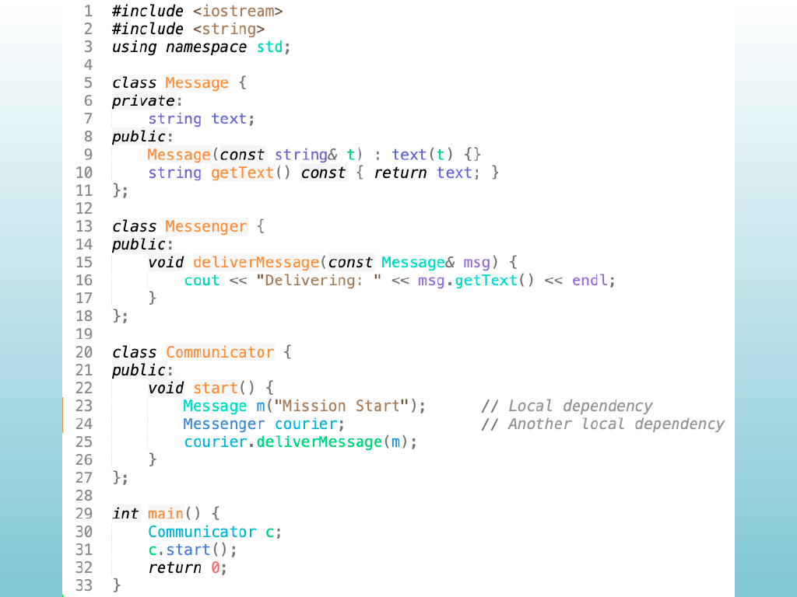
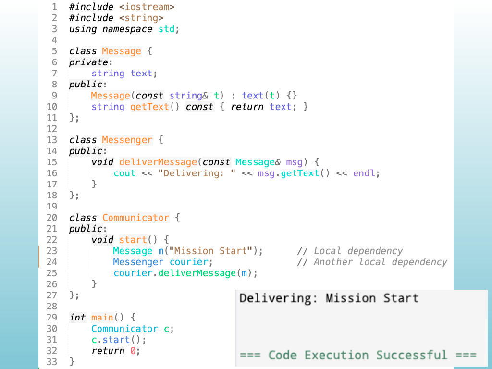
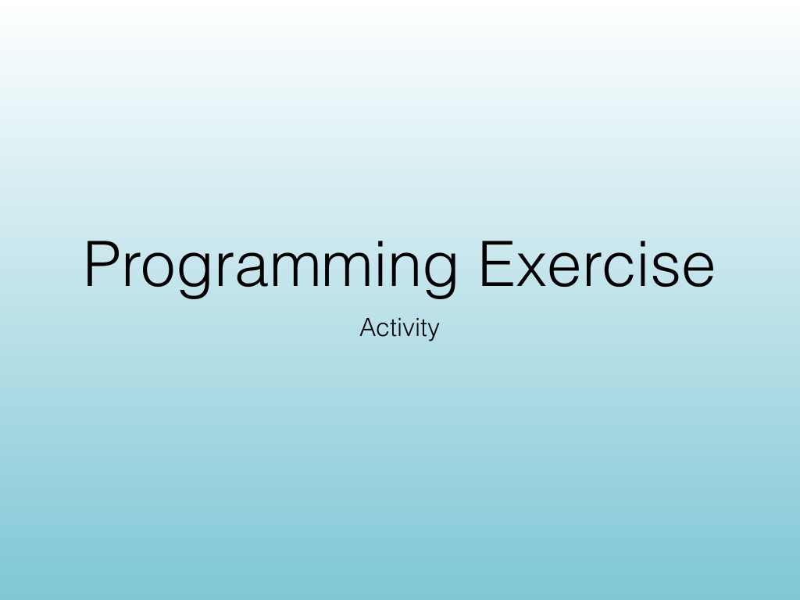
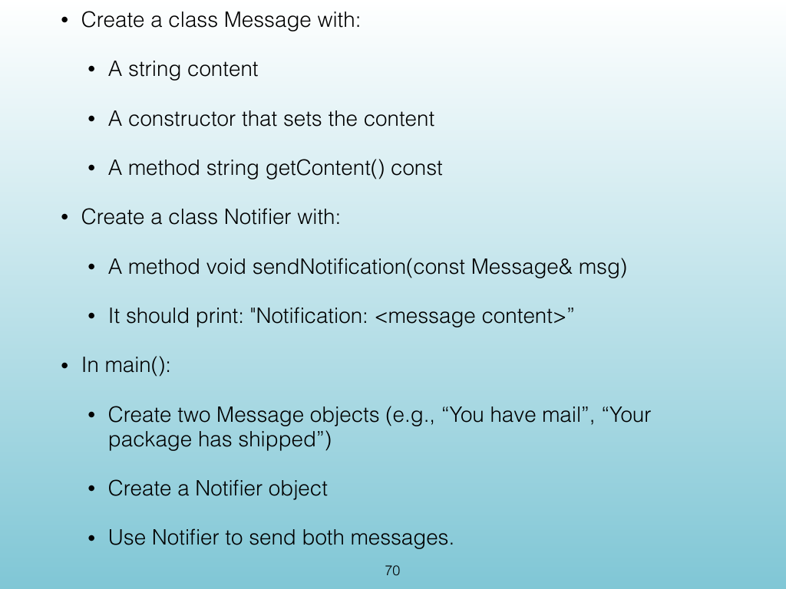
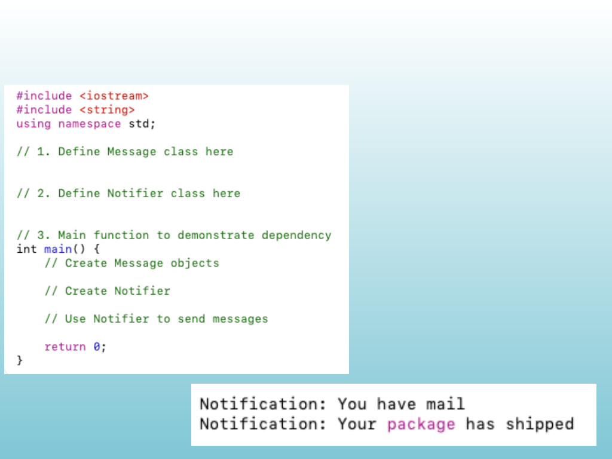

<!-- Topic: Programming Exercise -->
<!-- Slides 67–71 -->

# Programming Exercise

{width="100%" fig-alt="Programming Exercise"}

::: notes
Slides 67–71
Source slide 67 from the authoritative PDF.
:::

<!-- Slide 67 -->

---

## Source Slide 68

{width="100%" fig-alt="Source Slide 68"}

<!-- Slide 68 -->

---

## Source Slide 69

{width="100%" fig-alt="Programming Exercise"}

<!-- Slide 69 -->

---

## Source Slide 70

{width="100%" fig-alt="• Create a class Message with:"}

<!-- Slide 70 -->

---

## Source Slide 71

{width="100%" fig-alt="Source Slide 71"}

<!-- Slide 71 -->
