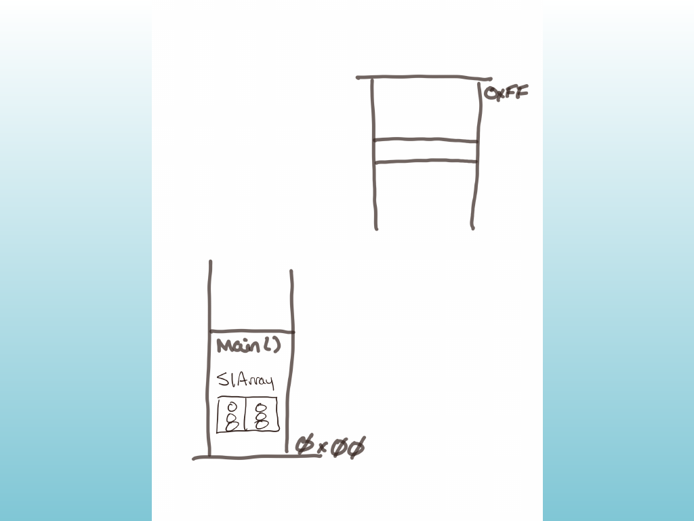
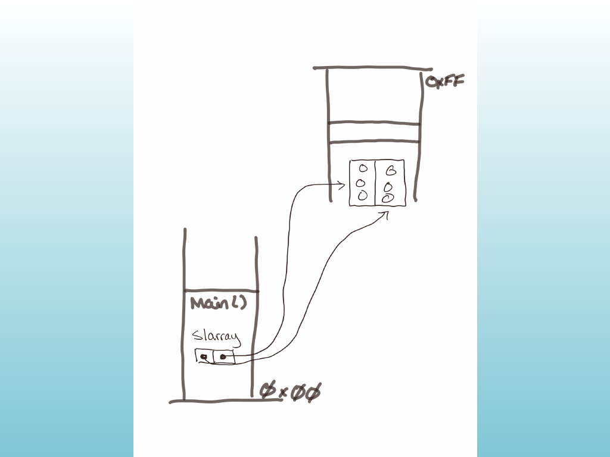
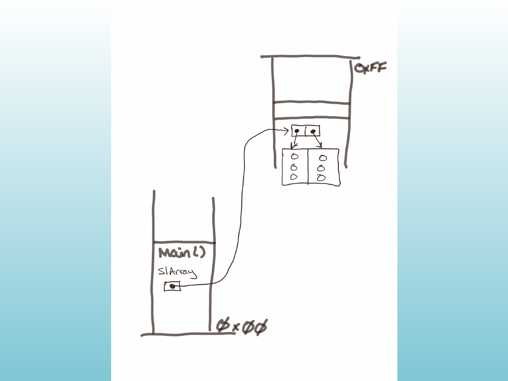

<!-- Topic: Arrays of Objects on the Stack and Heap -->
<!-- Slides 27–34 -->

# Arrays of Objects on the Stack and Heap
<!-- Slide 27 -->

**8.13 Arrays of Objects**

## Memory for an Array of Objects

{width="70%" fig-alt="Hand-drawn stack and heap memory diagram"}

<!-- Slide 28 -->

---

## Array of Objects

```{cpp}
 // dsla0.cpp — demo of array of StopLight objects
#include <iostream>
using namespace std;

class StopLight {
public:
    enum Light { RED, YELLOW, GREEN };
    Light steadyLight;

    StopLight() { steadyLight = YELLOW; }
    StopLight(Light lightColor) { steadyLight = lightColor; }
    void cycle();
};

void StopLight::cycle() {
    switch (steadyLight) {
    case RED: cout << "Red\\n"; break;
    case YELLOW: cout << "Yellow\\n"; break;
    case GREEN: cout << "Green\\n"; break;
    }
}

int main() {
    StopLight slArray[2];
    slArray[0].cycle();
    slArray[1].cycle();

    cout << "\\nCreate objects.\\n\\n";

    slArray[0] = StopLight(StopLight::RED);
    slArray[1] = StopLight(StopLight::YELLOW);

    slArray[0].cycle();
    slArray[1].cycle();

    return 0;
}
```

<!-- Slide 29 -->

---

## Objects and Pointers

{width="70%" fig-alt="Hand-drawn object and pointer memory diagram"}

<!-- Slide 30 -->

---

## Array of Object Pointers

```{cpp}
// dsla1.cpp — demo of array of StopLight class pointers
#include <iostream>
using namespace std;

class StopLight {
public:
    enum Light { RED, YELLOW, GREEN };
    Light steadyLight;

    StopLight() { steadyLight = YELLOW; }
    StopLight(Light lightColor) { steadyLight = lightColor; }
    void cycle();
};

void StopLight::cycle() {
    switch (steadyLight) {
    case RED: cout << "Red\\n"; break;
    case YELLOW: cout << "Yellow\\n"; break;
    case GREEN: cout << "Green\\n"; break;
    }
}

int main() {
    StopLight* slArray[2];

    slArray[0] = new StopLight(StopLight::RED);
    slArray[1] = new StopLight(StopLight::YELLOW);

    slArray[0]->cycle();
    slArray[1]->cycle();

    return 0;
}
```

<!-- Slide 31 -->

---

## Pointer Array Storage

{width="70%" fig-alt="Hand-drawn dynamic object pointer diagram"}

<!-- Slide 32 -->

---

## Dynamic Array of Object Pointers

```{cpp}
// dsla2.cpp — dynamic array of StopLight class pointers
#include <iostream>
using namespace std;

class StopLight {
public:
    enum Light { RED, YELLOW, GREEN };
    Light steadyLight;

    StopLight() { steadyLight = YELLOW; }
    StopLight(Light lightColor) { steadyLight = lightColor; }
    void cycle();
};

void StopLight::cycle() {
    switch (steadyLight) {
    case RED: cout << "Red\\n"; break;
    case YELLOW: cout << "Yellow\\n"; break;
    case GREEN: cout << "Green\\n"; break;
    }
}

int main() {
    StopLight** slArray = new StopLight*[2];

    slArray[0] = new StopLight(StopLight::RED);
    slArray[1] = new StopLight(StopLight::YELLOW);

    slArray[0]->cycle();
    slArray[1]->cycle();

    return 0;
}
```

<!-- Slide 33 -->

---

## Key Takeaway

- Classes are custom **types**, and we can pass them to methods just like any other type.
- We need to decide where to instantiate objects: on the stack or the heap.
- A useful array-of-objects design keeps both the array and its objects on the heap, with the array pointer on the stack.

<!-- Slide 34 -->
