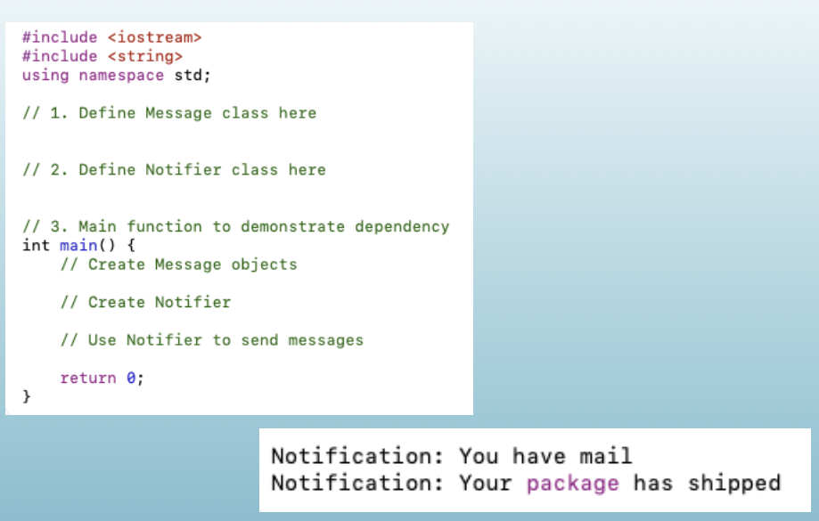

<!-- Topic: Programming Exercise -->
<!-- Slides 53–55 -->

# Programming Exercise

**Activity**

<!-- Slide 53 -->

---

## Programming Exercise Requirements

- Create a class `Message` with a string content field, a constructor that sets the content, and a `string getContent() const` method.
- Create a class `Notifier` with a `void sendNotification(const Message& msg)` method that prints `Notification: <message content>`.
- In `main()`, create two `Message` objects, create a `Notifier`, and use it to send both messages.

<!-- Slide 54 -->

---

## Programming Exercise Starter

{width="80%" fig-alt="Programming exercise starter code and expected notification output"}

<!-- Slide 55 -->
