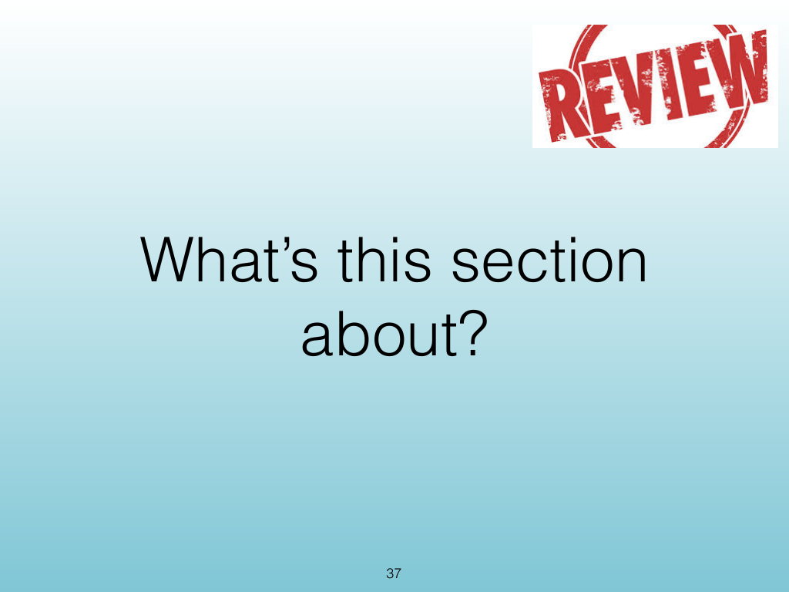
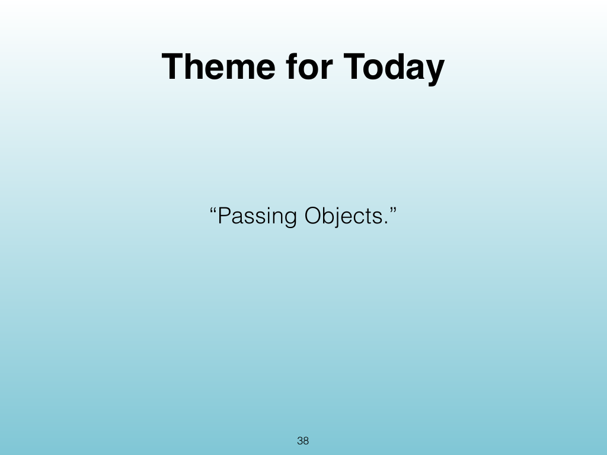
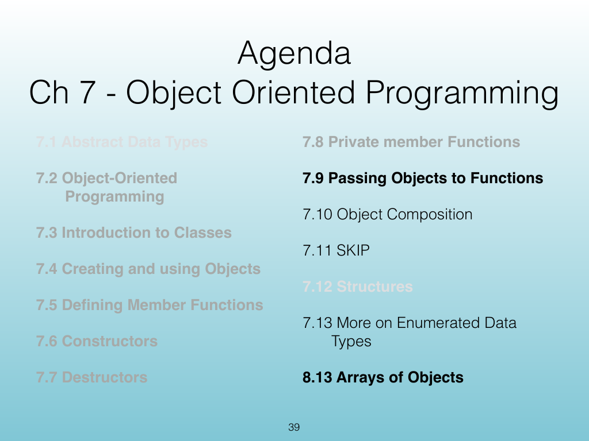
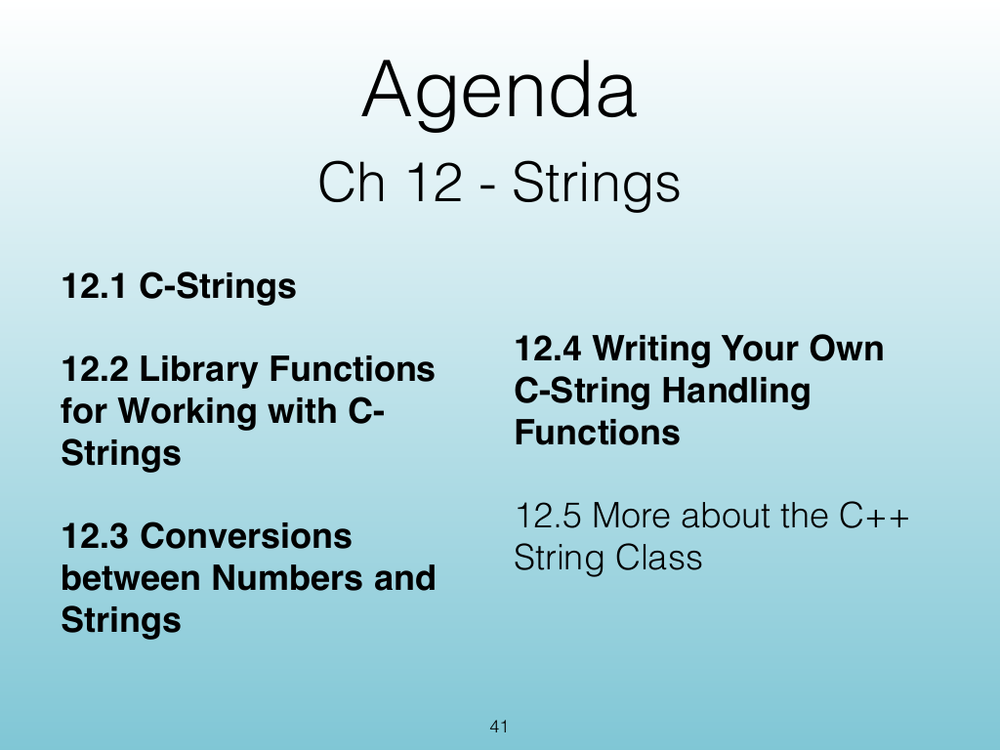
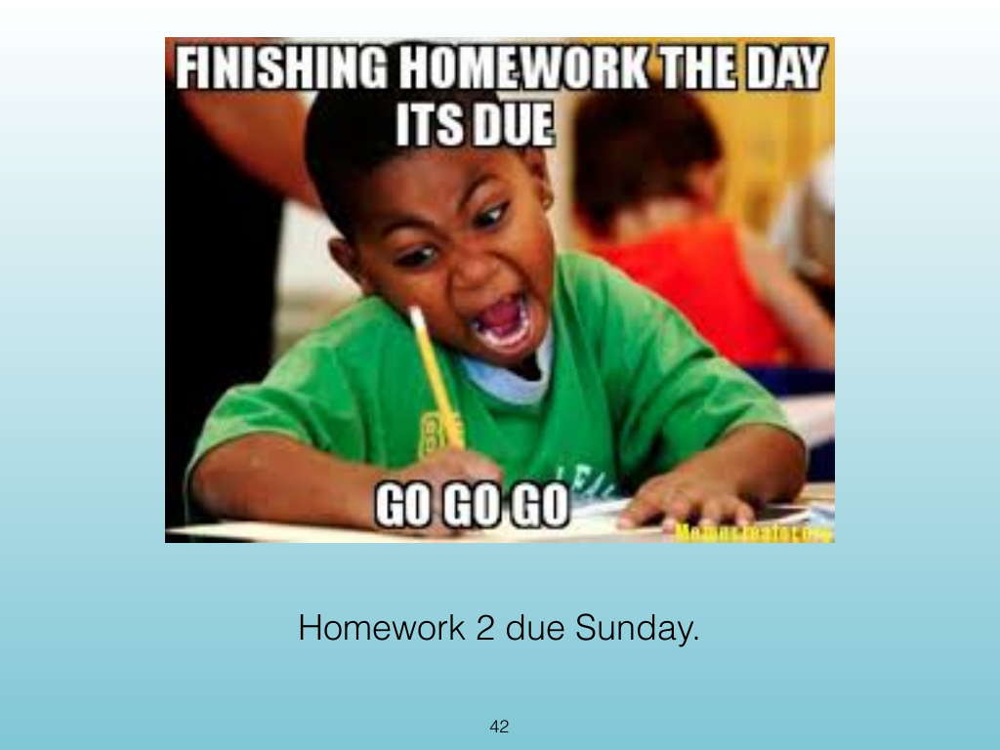
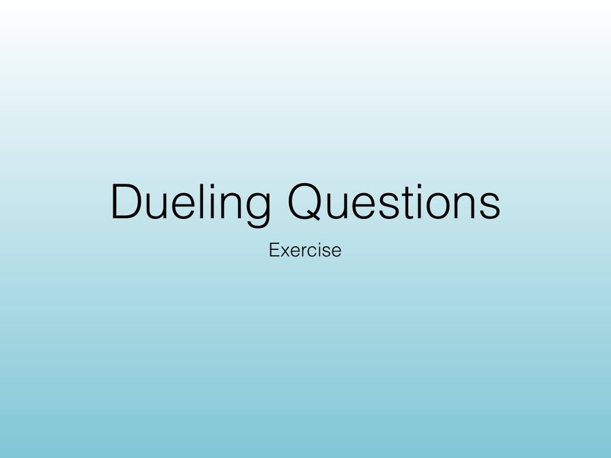
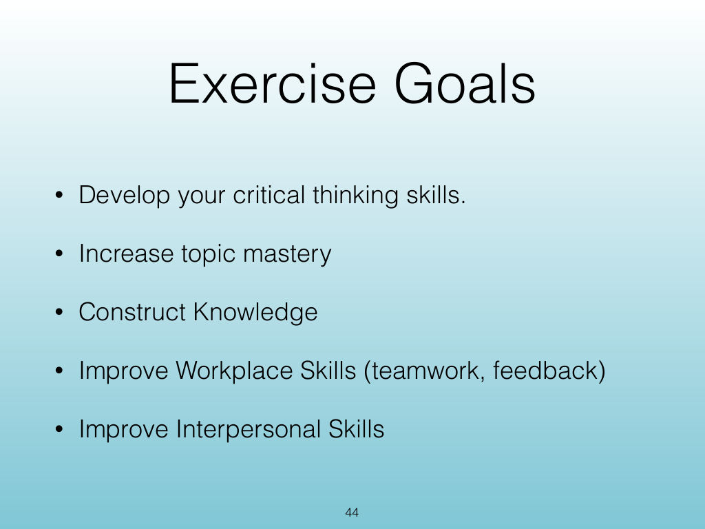
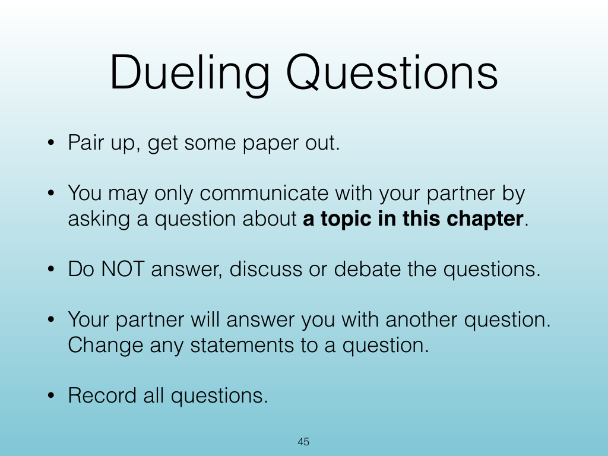
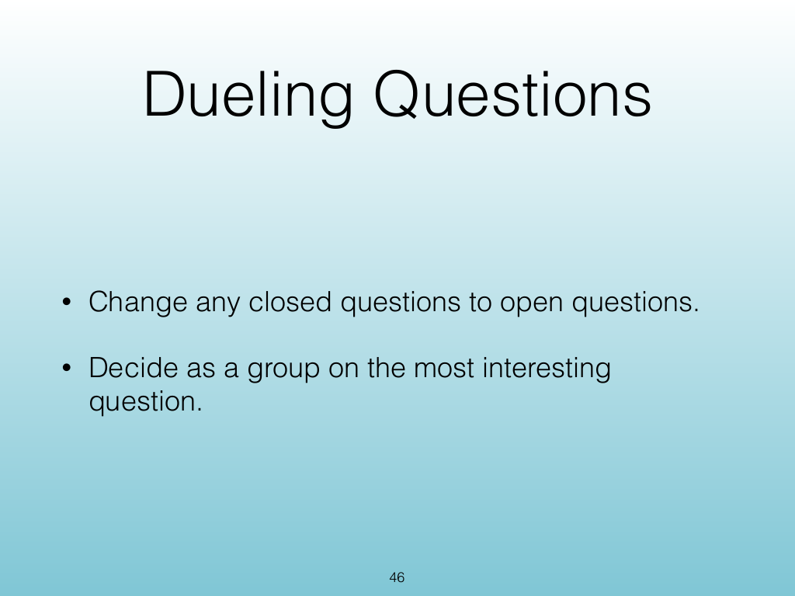

<!-- Topic: Activities and Wrap-Up -->
<!-- Slides 37–46 -->

# Activities and Wrap-Up

{width="100%" fig-alt="Activities and Wrap-Up"}

::: notes
Slides 37–46
Source slide 37 from the authoritative PDF.
:::

<!-- Slide 37 -->

---

## Source Slide 38

{width="100%" fig-alt="Theme for Today"}

<!-- Slide 38 -->

---

## Source Slide 39

{width="100%" fig-alt="Agenda"}

<!-- Slide 39 -->

---

## Source Slide 40

{width="100%" fig-alt="What’s Next?"}

<!-- Slide 40 -->

---

## Source Slide 41

{width="100%" fig-alt="Agenda"}

<!-- Slide 41 -->

---

## Source Slide 42

{width="100%" fig-alt="Homework 2 due Sunday."}

<!-- Slide 42 -->

---

## Source Slide 43

{width="100%" fig-alt="Dueling Questions"}

<!-- Slide 43 -->

---

## Source Slide 44

{width="100%" fig-alt="Exercise Goals"}

<!-- Slide 44 -->

---

## Source Slide 45

{width="100%" fig-alt="Dueling Questions"}

<!-- Slide 45 -->

---

## Source Slide 46

{width="100%" fig-alt="Dueling Questions"}

<!-- Slide 46 -->
