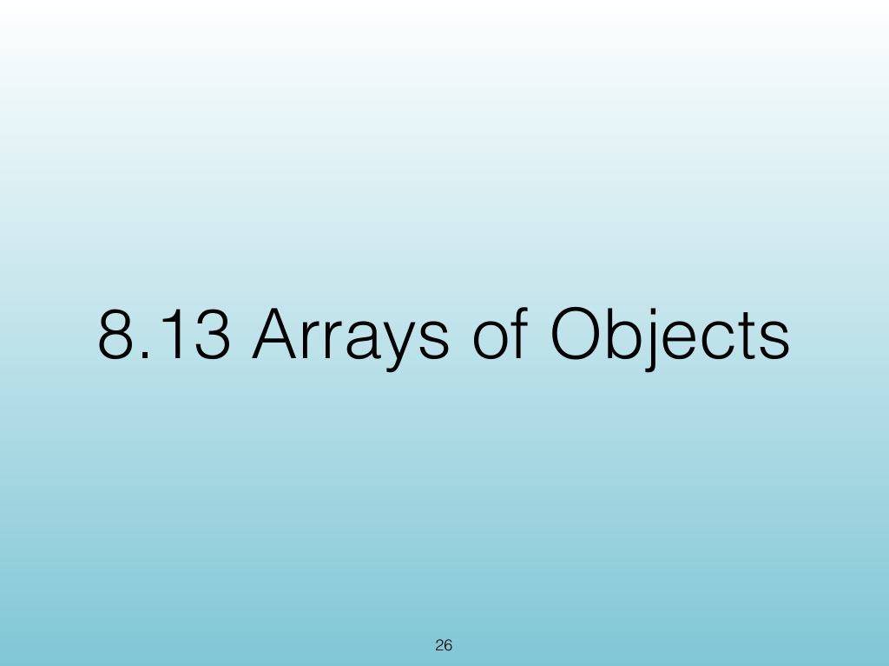
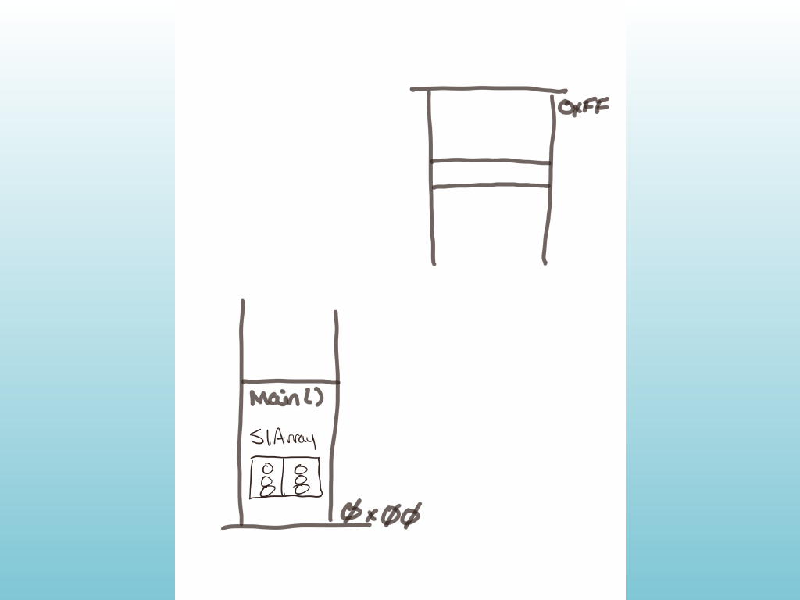
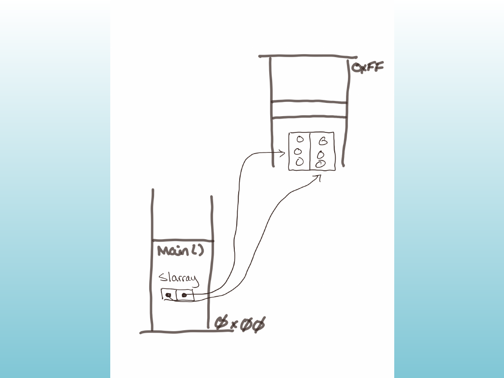
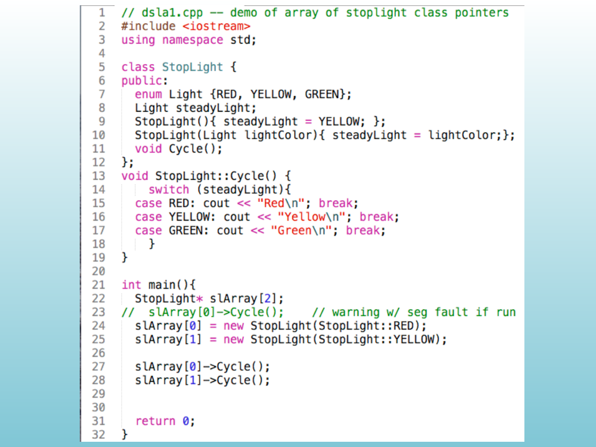
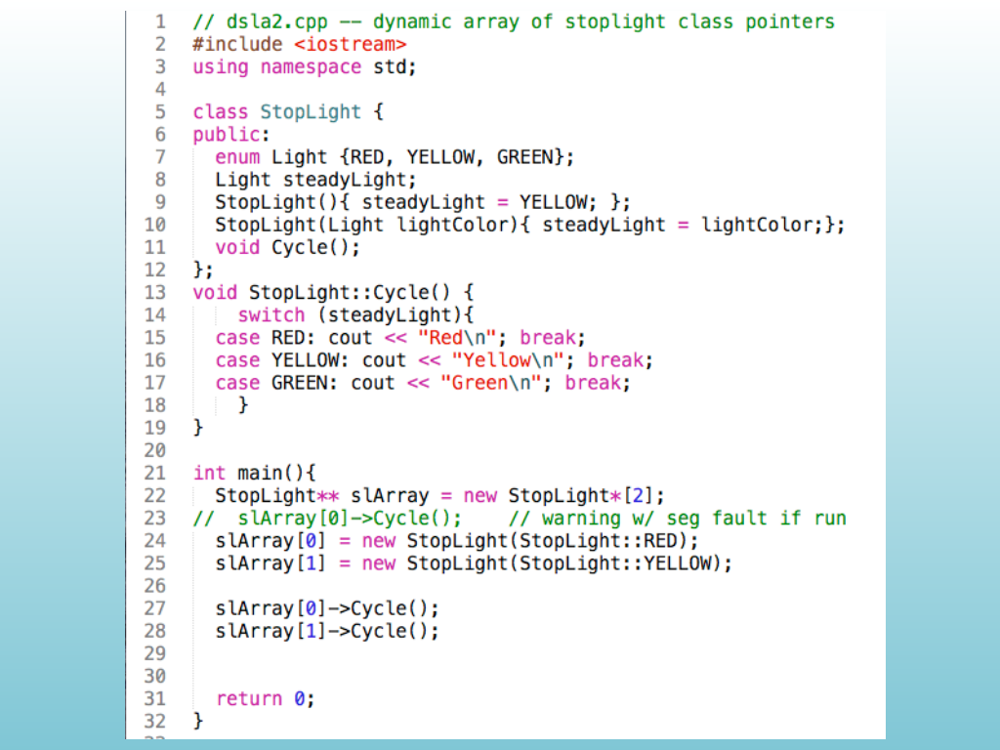
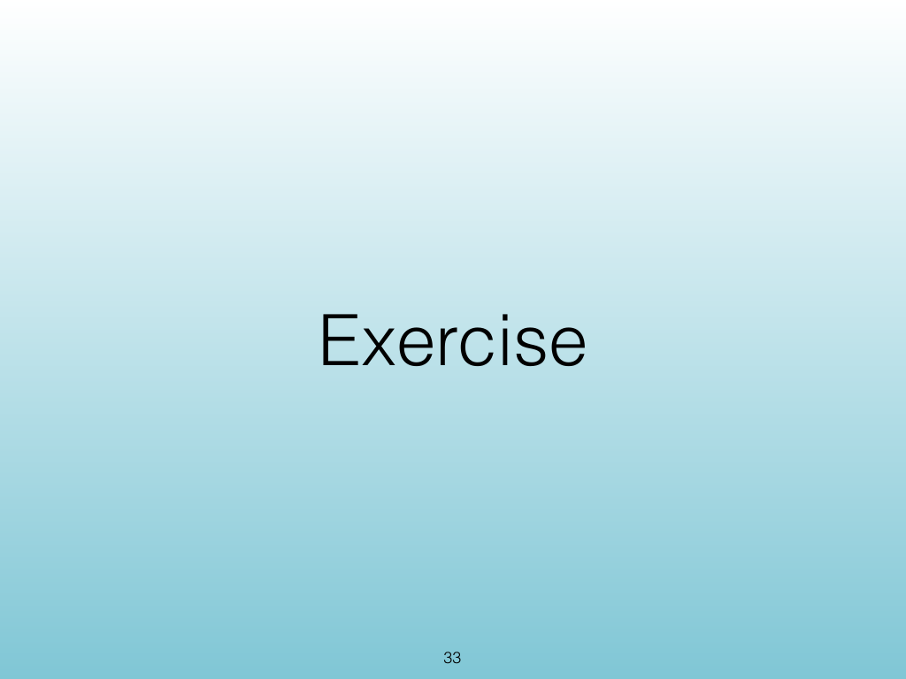
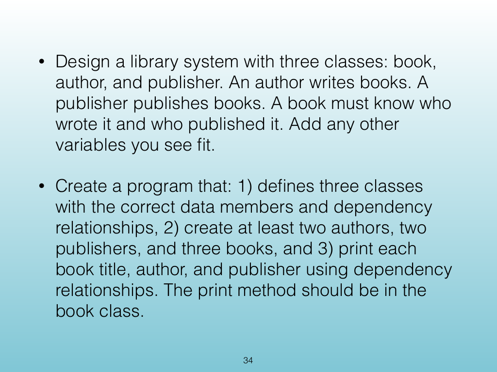
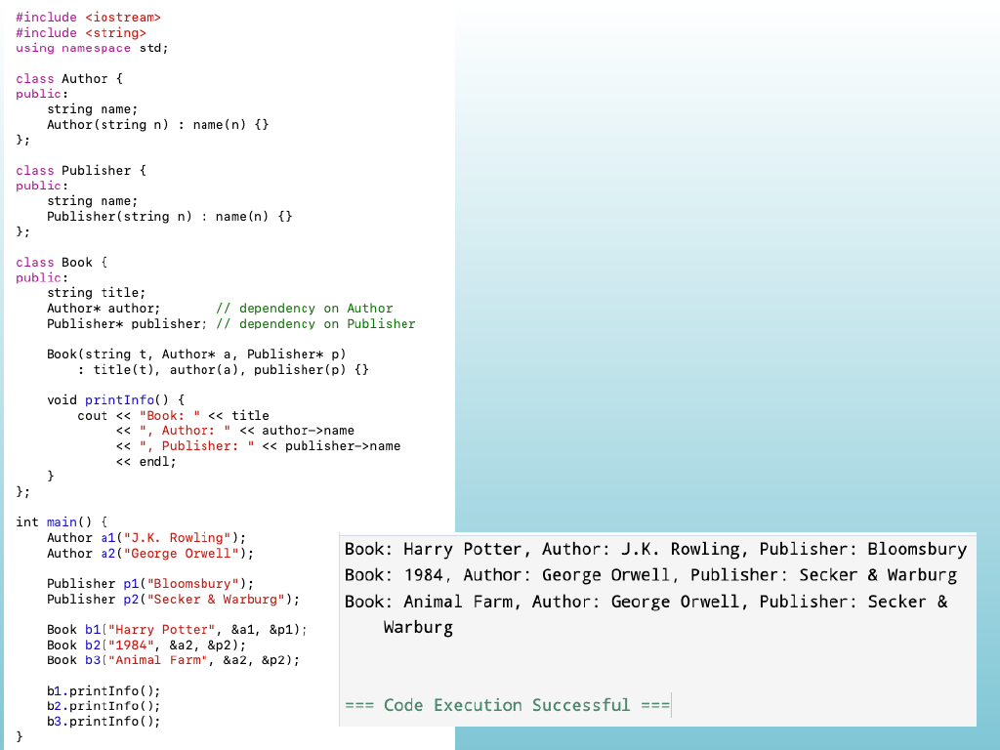
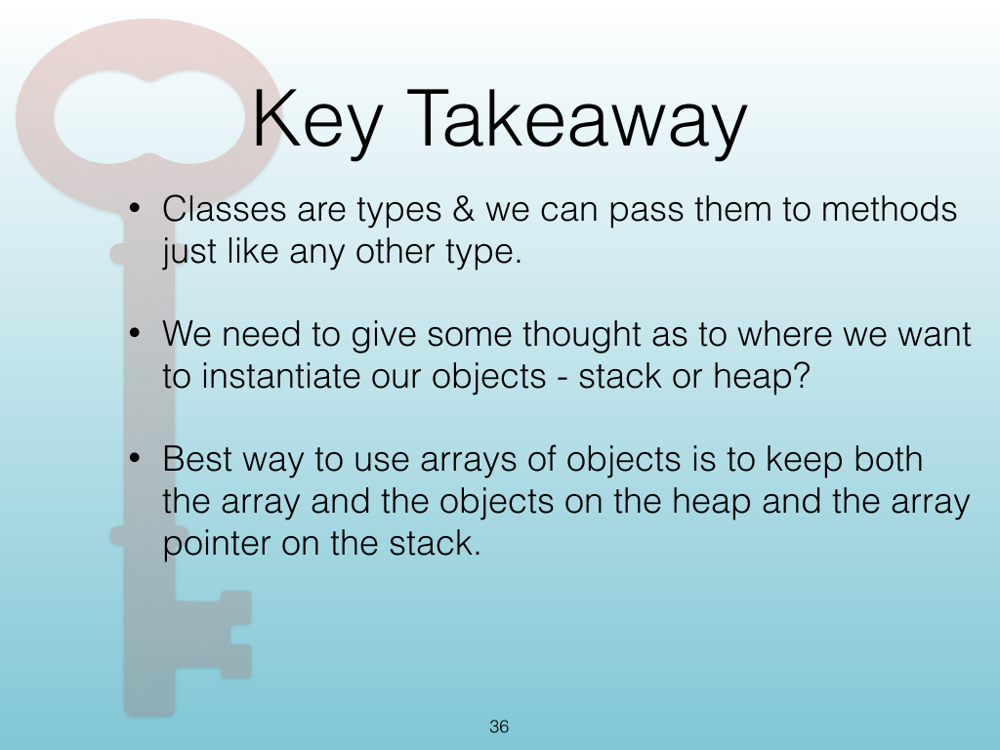

<!-- Topic: Arrays of Objects on the Stack and Heap -->
<!-- Slides 26–36 -->

# Arrays of Objects on the Stack and Heap

{width="100%" fig-alt="Arrays of Objects on the Stack and Heap"}

::: notes
Slides 26–36
Source slide 26 from the authoritative PDF.
:::

<!-- Slide 26 -->

---

## Source Slide 27

{width="100%" fig-alt="Source Slide 27"}

<!-- Slide 27 -->

---

## Source Slide 28

{width="100%" fig-alt="Source Slide 28"}

<!-- Slide 28 -->

---

## Source Slide 29

{width="100%" fig-alt="Source Slide 29"}

<!-- Slide 29 -->

---

## Source Slide 30

{width="100%" fig-alt="Source Slide 30"}

<!-- Slide 30 -->

---

## Source Slide 31

{width="100%" fig-alt="Source Slide 31"}

<!-- Slide 31 -->

---

## Source Slide 32

{width="100%" fig-alt="Source Slide 32"}

<!-- Slide 32 -->

---

## Source Slide 33

{width="100%" fig-alt="Exercise"}

<!-- Slide 33 -->

---

## Source Slide 34

{width="100%" fig-alt="• Design a library system with three classes: book,"}

<!-- Slide 34 -->

---

## Source Slide 35

{width="100%" fig-alt="Source Slide 35"}

<!-- Slide 35 -->

---

## Source Slide 36

{width="100%" fig-alt="Key Takeaway"}

<!-- Slide 36 -->
