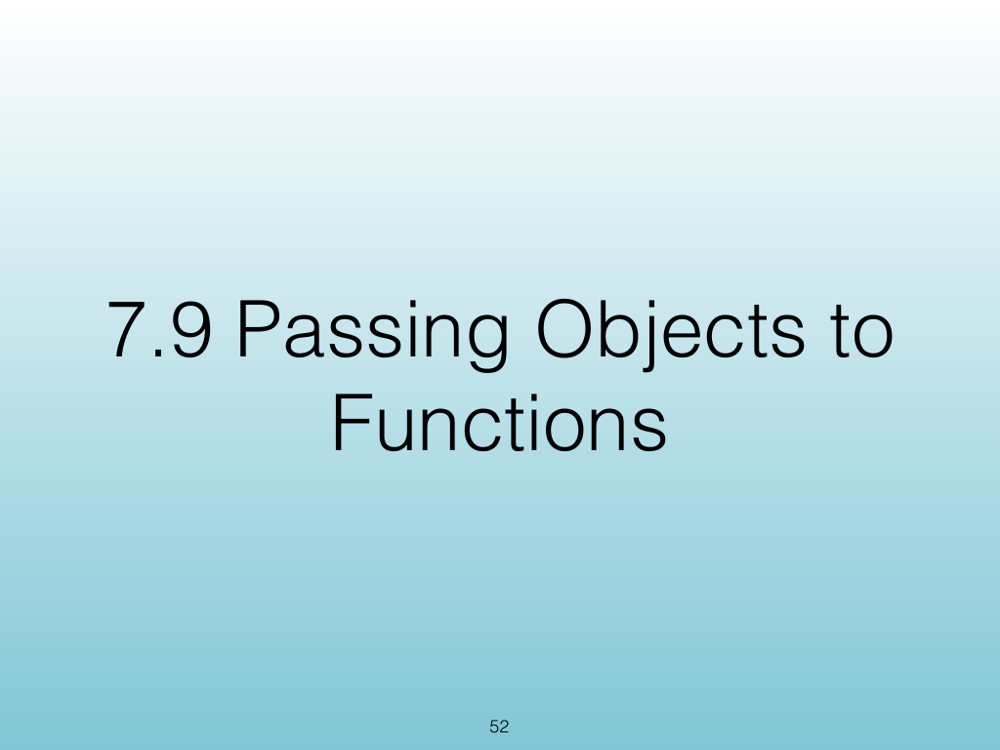
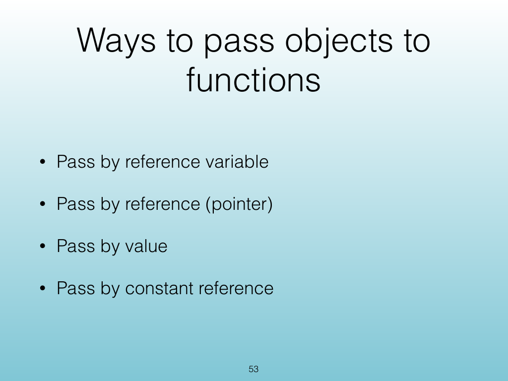
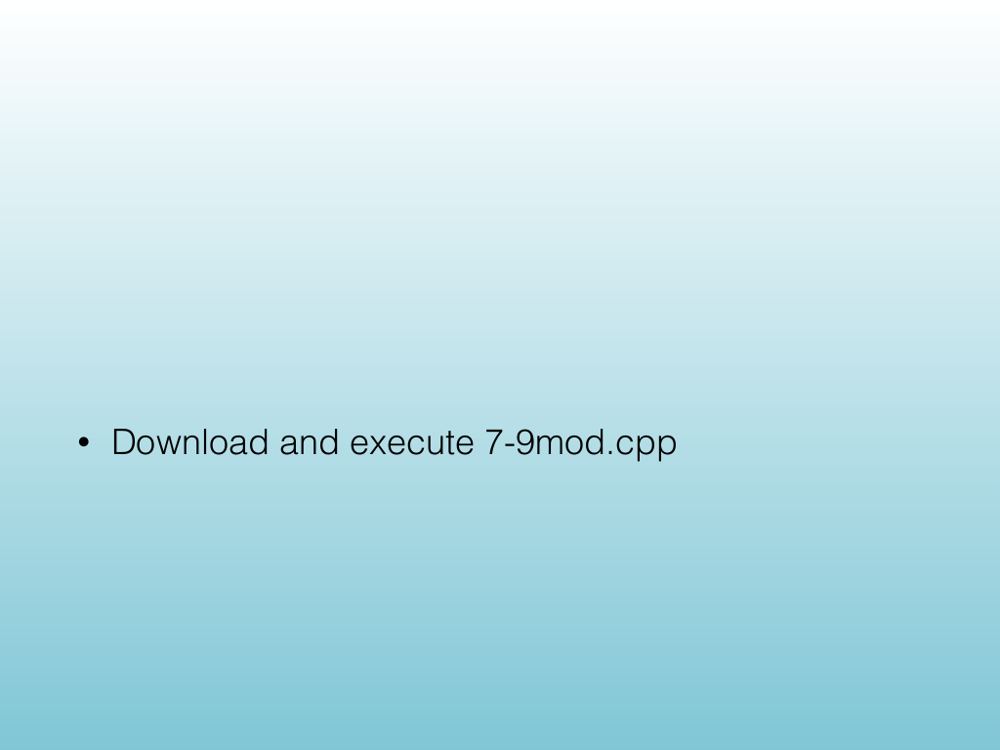
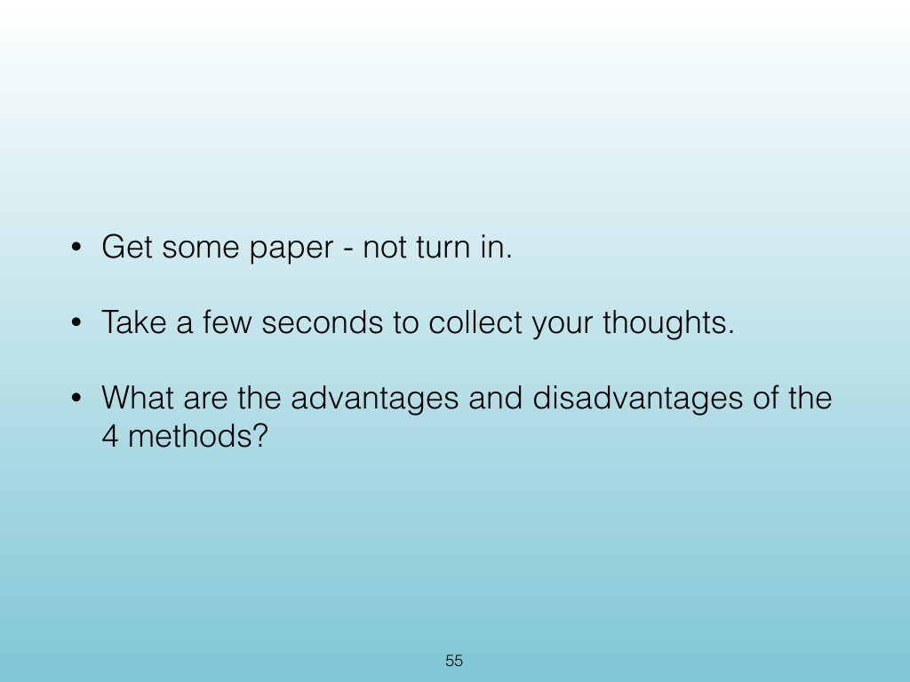
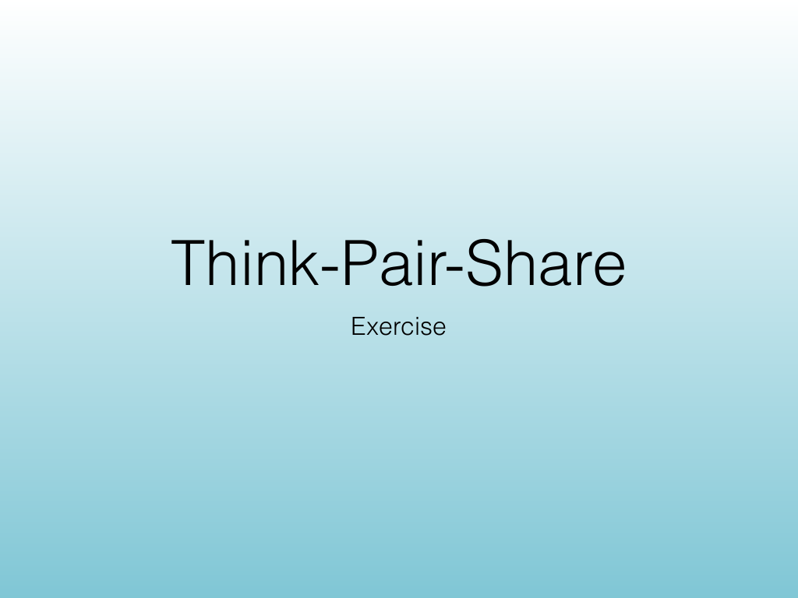
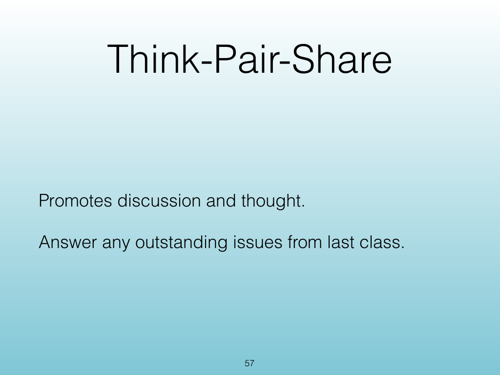
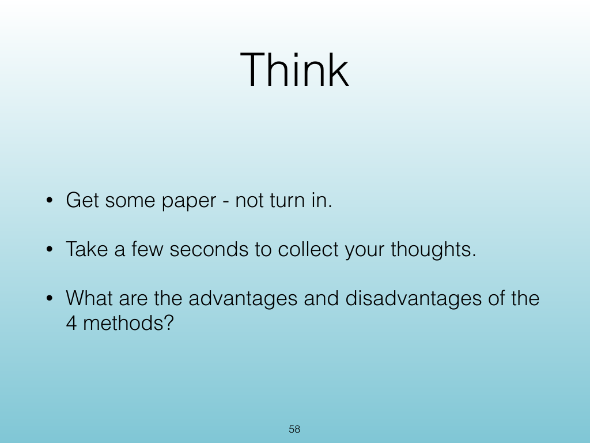
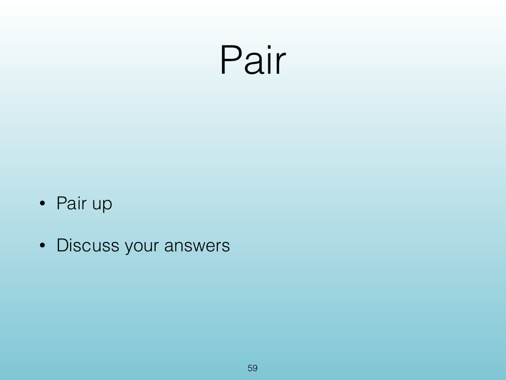
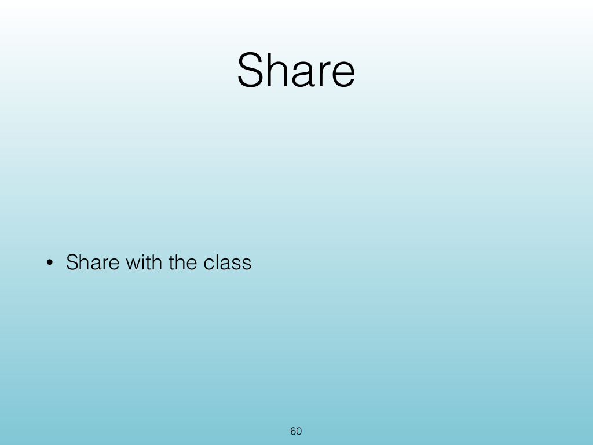
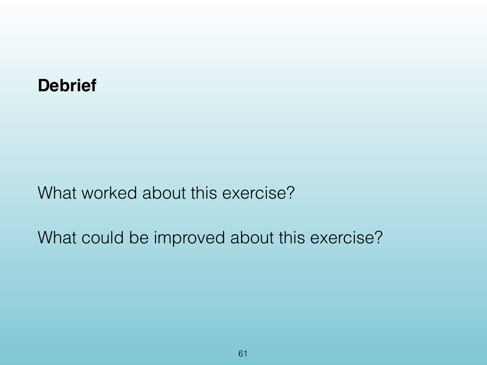

<!-- Topic: Passing Objects to Functions -->
<!-- Slides 52–61 -->

# Passing Objects to Functions

{width="100%" fig-alt="Passing Objects to Functions"}

::: notes
Slides 52–61
Source slide 52 from the authoritative PDF.
:::

<!-- Slide 52 -->

---

## Source Slide 53

{width="100%" fig-alt="Ways to pass objects to"}

<!-- Slide 53 -->

---

## Source Slide 54

{width="100%" fig-alt="• Download and execute 7-9mod.cpp"}

<!-- Slide 54 -->

---

## Source Slide 55

{width="100%" fig-alt="• Get some paper - not turn in."}

<!-- Slide 55 -->

---

## Source Slide 56

{width="100%" fig-alt="Think-Pair-Share"}

<!-- Slide 56 -->

---

## Source Slide 57

{width="100%" fig-alt="Think-Pair-Share"}

<!-- Slide 57 -->

---

## Source Slide 58

{width="100%" fig-alt="Think"}

<!-- Slide 58 -->

---

## Source Slide 59

{width="100%" fig-alt="Pair"}

<!-- Slide 59 -->

---

## Source Slide 60

{width="100%" fig-alt="Share"}

<!-- Slide 60 -->

---

## Source Slide 61

{width="100%" fig-alt="Debrief"}

<!-- Slide 61 -->
