<!-- Topic: Selecting Members of Objects -->
<!-- Slides 15–25 -->

# Selecting Members of Objects

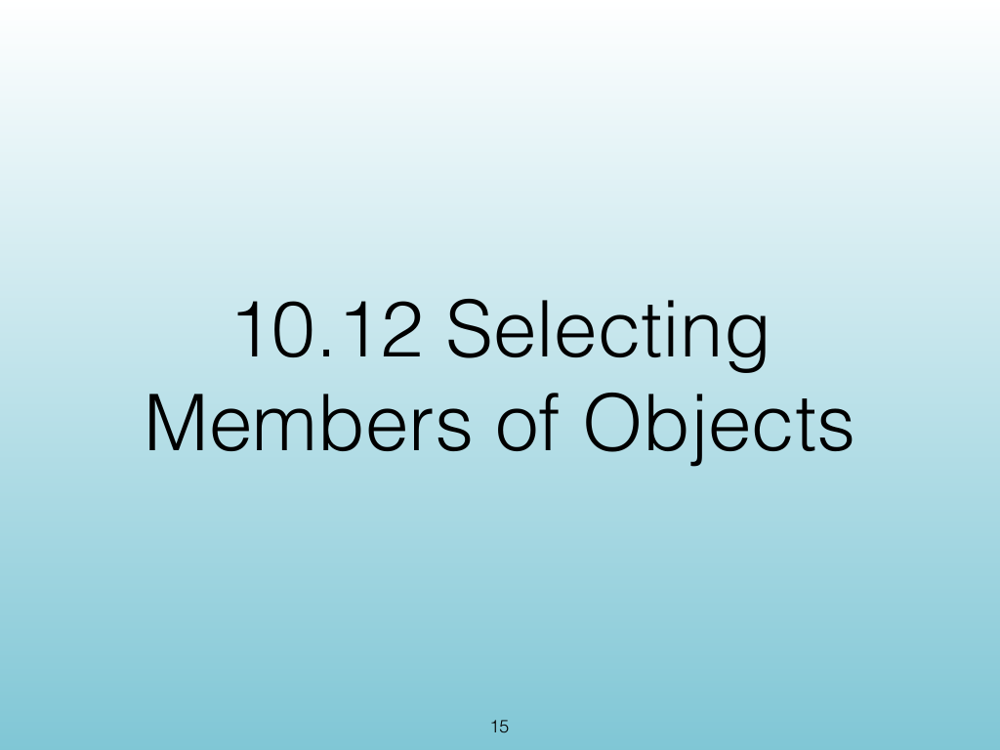{width="100%" fig-alt="Selecting Members of Objects"}

::: notes
Slides 15–25
Source slide 15 from the authoritative PDF.
:::

<!-- Slide 15 -->

---

## Source Slide 16

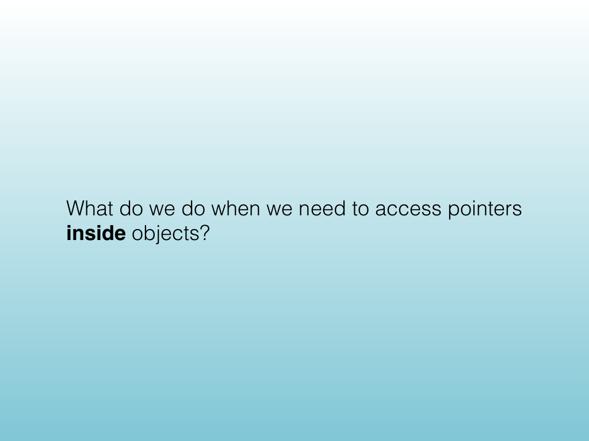{width="100%" fig-alt="What do we do when we need to access pointers"}

<!-- Slide 16 -->

---

## Source Slide 17

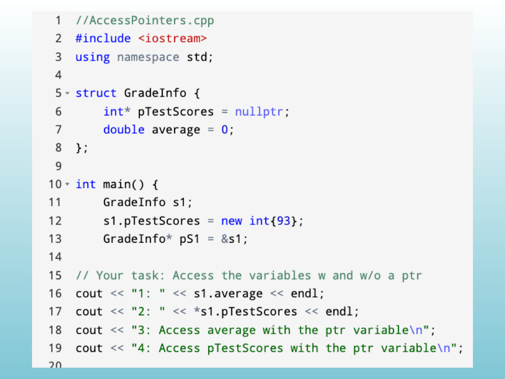{width="100%" fig-alt="Source Slide 17"}

<!-- Slide 17 -->

---

## Source Slide 18

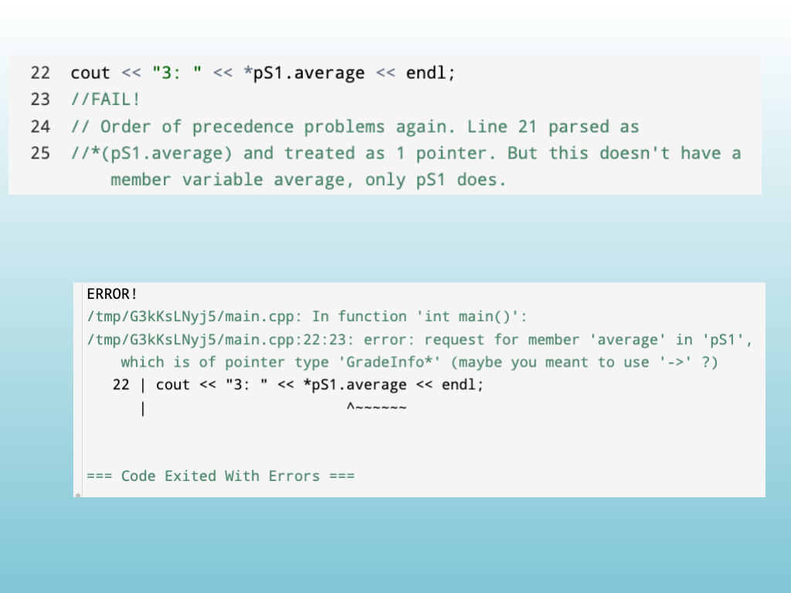{width="100%" fig-alt="Source Slide 18"}

<!-- Slide 18 -->

---

## Source Slide 19

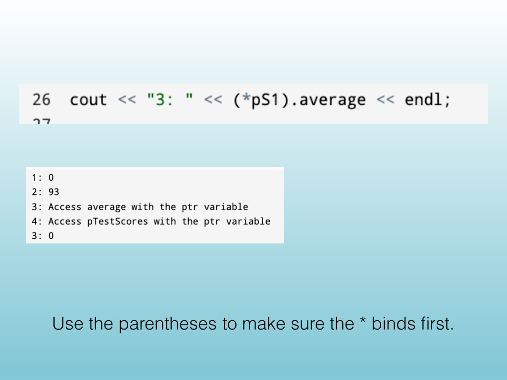{width="100%" fig-alt="Use the parentheses to make sure the * binds rst."}

<!-- Slide 19 -->

---

## Source Slide 20

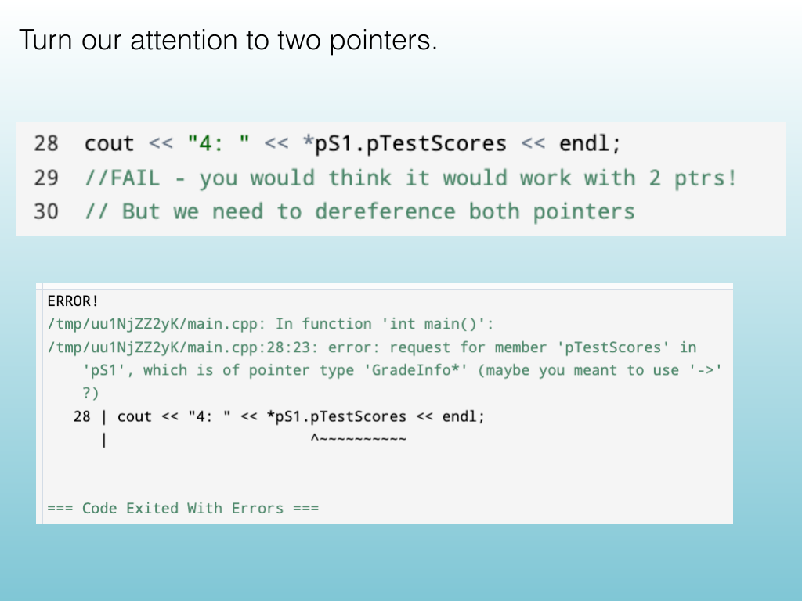{width="100%" fig-alt="Turn our attention to two pointers."}

<!-- Slide 20 -->

---

## Source Slide 21

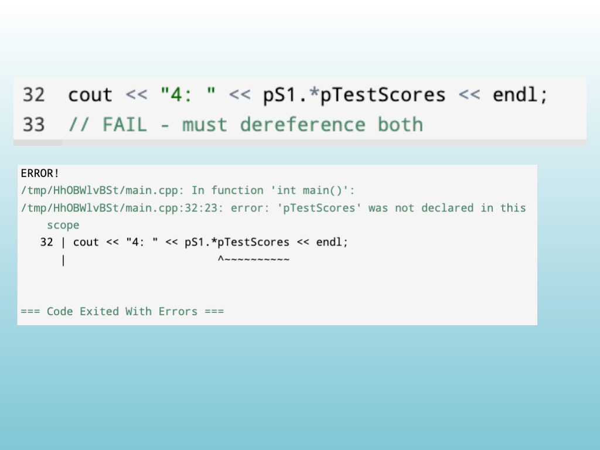{width="100%" fig-alt="Source Slide 21"}

<!-- Slide 21 -->

---

## Source Slide 22

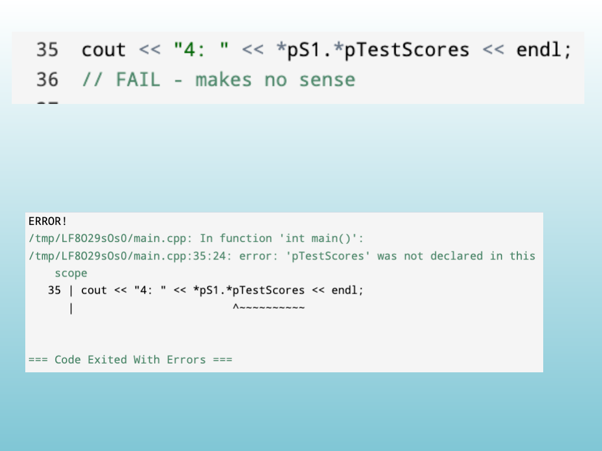{width="100%" fig-alt="Source Slide 22"}

<!-- Slide 22 -->

---

## Source Slide 23

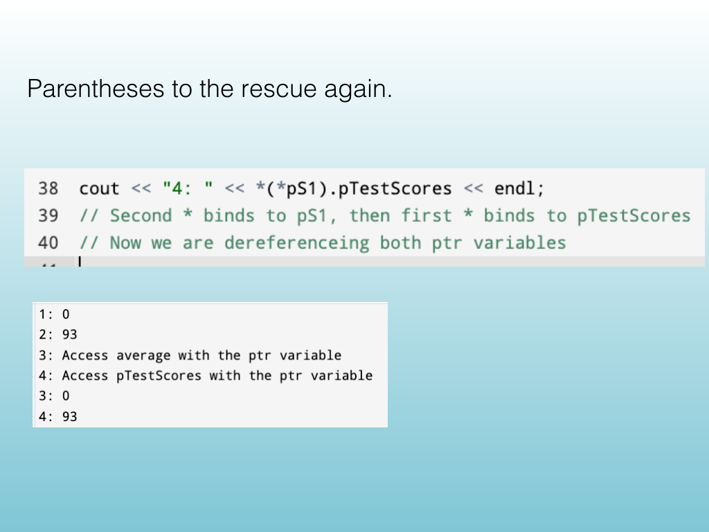{width="100%" fig-alt="Parentheses to the rescue again."}

<!-- Slide 23 -->

---

## Source Slide 24

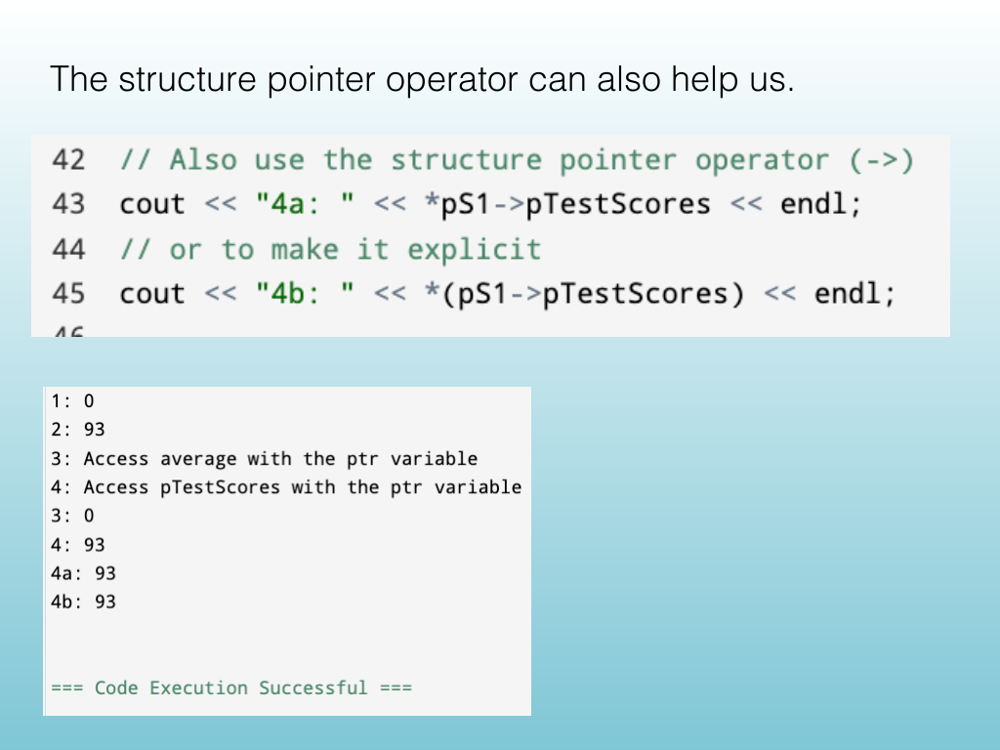{width="100%" fig-alt="The structure pointer operator can also help us."}

<!-- Slide 24 -->

---

## Source Slide 25

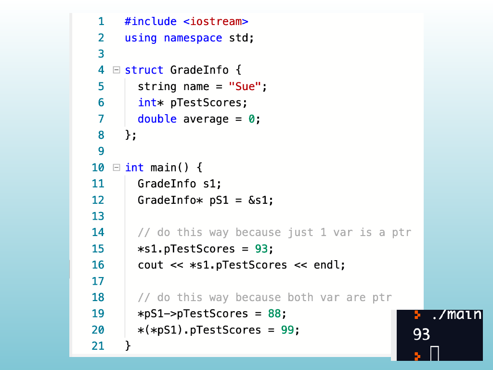{width="100%" fig-alt="Source Slide 25"}

<!-- Slide 25 -->
