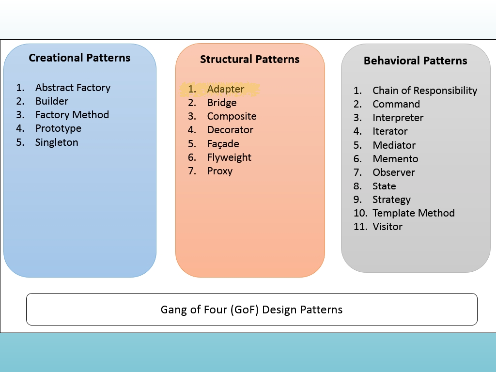
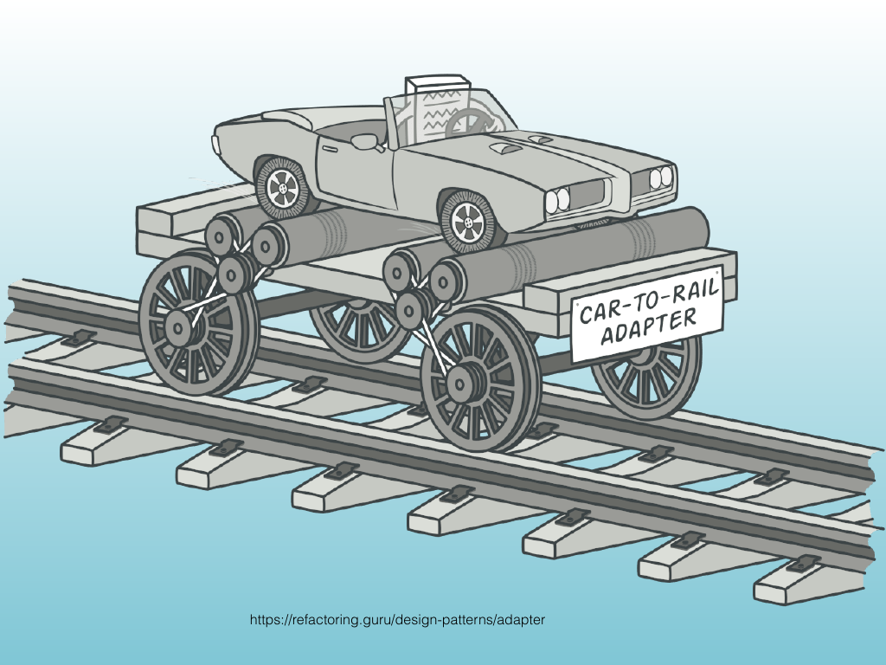

<!-- Topic: Adapter Pattern -->
<!-- Slides 38–51 -->

# Adapter Pattern
<!-- Slide 38 -->

---

## Use Case

Suppose we create a `Whizbang` class that performs impressive processing on multimedia files.

- To use it, we send a multimedia file to a `Whizbang` object.
- But multimedia files come in many formats.
- How many different file-specific interfaces would `Whizbang` need to support?

::: notes
Slides 38–51
:::

<!-- Slide 39 -->

---

## Whizbang Example

```cpp
#include <iostream>
using namespace std;

class Whizbang {
public:
    Whizbang(PDF& in) {
        // Process a multimedia file.
    }

    Whizbang(MP3& in) {
        // Process a multimedia file.
    }
};

int main() {
    PDF myPDF;                    // Supplier object.
    MP3 myMP3;
    Whizbang processPDF(myPDF);   // Client object.
    Whizbang processMP3(myMP3);

    return 0;
}
```

The client and supplier types become coupled to every constructor overload that `Whizbang` must support.

<!-- Slide 40 -->

---

## Adapters

An adapter lets an existing client work with an object whose interface does not match what the client expects.

<!-- Slide 41 -->

---

## Adapter

- Bridges the gap between one object format and another.
- Is usually temporary and often used for one specific interaction.
- Converts an existing interface without requiring the client or supplier to be rewritten.

<!-- Slide 42 -->

---

## Pattern Language

Christopher Alexander described recurring design problems in buildings and towns as patterns.

- A pattern identifies a recurring problem.
- It describes the forces that shape the problem.
- It gives a reusable solution shape rather than a fixed construction recipe.

<!-- Slide 43 -->

---

## Design Patterns

The Gang of Four book popularized design patterns for object-oriented software.

- Erich Gamma
- Richard Helm
- Ralph Johnson
- John Vlissides

The authors are commonly called the Gang of Four.

<!-- Slide 44 -->

---

## Pattern Categories

The Gang of Four organizes patterns into three broad categories.

| Creational | Structural | Behavioral |
|---|---|---|
| Abstract Factory | Adapter | Chain of Responsibility |
| Builder | Bridge | Command |
| Factory Method | Composite | Interpreter |
| Prototype | Decorator | Iterator |
| Singleton | Facade | Mediator |
|  | Flyweight | Memento |
|  | Proxy | Observer |
|  |  | State |
|  |  | Strategy |
|  |  | Template Method |
|  |  | Visitor |

<!-- Slide 45 -->

---

## Adapter in the Structural Category

Adapter is a structural pattern because it changes how existing objects connect without changing their internal implementations.

{width="70%"}

<!-- Slide 46 -->

---

## Adapting the Interface

The adapter acts like a connector between incompatible interfaces: the client uses the interface it already knows, while the adapter translates the request for the supplier.

{width="70%"}

<!-- Slide 47 -->

---

## Back to Whizbang

- We no longer need a large set of multimedia-specific types built into `Whizbang`.
- Instead, we accept one relatively broad type.
- Each adapter converts a supplier object to that type.

<!-- Slide 48 -->

---

## Named Adapter Class

```cpp
#include <iostream>
using namespace std;

class Whizbang {
public:
    Whizbang(string& in) {
        // Process a multimedia file.
    }
};

class PDF2String {
public:
    PDF2String(PDF& in) {
        cout << "Convert PDF to string" << endl;
    }
};

int main() {
    PDF myPDF;                    // Supplier object.
    Whizbang processPDF(PDF2String(myPDF));

    return 0;
}
```

The named adapter converts a `PDF` into the representation expected by `Whizbang`.

<!-- Slide 49 -->

---

## Anonymous Adapter Class

```cpp
class Whizbang {
public:
    Whizbang(string& in) {
        // Process a multimedia file.
    }
};

class {
public:
    PDF2String(PDF& in) {
        cout << "Convert PDF to string" << endl;
    }
} PDF2S(myPDF);

int main() {
    PDF myPDF;                    // Supplier object.
    Whizbang processPDF(PDF2S);

    return 0;
}
```

An anonymous adapter object can be created when the conversion is needed without giving the adapter class a reusable name.

<!-- Slide 50 -->

---

## Named Adapter Object

```cpp
class Whizbang {
public:
    Whizbang(string& in) {
        // Process a multimedia file.
    }
};

class PDF2String {
public:
    PDF2String(PDF& in) {
        cout << "Convert PDF to string" << endl;
    }
};

int main() {
    PDF myPDF;                    // Supplier object.
    PDF2String PDF2S(myPDF);
    Whizbang processPDF(PDF2S);

    return 0;
}
```

The named object makes the conversion step explicit and can be reused for additional calls.

<!-- Slide 51 -->
