<!-- Topic: Adapter Pattern -->
<!-- Slides 15–28 -->

# Adapter Pattern

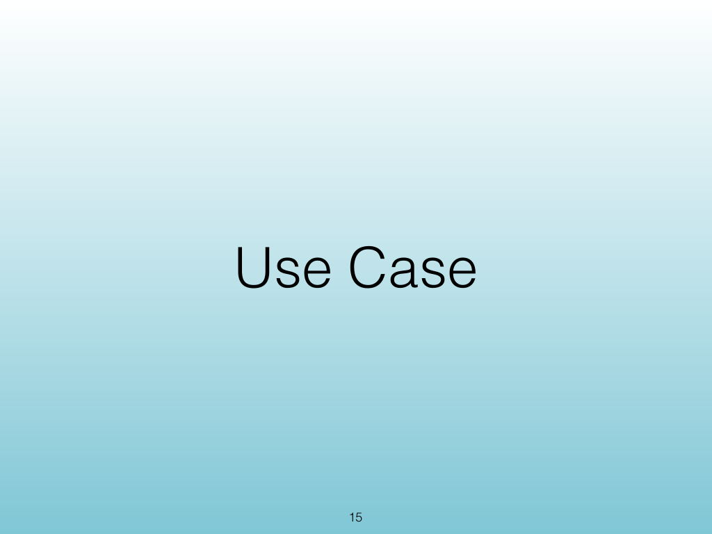{width="100%" fig-alt="Adapter Pattern"}

::: notes
Slides 15–28
Source slide 15 from the authoritative PDF.
:::

<!-- Slide 15 -->

---

## Source Slide 16

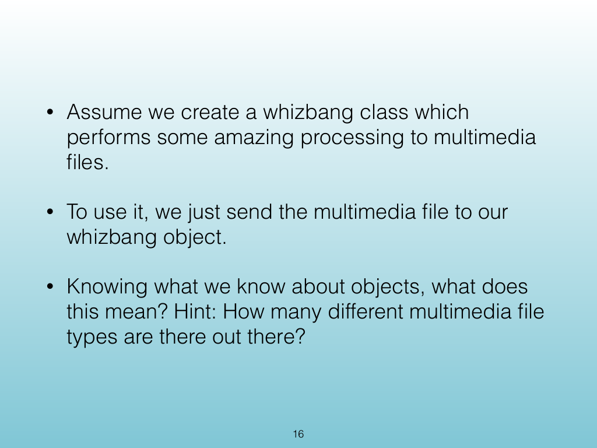{width="100%" fig-alt="• Assume we create a whizbang class which"}

<!-- Slide 16 -->

---

## Source Slide 17

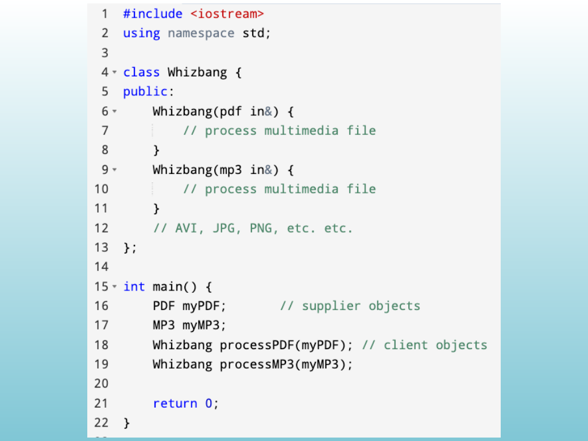{width="100%" fig-alt="Source Slide 17"}

<!-- Slide 17 -->

---

## Source Slide 18

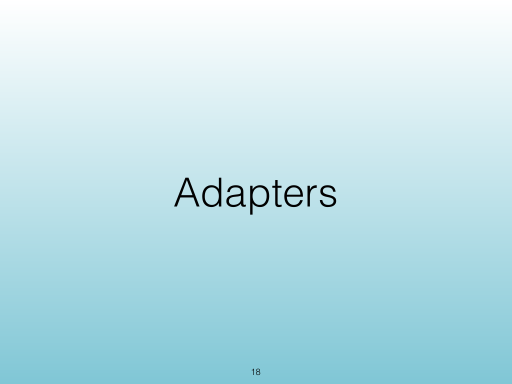{width="100%" fig-alt="Adapters"}

<!-- Slide 18 -->

---

## Source Slide 19

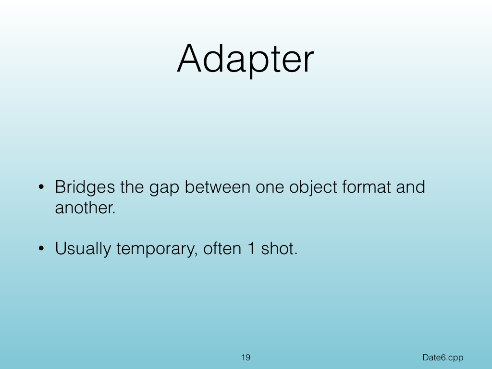{width="100%" fig-alt="Adapter"}

<!-- Slide 19 -->

---

## Source Slide 20

{width="100%" fig-alt="Source Slide 20"}

<!-- Slide 20 -->

---

## Source Slide 21

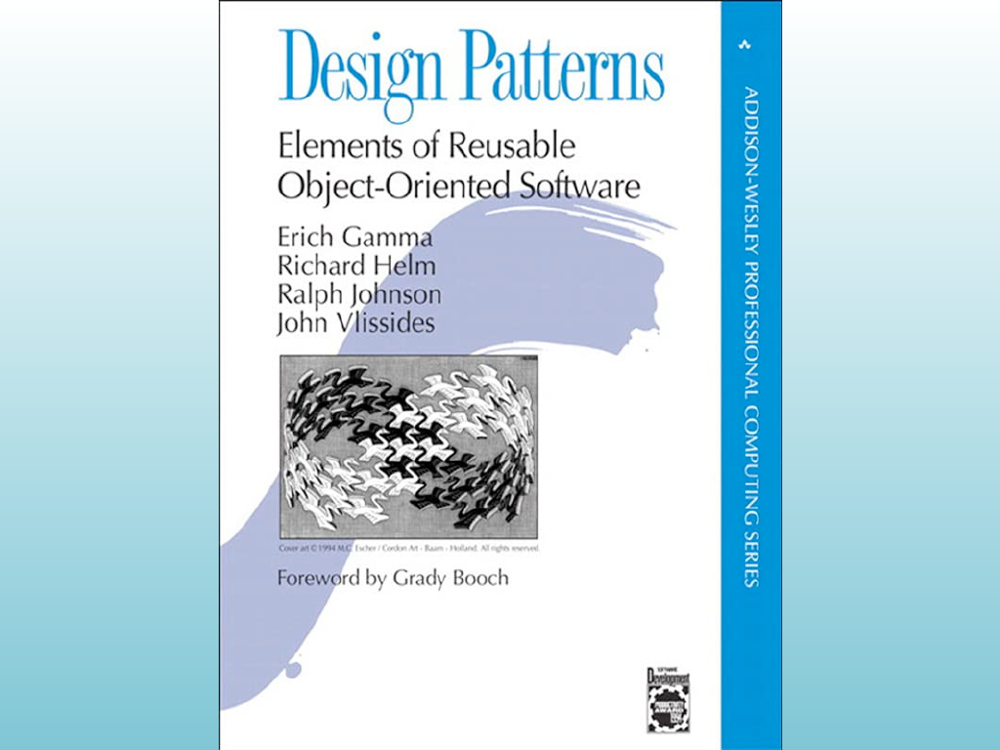{width="100%" fig-alt="Source Slide 21"}

<!-- Slide 21 -->

---

## Source Slide 22

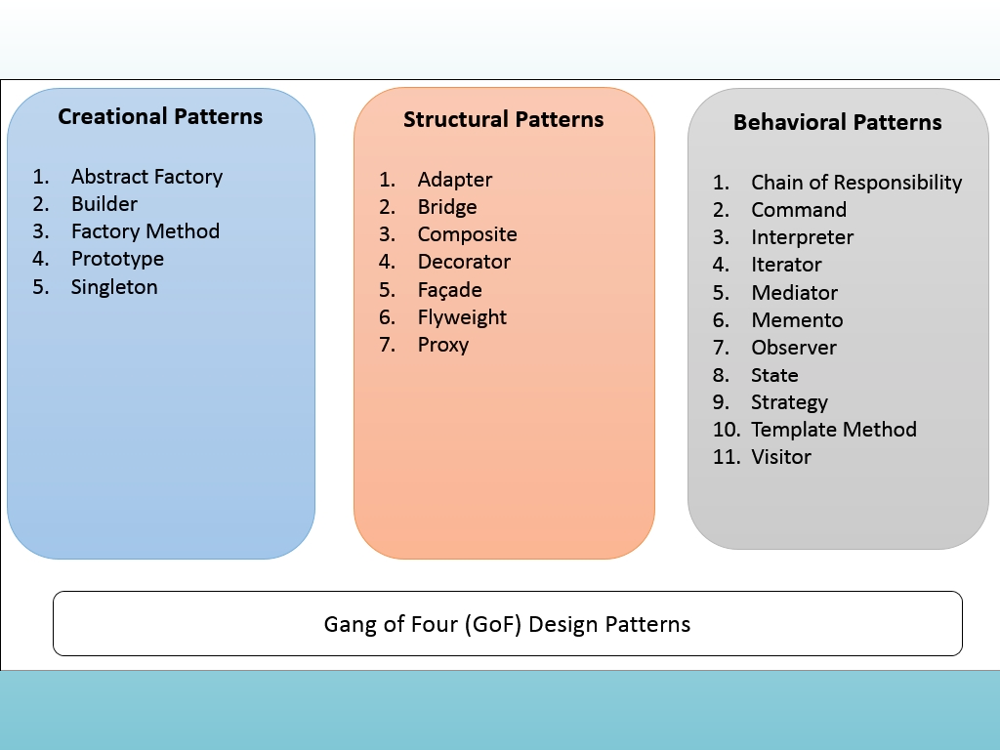{width="100%" fig-alt="Source Slide 22"}

<!-- Slide 22 -->

---

## Source Slide 23

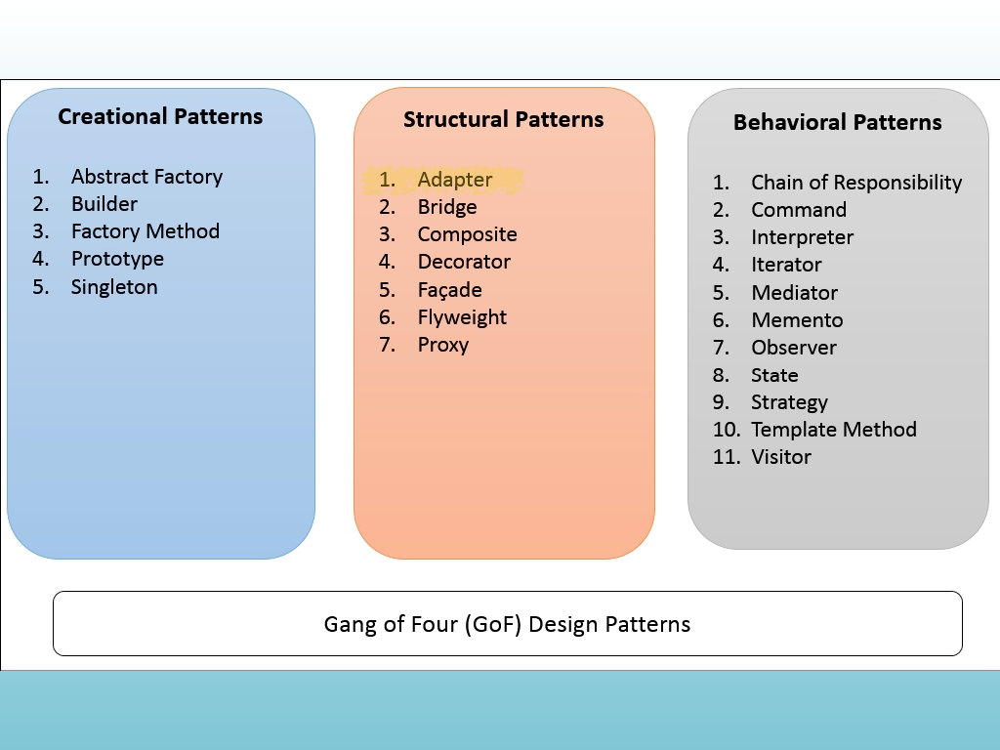{width="100%" fig-alt="Source Slide 23"}

<!-- Slide 23 -->

---

## Source Slide 24

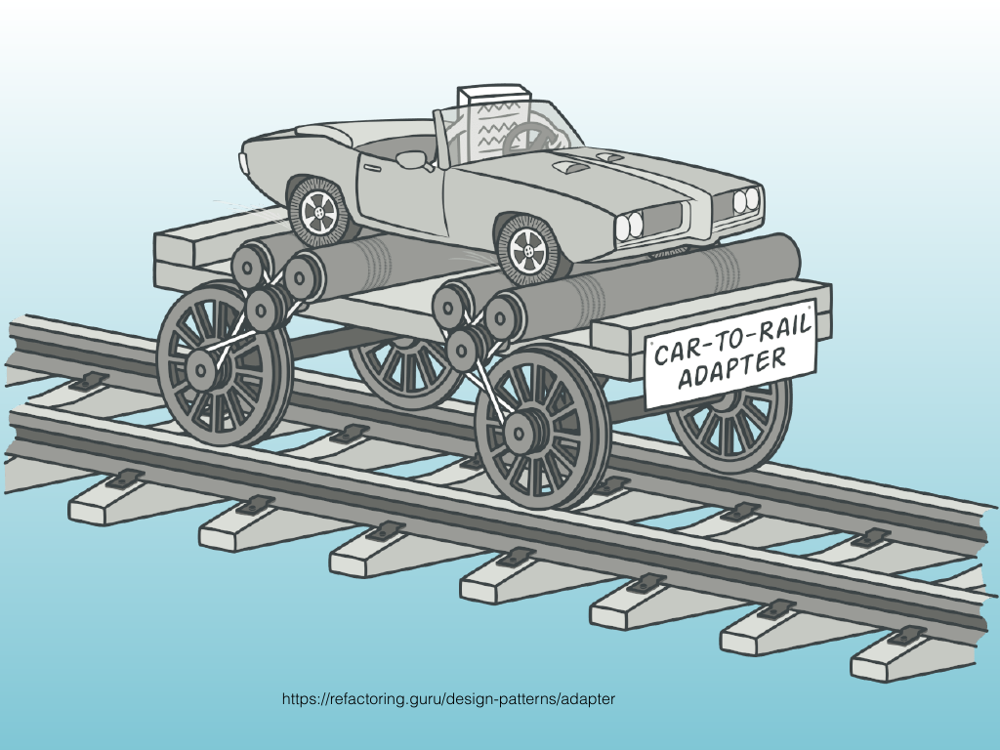{width="100%" fig-alt="https://refactoring.guru/design-patterns/adapter"}

<!-- Slide 24 -->

---

## Source Slide 25

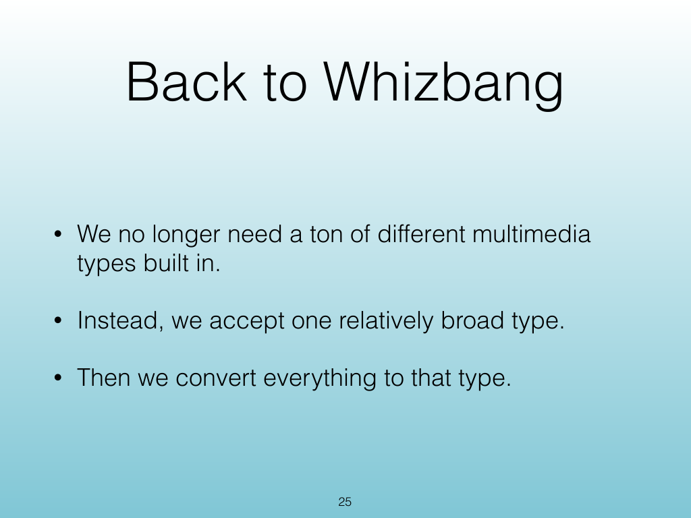{width="100%" fig-alt="Back to Whizbang"}

<!-- Slide 25 -->

---

## Source Slide 26

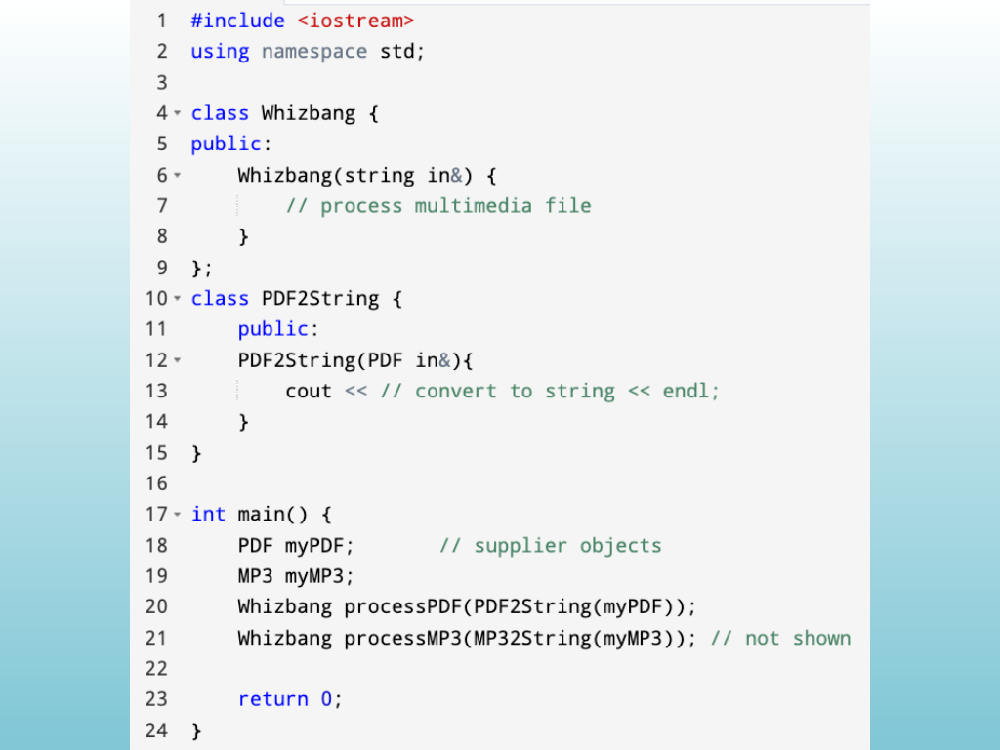{width="100%" fig-alt="Source Slide 26"}

<!-- Slide 26 -->

---

## Source Slide 27

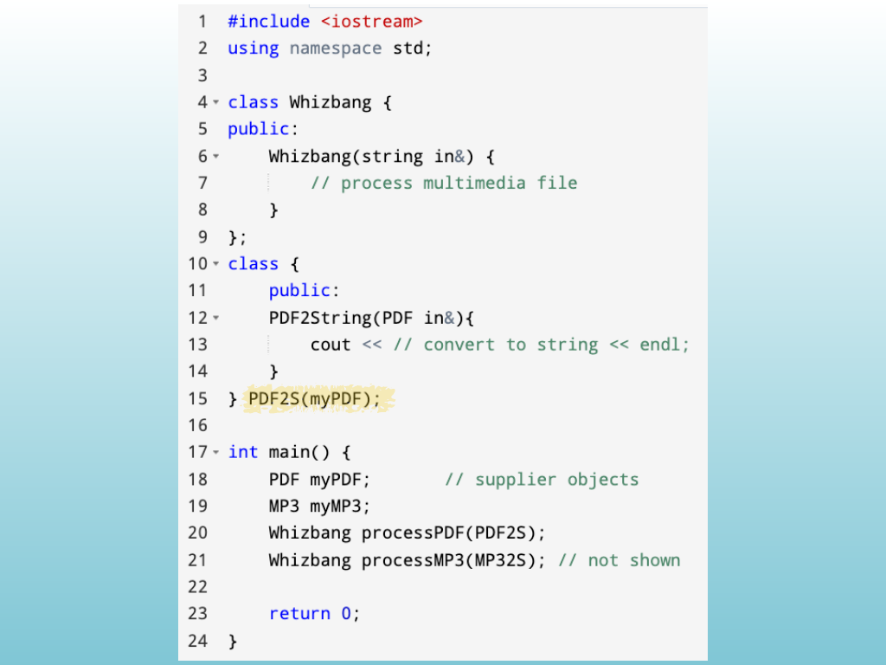{width="100%" fig-alt="Source Slide 27"}

<!-- Slide 27 -->

---

## Source Slide 28

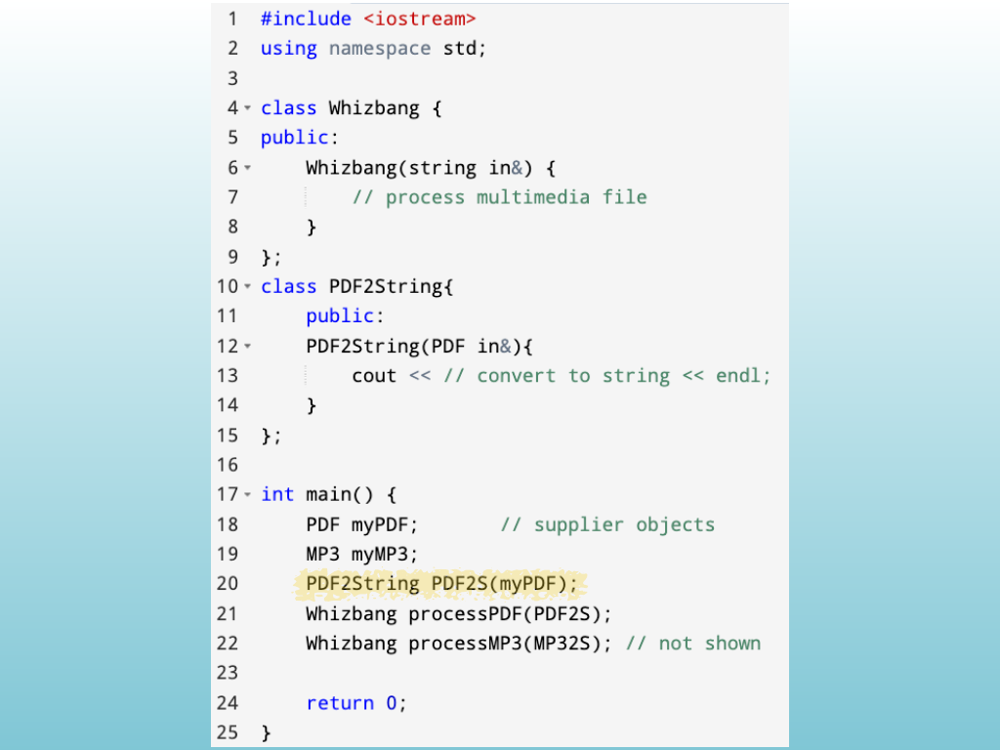{width="100%" fig-alt="Source Slide 28"}

<!-- Slide 28 -->
