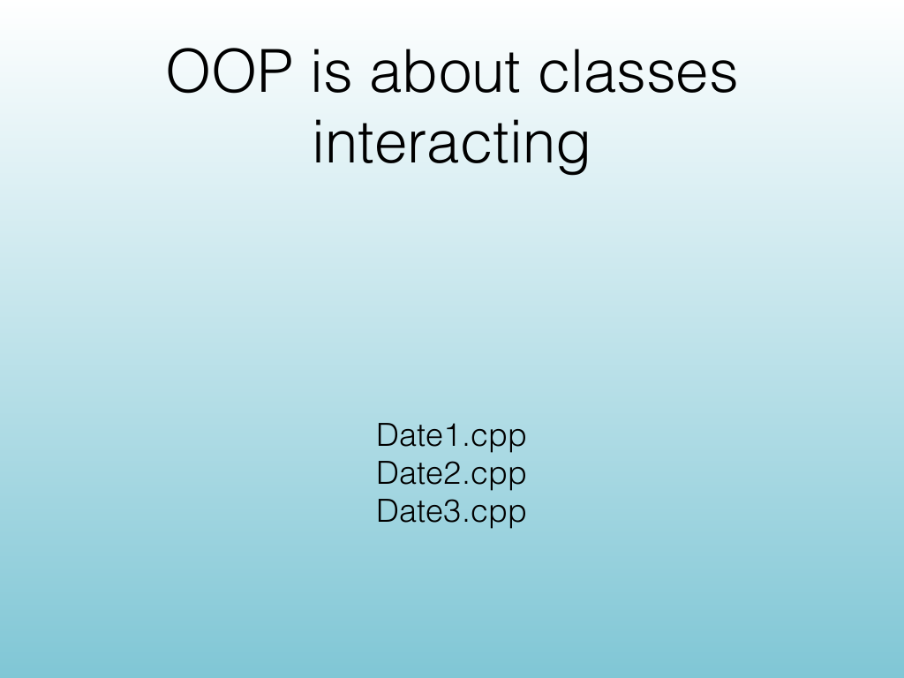
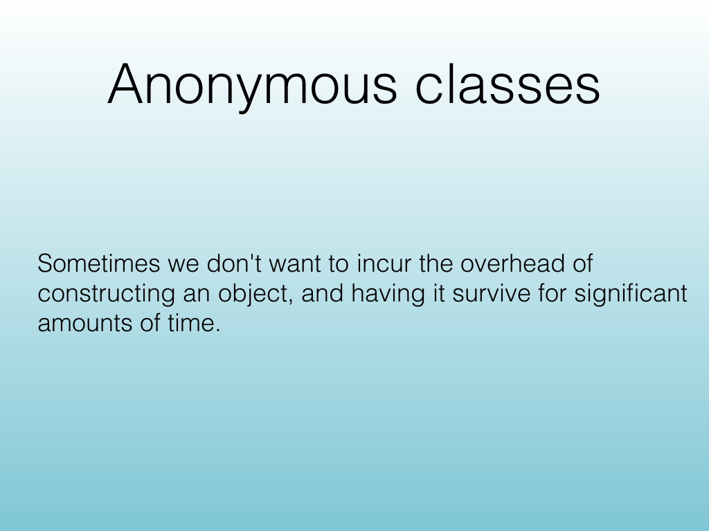
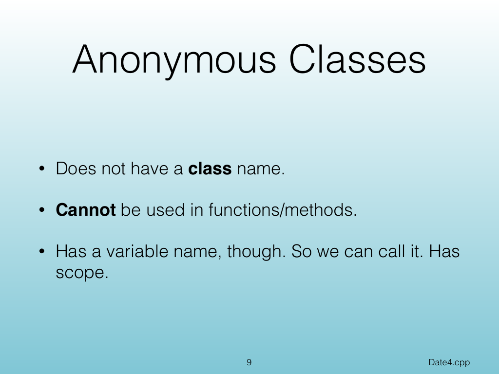
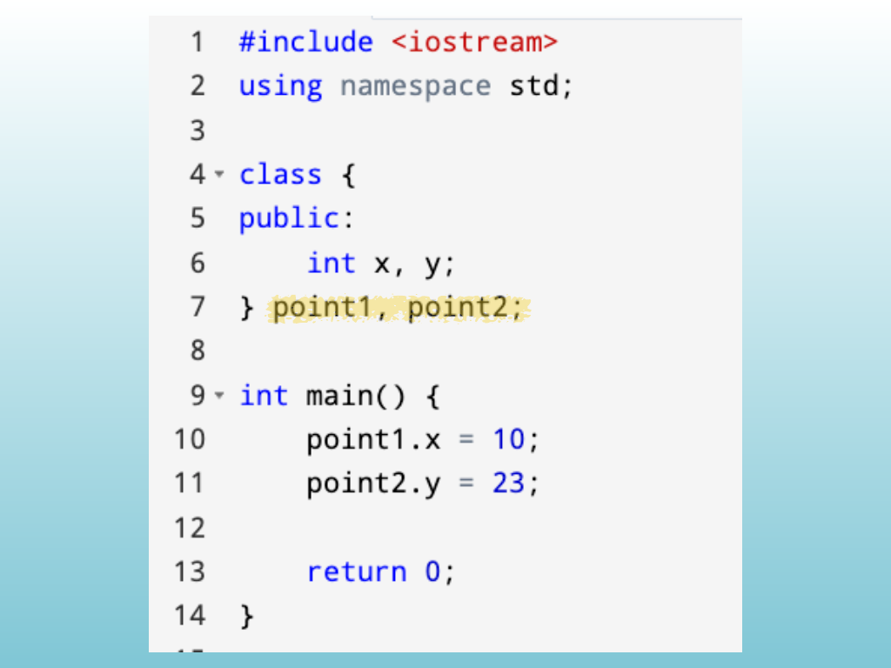
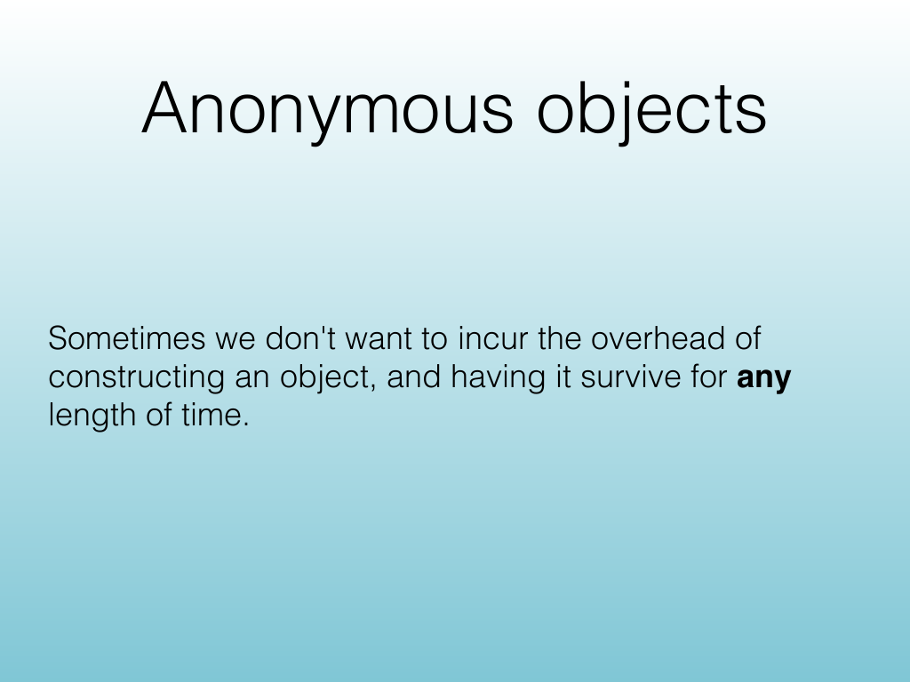
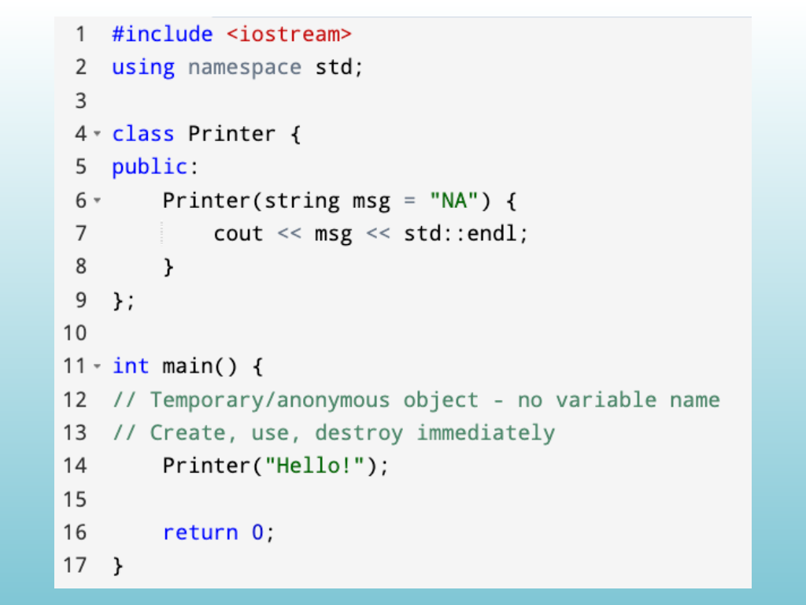
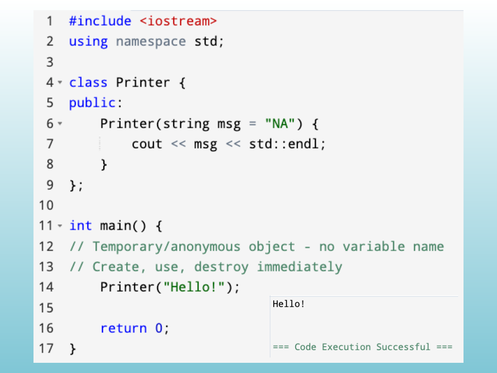
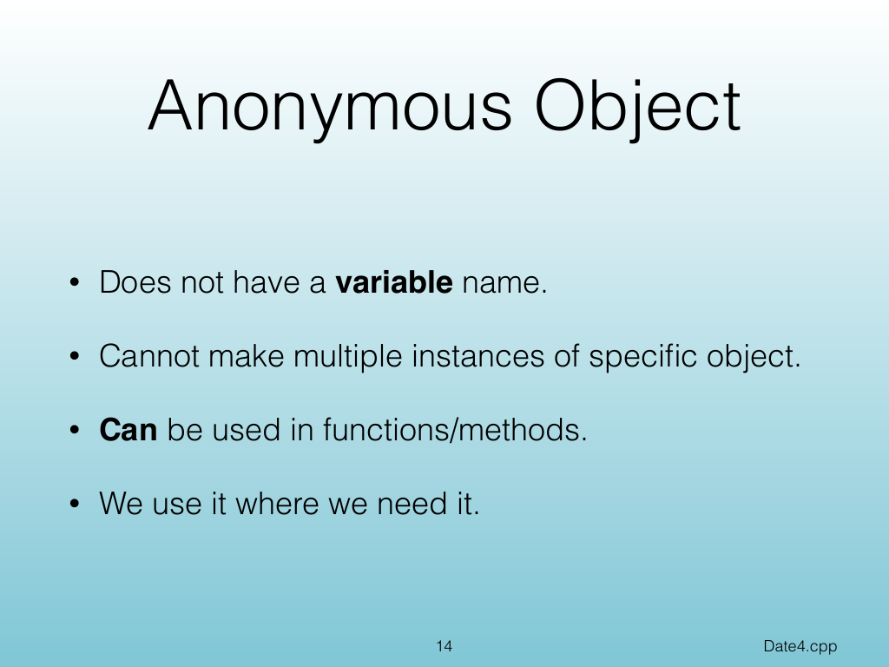

<!-- Topic: Anonymous Classes and Objects -->
<!-- Slides 7–14 -->

# Anonymous Classes and Objects

{width="100%" fig-alt="Anonymous Classes and Objects"}

::: notes
Slides 7–14
Source slide 7 from the authoritative PDF.
:::

<!-- Slide 7 -->

---

## Source Slide 8

{width="100%" fig-alt="Anonymous classes"}

<!-- Slide 8 -->

---

## Source Slide 9

{width="100%" fig-alt="Anonymous Classes"}

<!-- Slide 9 -->

---

## Source Slide 10

{width="100%" fig-alt="Source Slide 10"}

<!-- Slide 10 -->

---

## Source Slide 11

{width="100%" fig-alt="Anonymous objects"}

<!-- Slide 11 -->

---

## Source Slide 12

{width="100%" fig-alt="Source Slide 12"}

<!-- Slide 12 -->

---

## Source Slide 13

{width="100%" fig-alt="Source Slide 13"}

<!-- Slide 13 -->

---

## Source Slide 14

{width="100%" fig-alt="Anonymous Object"}

<!-- Slide 14 -->
