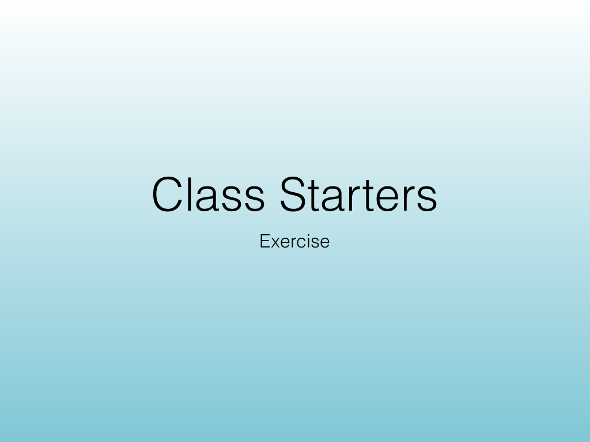
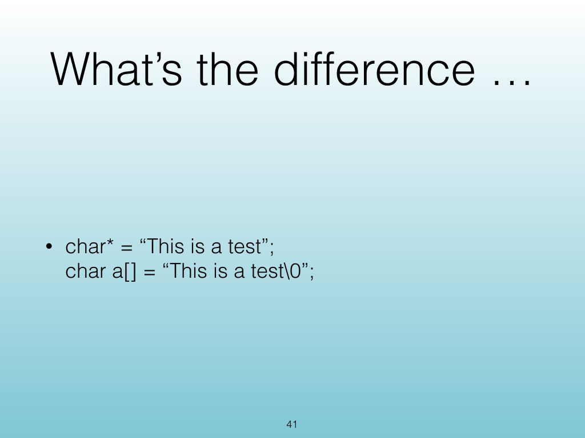
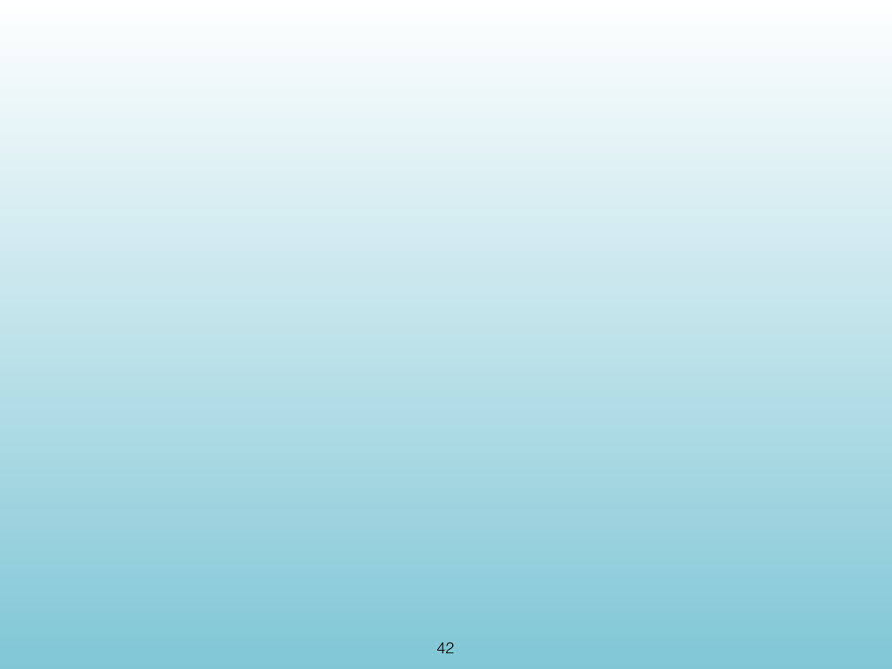
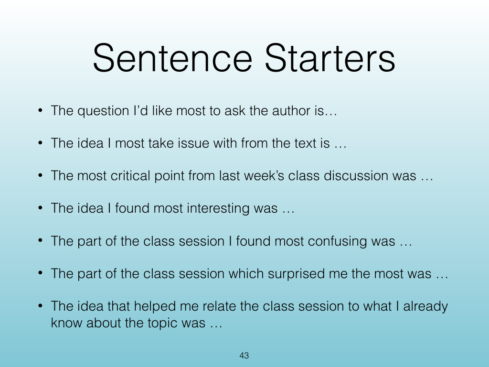

<!-- Topic: Class Starters -->
<!-- Slides 40–43 -->

# Class Starters

{width="100%" fig-alt="Class Starters"}

::: notes
Slides 40–43
Source slide 40 from the authoritative PDF.
:::

<!-- Slide 40 -->

---

## Source Slide 41

{width="100%" fig-alt="What’s the difference …"}

<!-- Slide 41 -->

---

## Source Slide 42

{width="100%" fig-alt="42"}

<!-- Slide 42 -->

---

## Source Slide 43

{width="100%" fig-alt="Sentence Starters"}

<!-- Slide 43 -->
