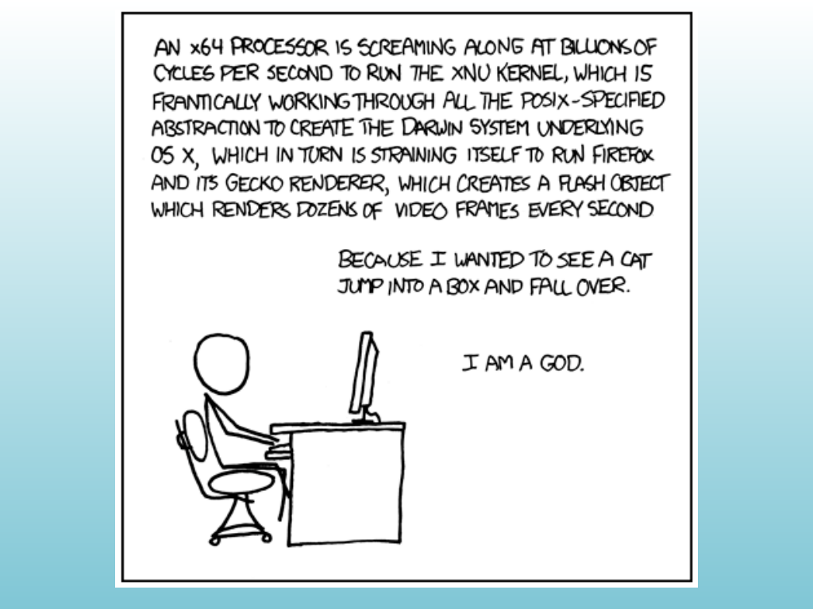

<!-- Topic: Course Framing -->
<!-- Slides 1–4 -->

# Course Framing

<!-- Slide 1 -->

---

## Source Slide 2

{width="100%" fig-alt="Source Slide 2"}

<!-- Slide 2 -->

---

## Last Time

::: {.incremental}
+ **Relationships**
+ **Arrays of Objects on the Stack and Heap**
+ **Resource Acquisition Is Initialization**
:::

<!-- Slide 3 -->

---

## Agenda

- Topic 2 — Anonymous Classes and Objects
- Topic 3 — Design Patterns
- Topic 4 — Singleton Pattern
- Topic 5 — Adapter Pattern

<!-- Slide 4 -->
