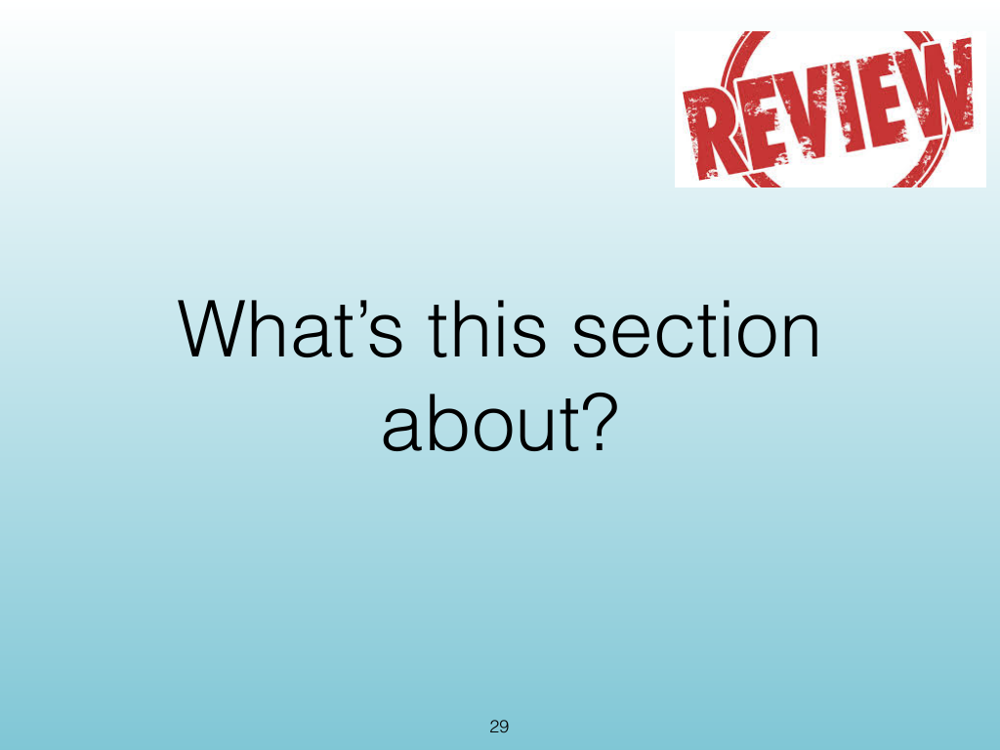

<!-- Topic: Lecture Wrap-Up -->
<!-- Slides 30–34 -->

# Lecture Wrap-Up

{width="100%" fig-alt="Lecture Wrap-Up"}

::: notes
Slides 29–33
Source slide 29 from the authoritative PDF.
:::

<!-- Slide 30 -->

---

## Source Slide 30

{width="100%" fig-alt="• Learning OOP is about objects working together."}

<!-- Slide 31 -->

---

## Source Slide 31

{width="100%" fig-alt="31"}

<!-- Slide 32 -->

---

## Source Slide 32

{width="100%" fig-alt="Ch 11 - More OOP"}

<!-- Slide 33 -->

---

## Source Slide 33

{width="100%" fig-alt="Homework 2 Peer Review due Sunday."}

<!-- Slide 34 -->
