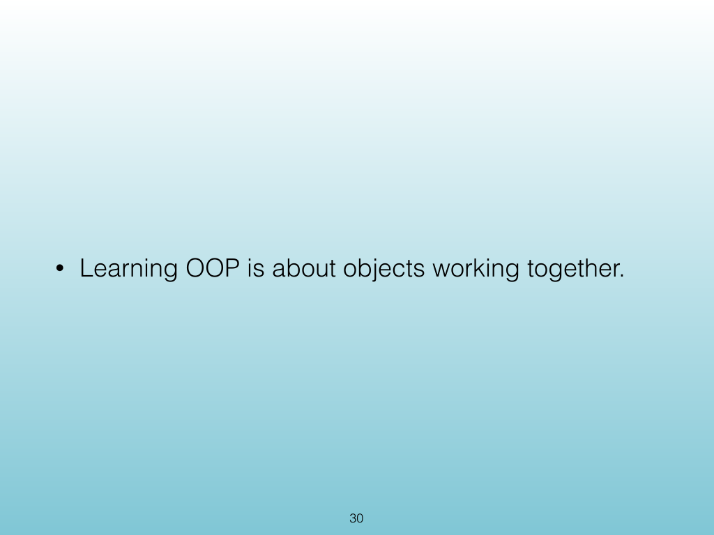
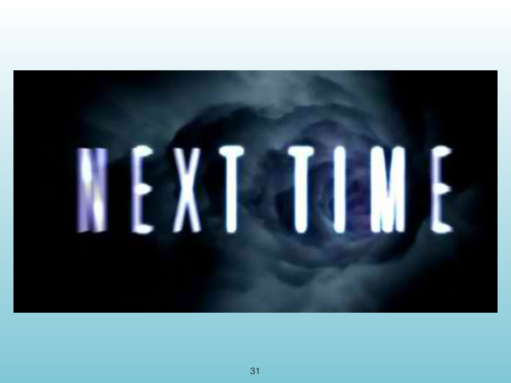
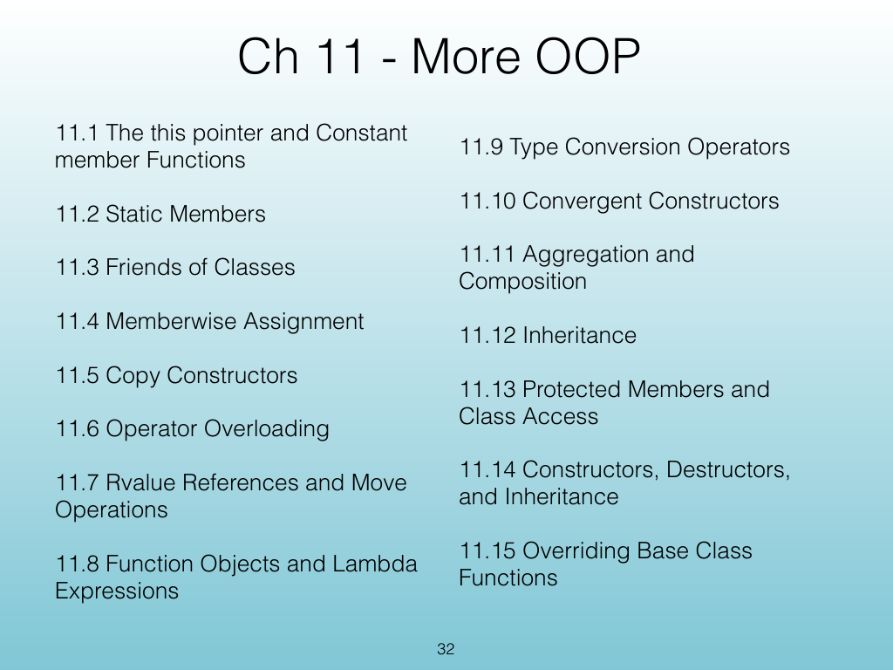
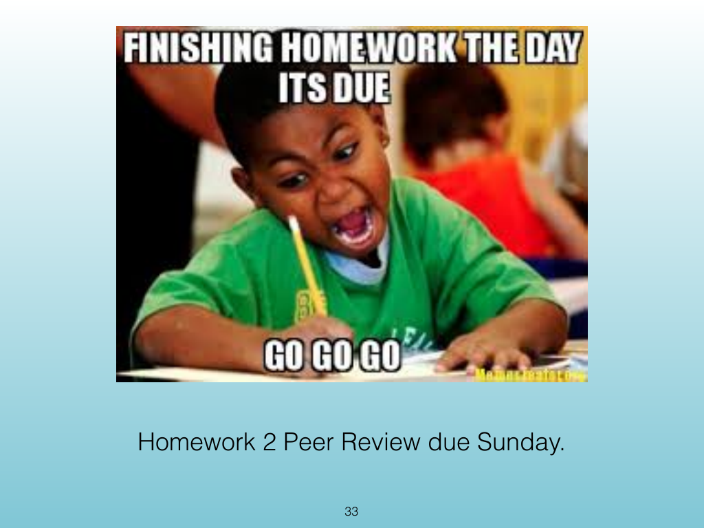

<!-- Topic: Lecture Wrap-Up -->
<!-- Slides 52–56 -->

# Lecture Wrap-Up

<!-- Slide 52 -->

---

## Source Slide 30

{width="100%" fig-alt="• Learning OOP is about objects working together."}

<!-- Slide 53 -->

---

## Source Slide 31

{width="100%" fig-alt="31"}

<!-- Slide 54 -->

---

## Source Slide 32

{width="100%" fig-alt="Ch 11 - More OOP"}

<!-- Slide 55 -->

---

## Source Slide 33

{width="100%" fig-alt="Homework 2 Peer Review due Sunday."}

<!-- Slide 56 -->
