<!-- Topic: C-Strings and Character Arrays -->
<!-- Slides 12–25 -->

# C-Strings and Character Arrays

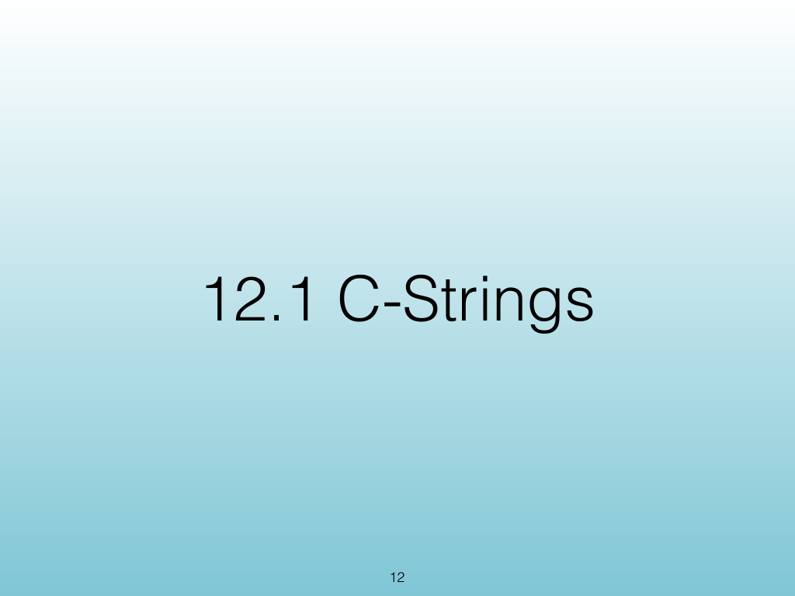{width="100%" fig-alt="C-Strings and Character Arrays"}

::: notes
Slides 12–25
Source slide 12 from the authoritative PDF.
:::

<!-- Slide 12 -->

---

## Source Slide 13

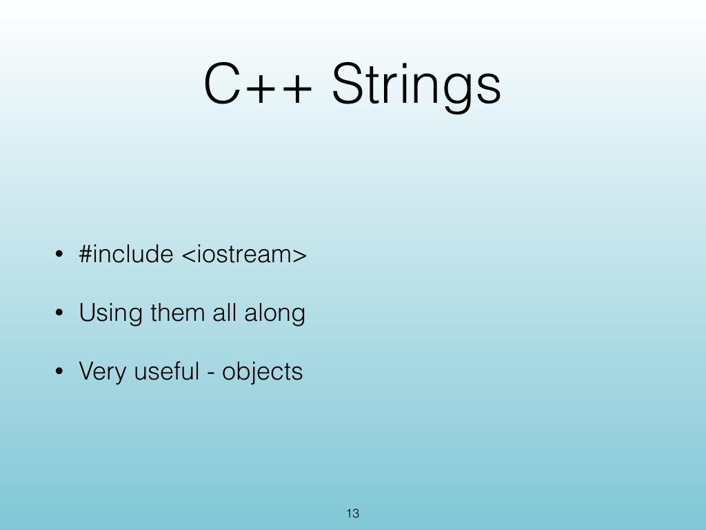{width="100%" fig-alt="C++ Strings"}

<!-- Slide 13 -->

---

## Source Slide 14

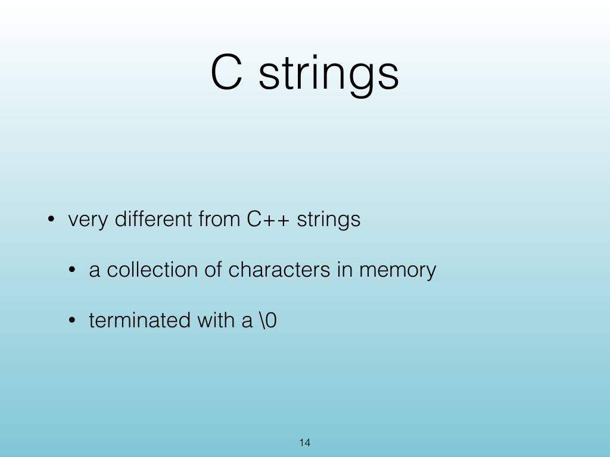{width="100%" fig-alt="C strings"}

<!-- Slide 14 -->

---

## Source Slide 15

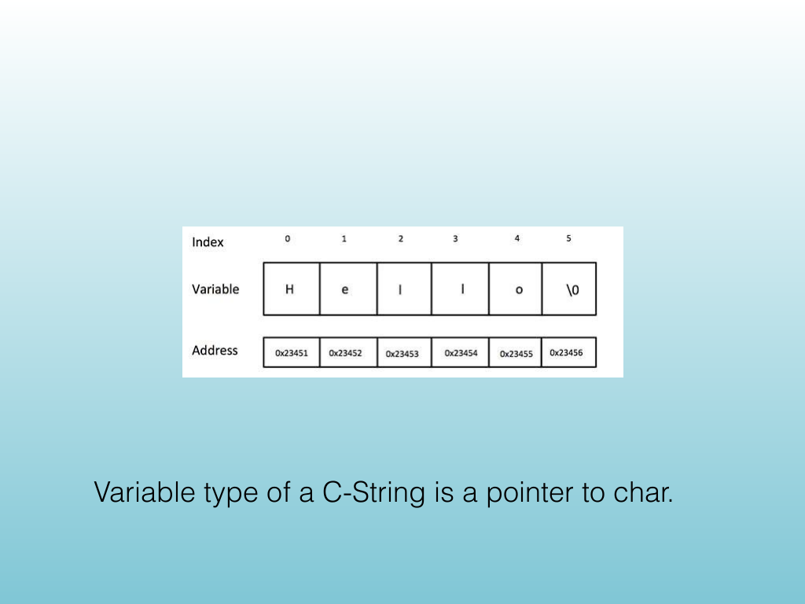{width="100%" fig-alt="Variable type of a C-String is a pointer to char."}

<!-- Slide 15 -->

---

## Source Slide 16

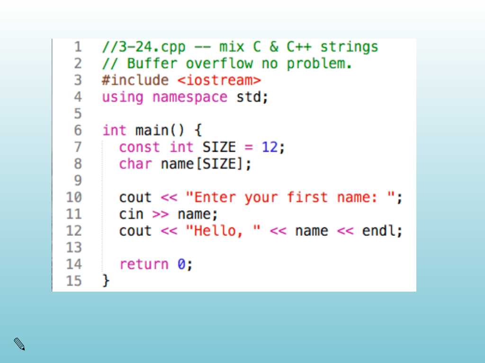{width="100%" fig-alt="✎"}

<!-- Slide 16 -->

---

## Source Slide 17

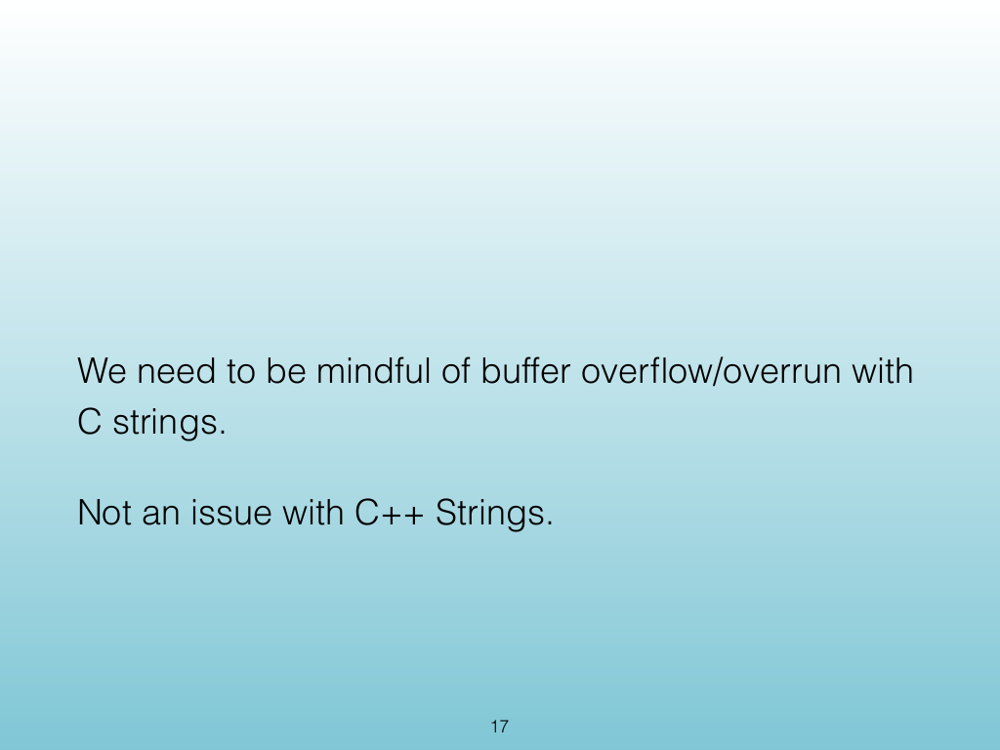{width="100%" fig-alt="We need to be mindful of buffer over ow/overrun with"}

<!-- Slide 17 -->

---

## Source Slide 18

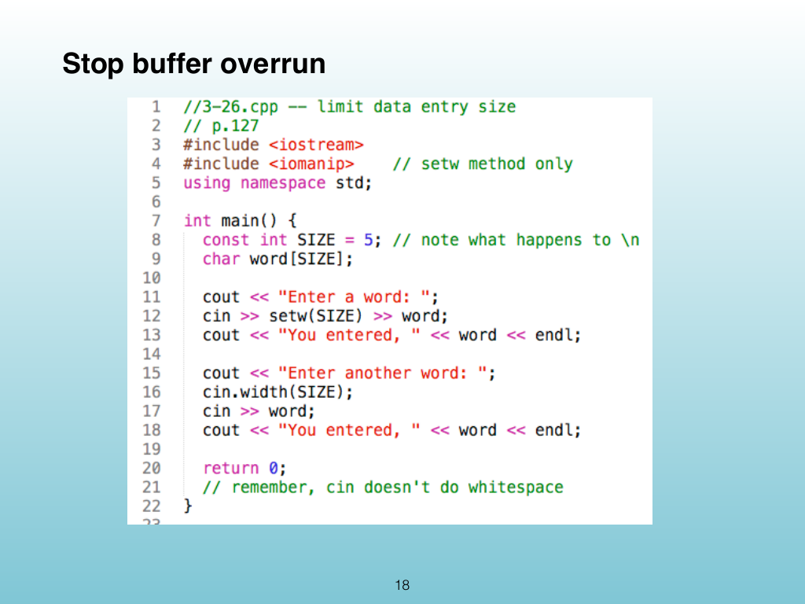{width="100%" fig-alt="Stop buffer overrun"}

<!-- Slide 18 -->

---

## Source Slide 19

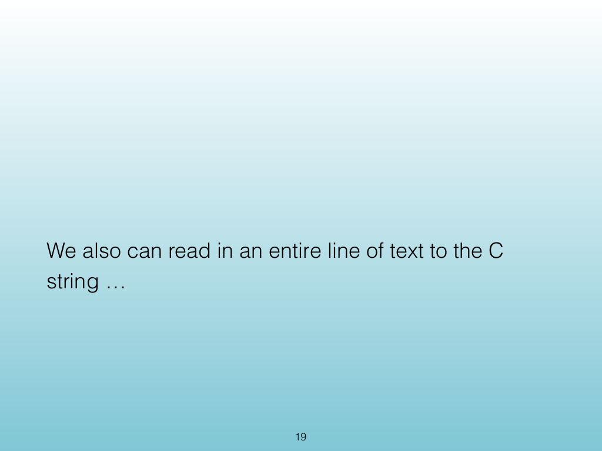{width="100%" fig-alt="We also can read in an entire line of text to the C"}

<!-- Slide 19 -->

---

## Source Slide 20

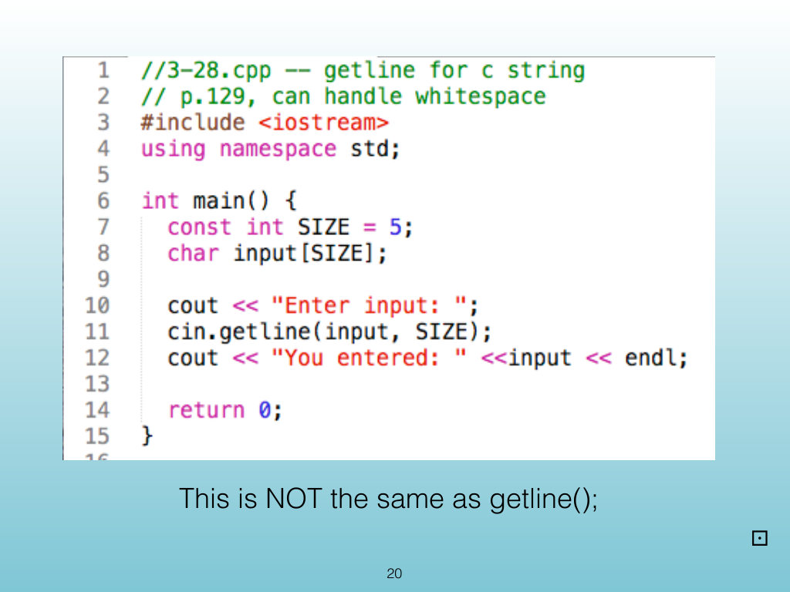{width="100%" fig-alt="This is NOT the same as getline();"}

<!-- Slide 20 -->

---

## Source Slide 21

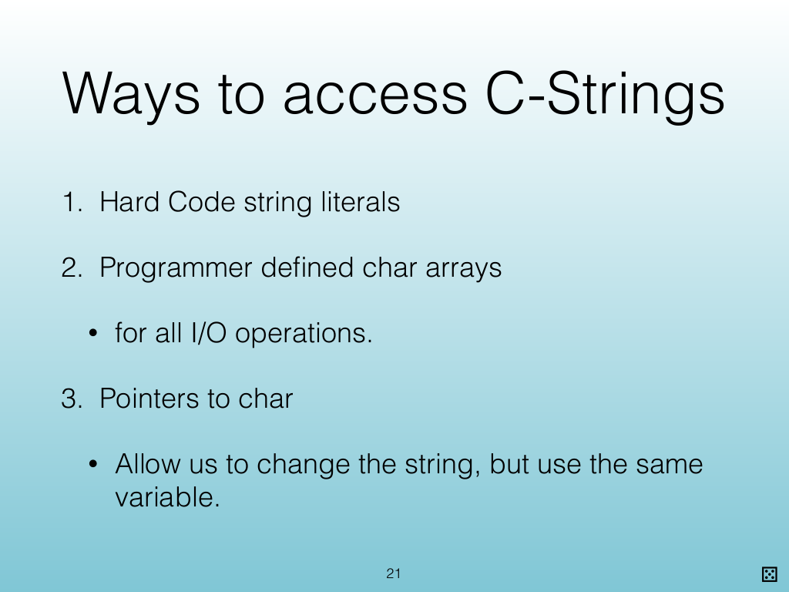{width="100%" fig-alt="Ways to access C-Strings"}

<!-- Slide 21 -->

---

## Source Slide 22

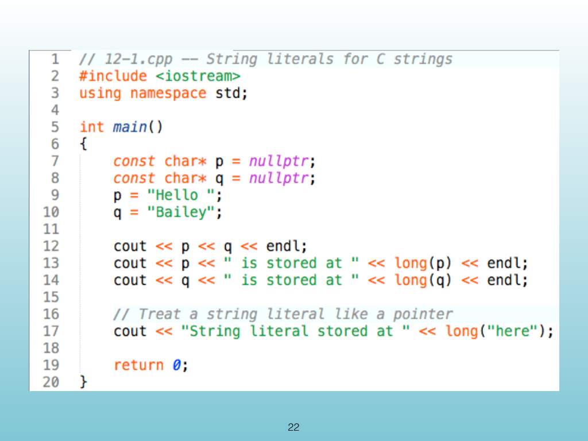{width="100%" fig-alt="22"}

<!-- Slide 22 -->

---

## Source Slide 23

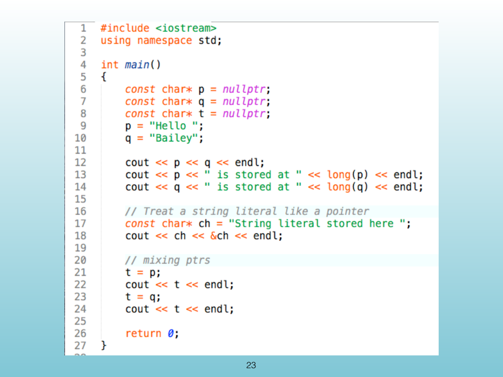{width="100%" fig-alt="23"}

<!-- Slide 23 -->

---

## Source Slide 24

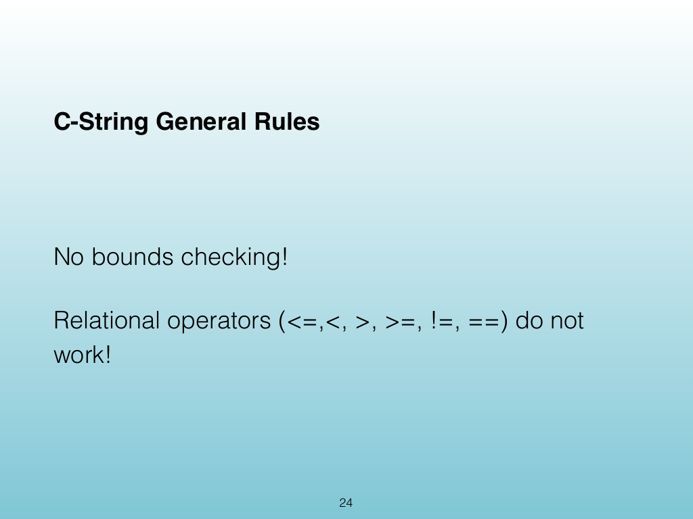{width="100%" fig-alt="C-String General Rules"}

<!-- Slide 24 -->

---

## Source Slide 25

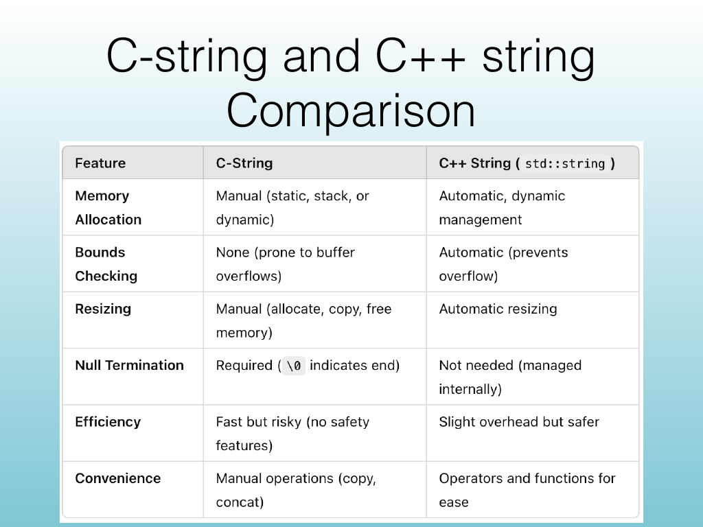{width="100%" fig-alt="C-string and C++ string"}

<!-- Slide 25 -->
