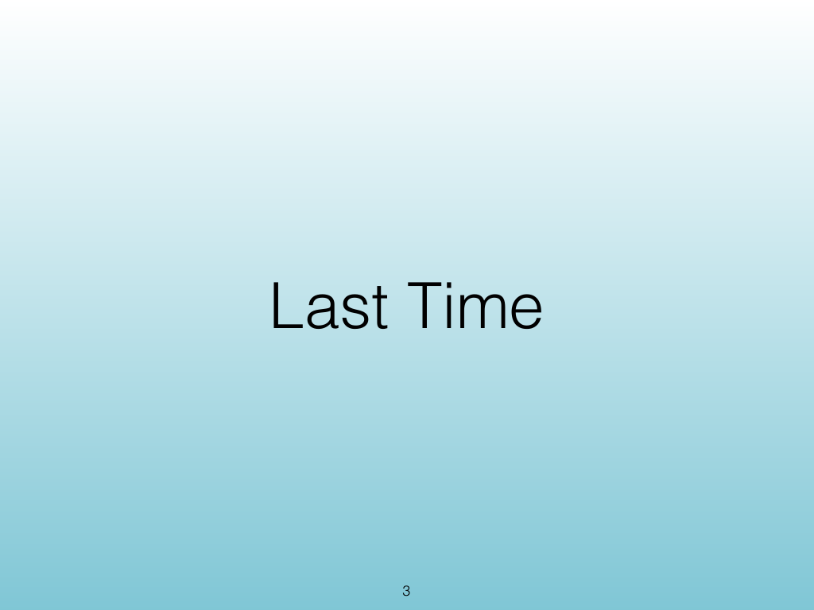
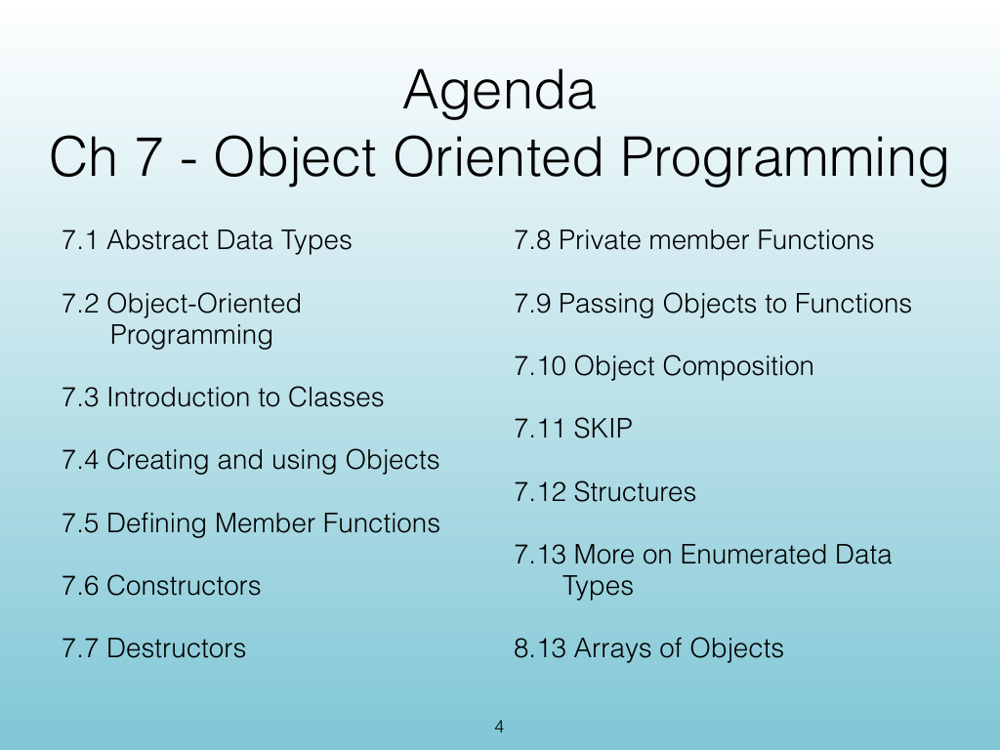
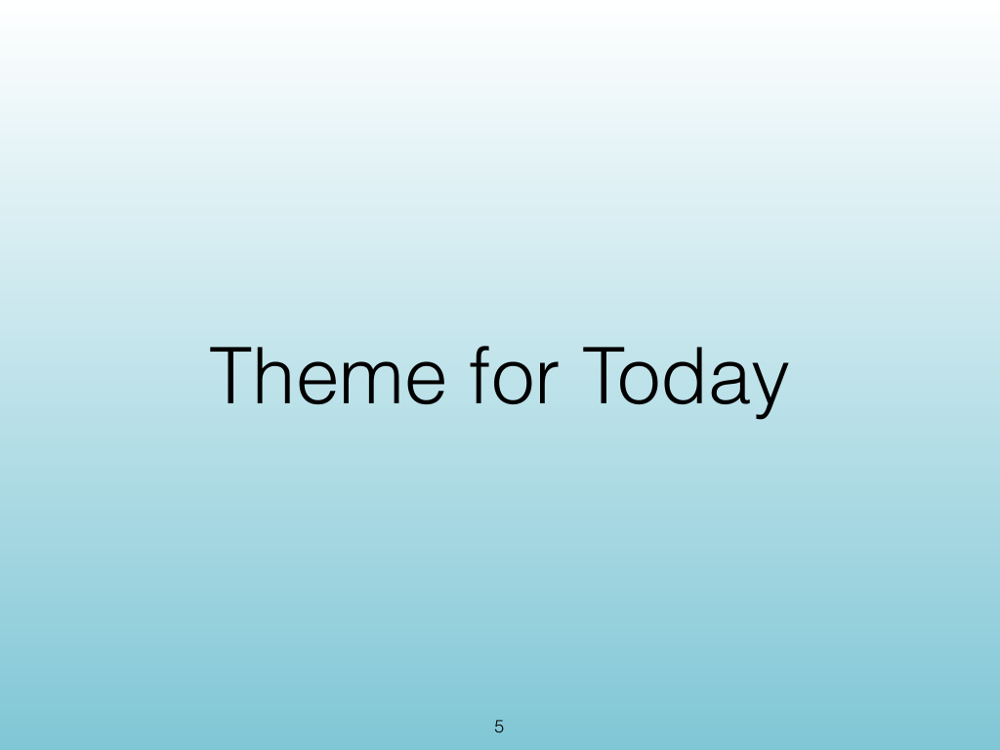
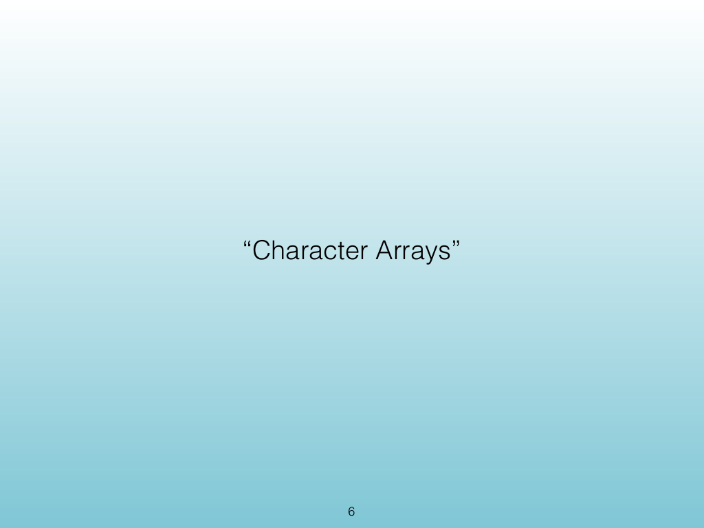
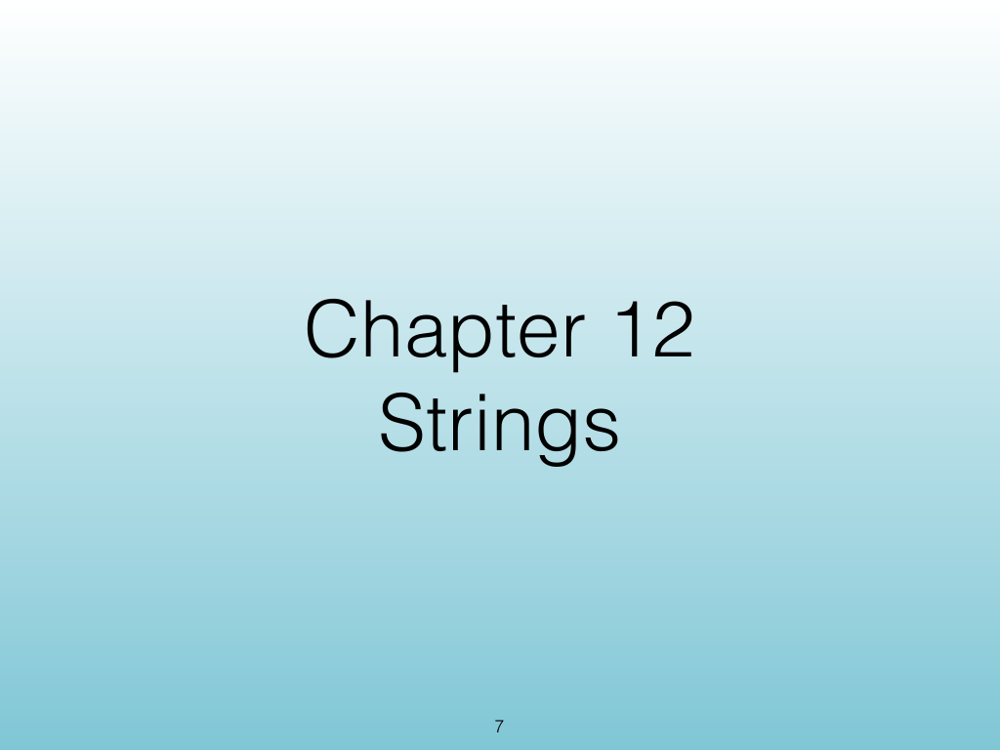
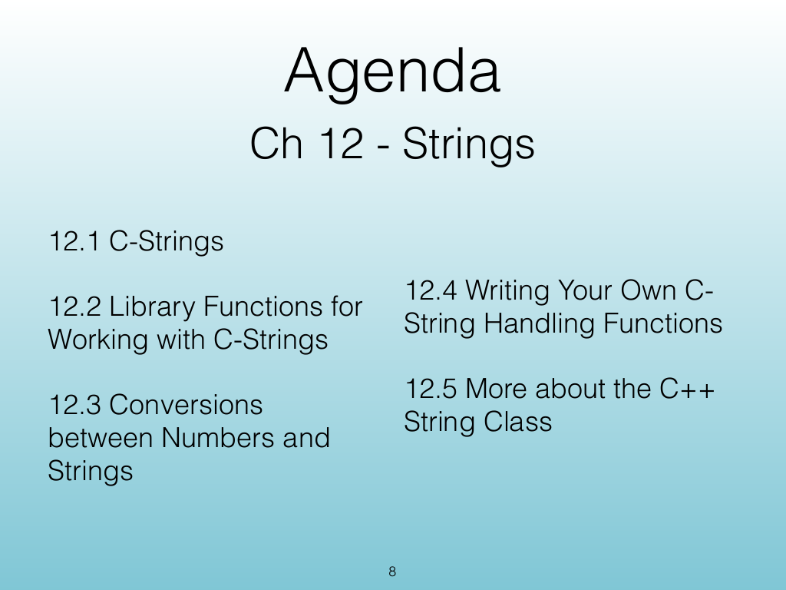
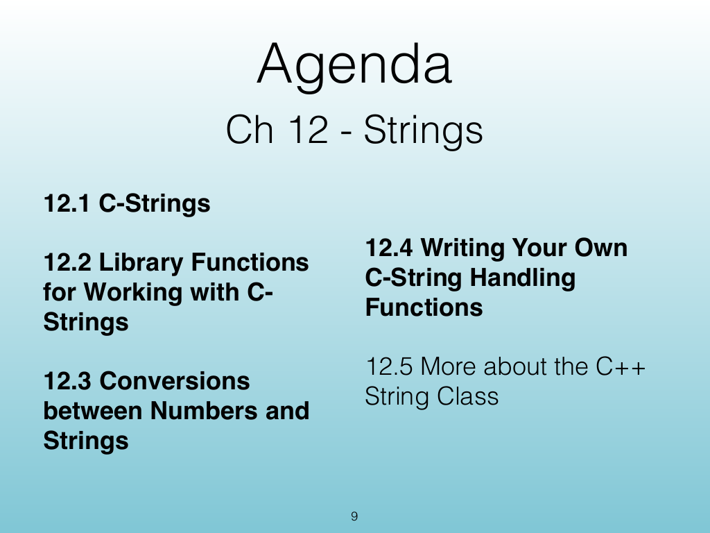
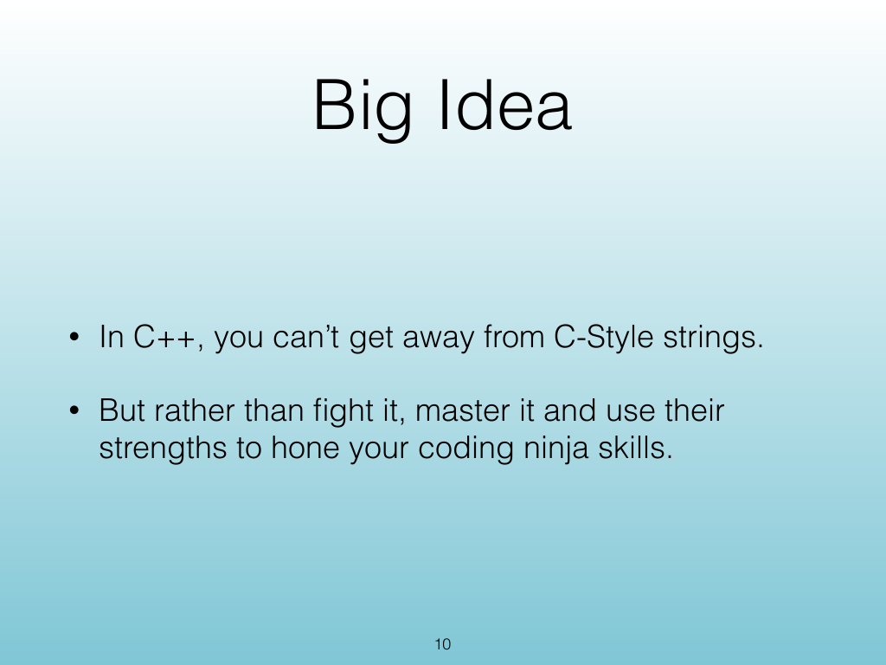
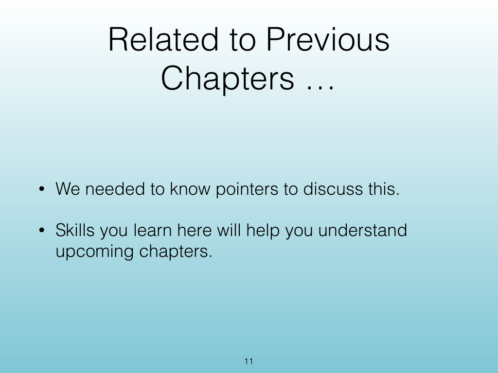

<!-- Topic: Course Framing -->
<!-- Slides 1–11 -->

# Course Framing

{width="100%" fig-alt="Course Framing"}

::: notes
Slides 1–11
Source slide 1 from the authoritative PDF.
:::

<!-- Slide 1 -->

---

## Source Slide 2

{width="100%" fig-alt="Source Slide 2"}

<!-- Slide 2 -->

---

## Source Slide 3

{width="100%" fig-alt="Last Time"}

<!-- Slide 3 -->

---

## Source Slide 4

{width="100%" fig-alt="Agenda"}

<!-- Slide 4 -->

---

## Source Slide 5

{width="100%" fig-alt="Theme for Today"}

<!-- Slide 5 -->

---

## Source Slide 6

{width="100%" fig-alt="“Character Arrays”"}

<!-- Slide 6 -->

---

## Source Slide 7

{width="100%" fig-alt="Chapter 12"}

<!-- Slide 7 -->

---

## Source Slide 8

{width="100%" fig-alt="Agenda"}

<!-- Slide 8 -->

---

## Source Slide 9

{width="100%" fig-alt="Agenda"}

<!-- Slide 9 -->

---

## Source Slide 10

{width="100%" fig-alt="Big Idea"}

<!-- Slide 10 -->

---

## Source Slide 11

{width="100%" fig-alt="Related to Previous"}

<!-- Slide 11 -->
