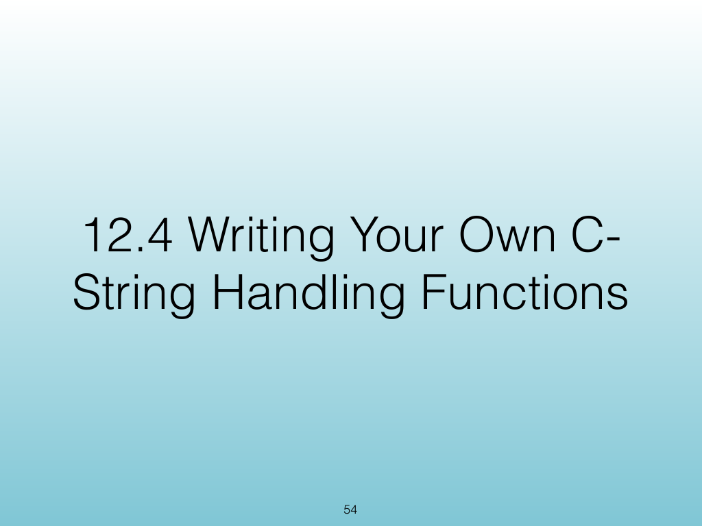
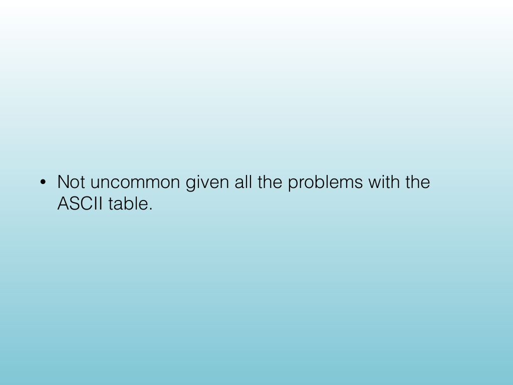
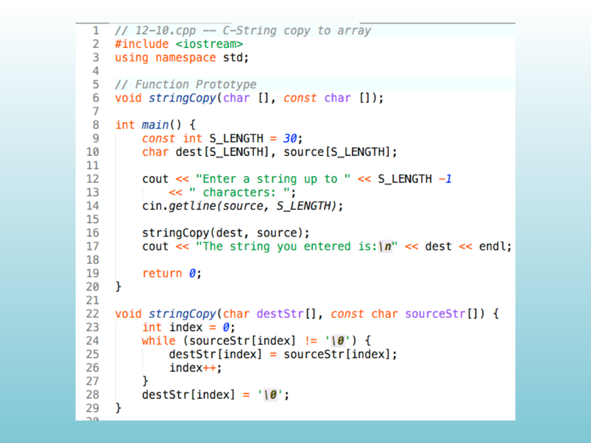
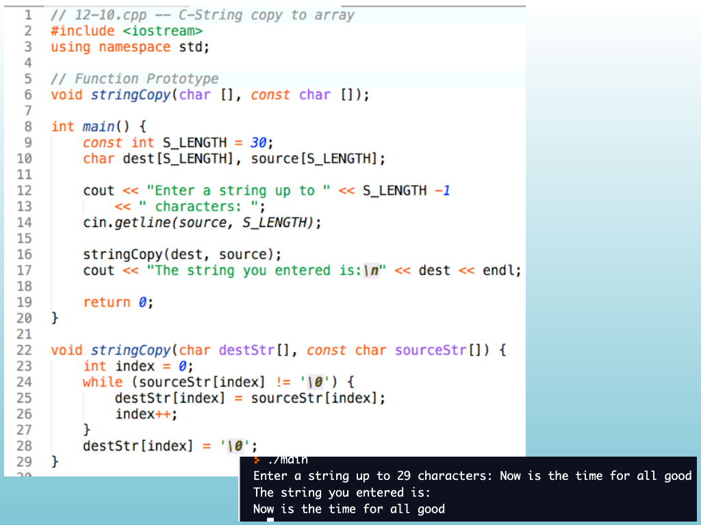
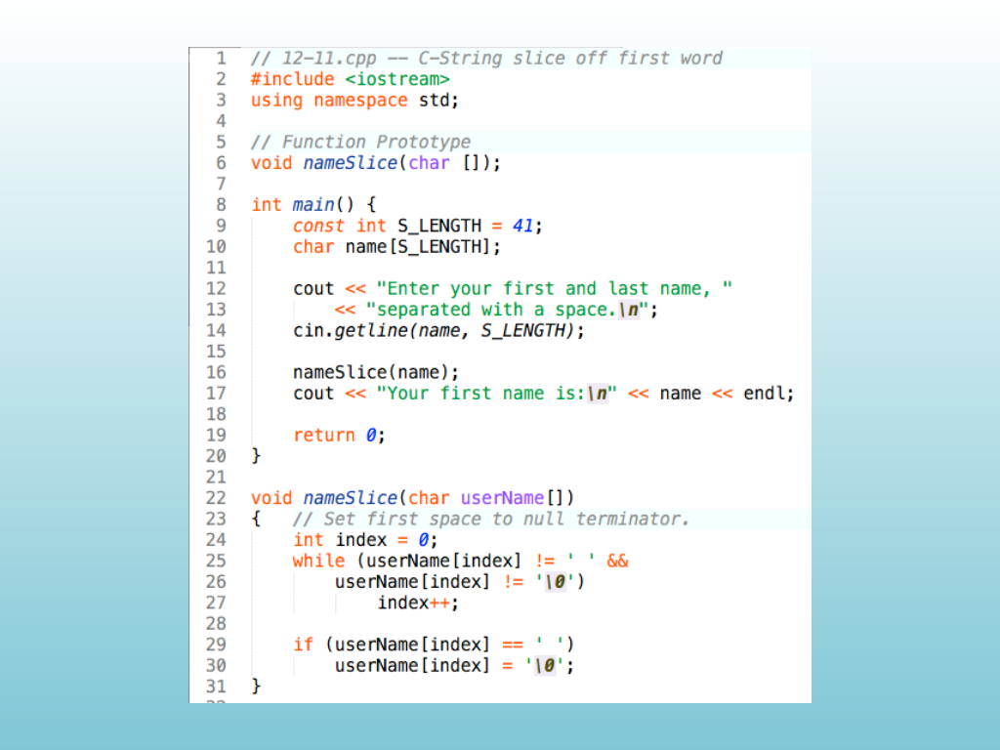
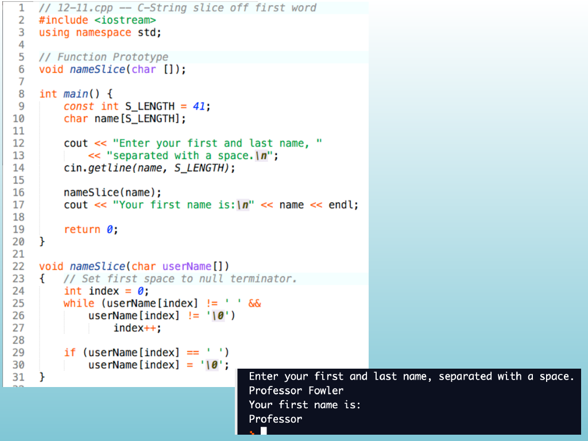
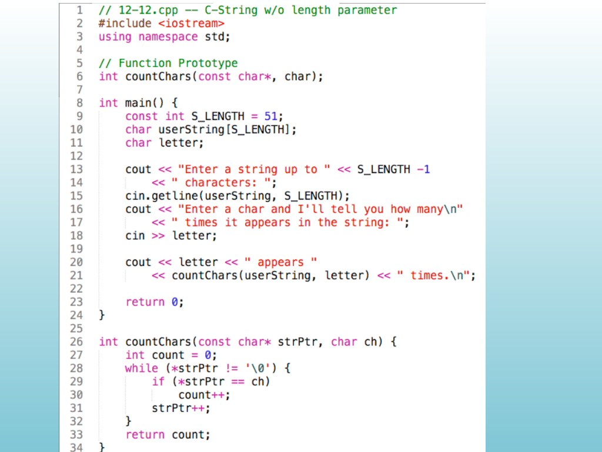
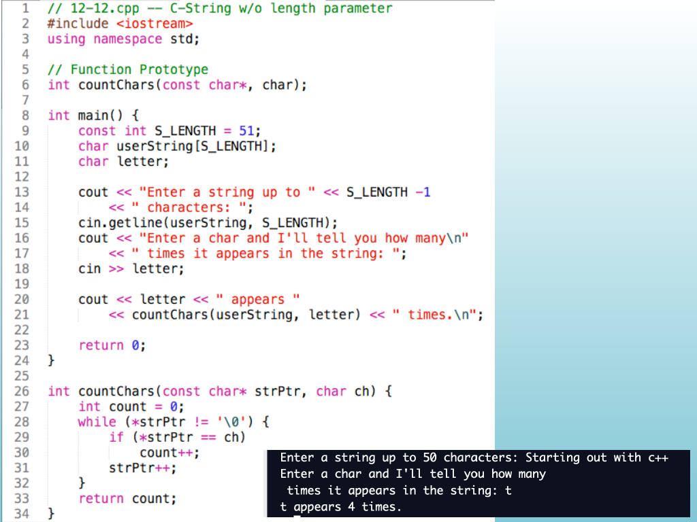

<!-- Topic: Writing C-String Handling Functions -->
<!-- Slides 54–61 -->

# Writing C-String Handling Functions

{width="100%" fig-alt="Writing C-String Handling Functions"}

::: notes
Slides 54–61
Source slide 54 from the authoritative PDF.
:::

<!-- Slide 54 -->

---

## Source Slide 55

{width="100%" fig-alt="• Not uncommon given all the problems with the"}

<!-- Slide 55 -->

---

## Source Slide 56

{width="100%" fig-alt="Source Slide 56"}

<!-- Slide 56 -->

---

## Source Slide 57

{width="100%" fig-alt="Source Slide 57"}

<!-- Slide 57 -->

---

## Source Slide 58

{width="100%" fig-alt="Source Slide 58"}

<!-- Slide 58 -->

---

## Source Slide 59

{width="100%" fig-alt="Source Slide 59"}

<!-- Slide 59 -->

---

## Source Slide 60

{width="100%" fig-alt="Source Slide 60"}

<!-- Slide 60 -->

---

## Source Slide 61

{width="100%" fig-alt="Source Slide 61"}

<!-- Slide 61 -->
