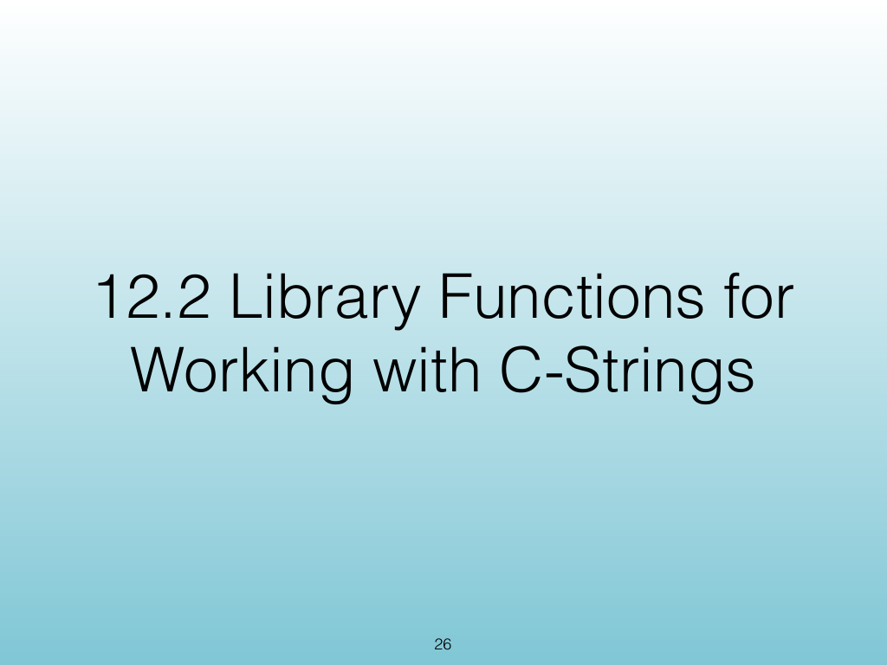
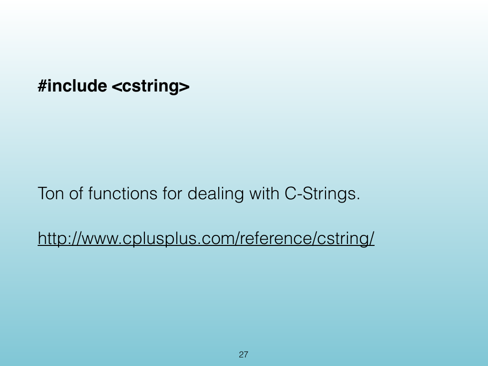
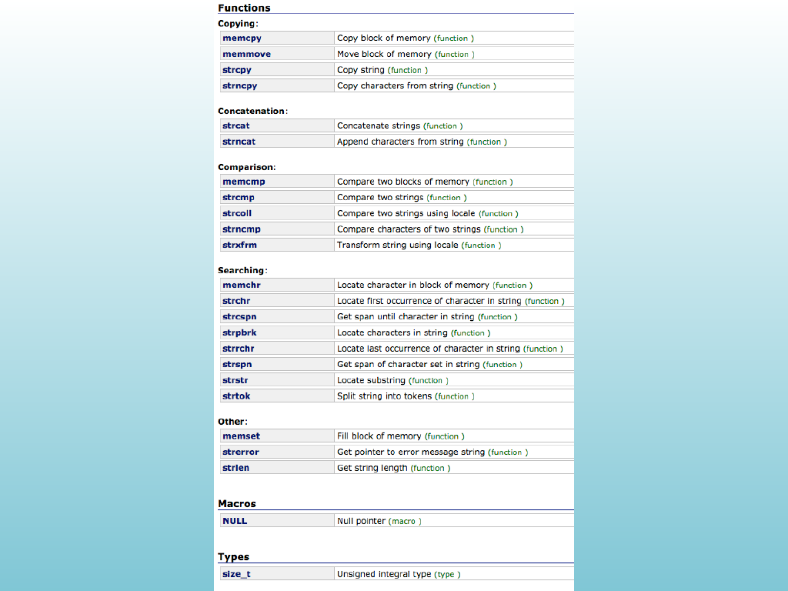
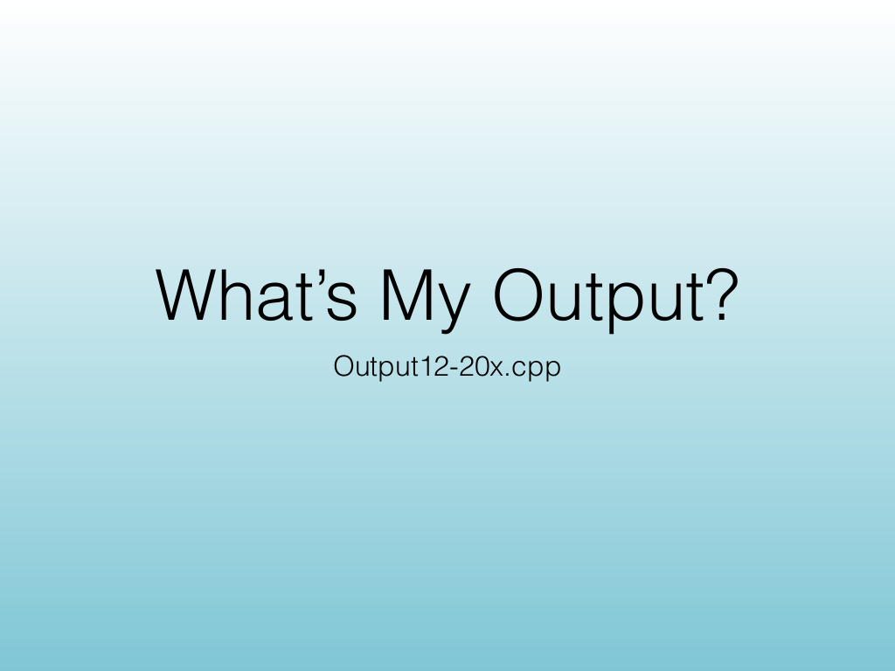
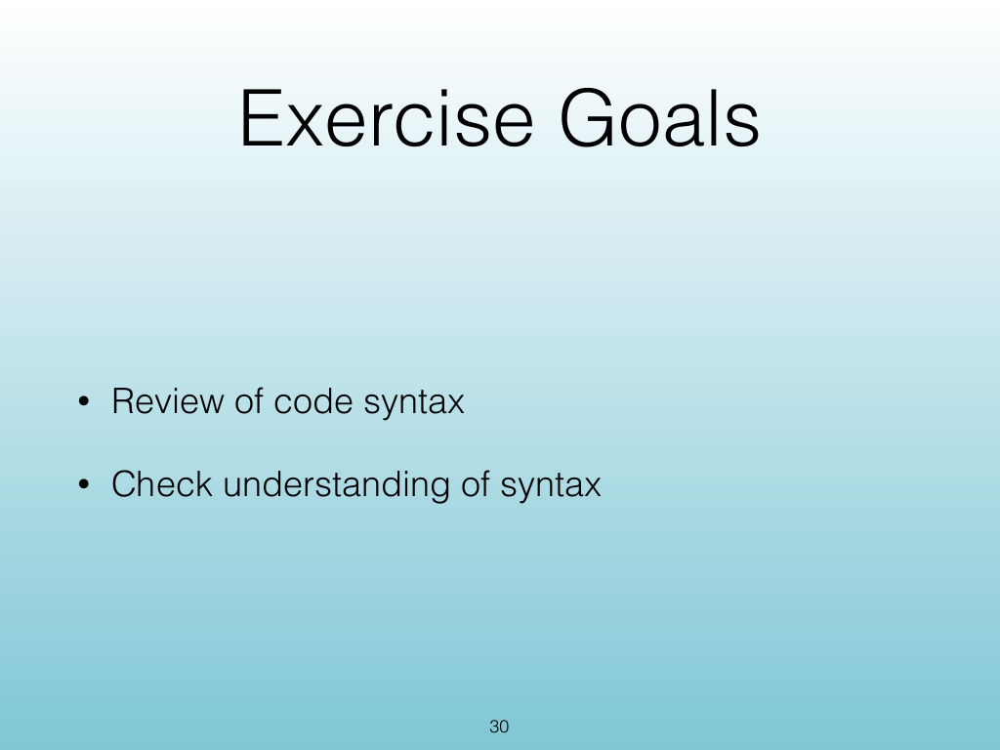
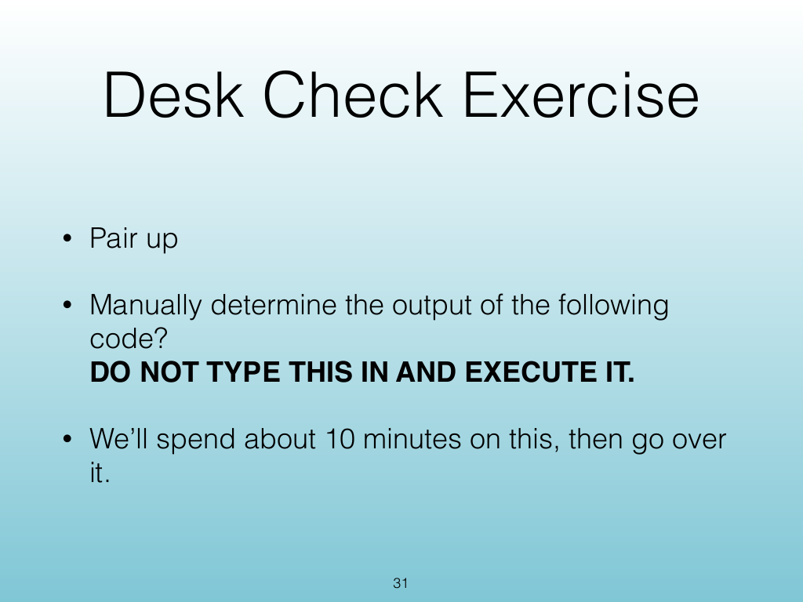
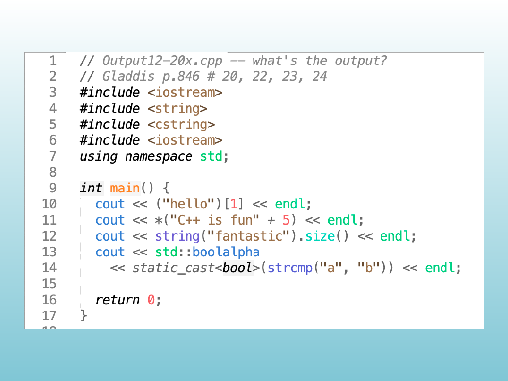
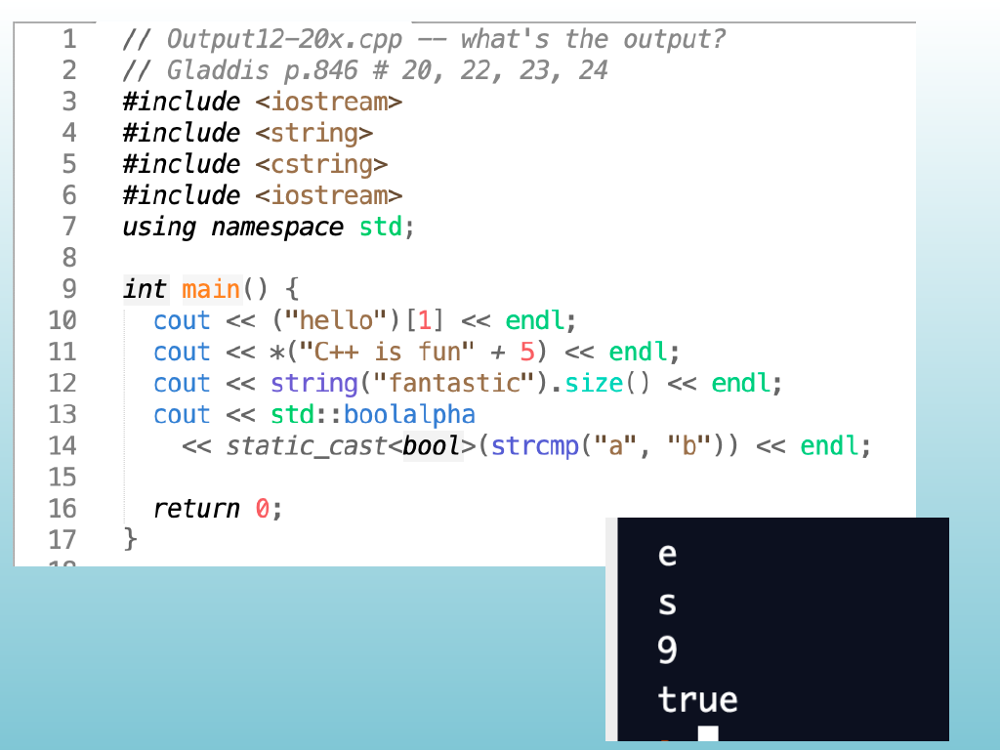

<!-- Topic: C-String Library Functions -->
<!-- Slides 26–33 -->

# C-String Library Functions

{width="100%" fig-alt="C-String Library Functions"}

::: notes
Slides 26–33
Source slide 26 from the authoritative PDF.
:::

<!-- Slide 26 -->

---

## Source Slide 27

{width="100%" fig-alt="#include <cstring>"}

<!-- Slide 27 -->

---

## Source Slide 28

{width="100%" fig-alt="28"}

<!-- Slide 28 -->

---

## Source Slide 29

{width="100%" fig-alt="What’s My Output?"}

<!-- Slide 29 -->

---

## Source Slide 30

{width="100%" fig-alt="Exercise Goals"}

<!-- Slide 30 -->

---

## Source Slide 31

{width="100%" fig-alt="Desk Check Exercise"}

<!-- Slide 31 -->

---

## Source Slide 32

{width="100%" fig-alt="Source Slide 32"}

<!-- Slide 32 -->

---

## Source Slide 33

{width="100%" fig-alt="Source Slide 33"}

<!-- Slide 33 -->
