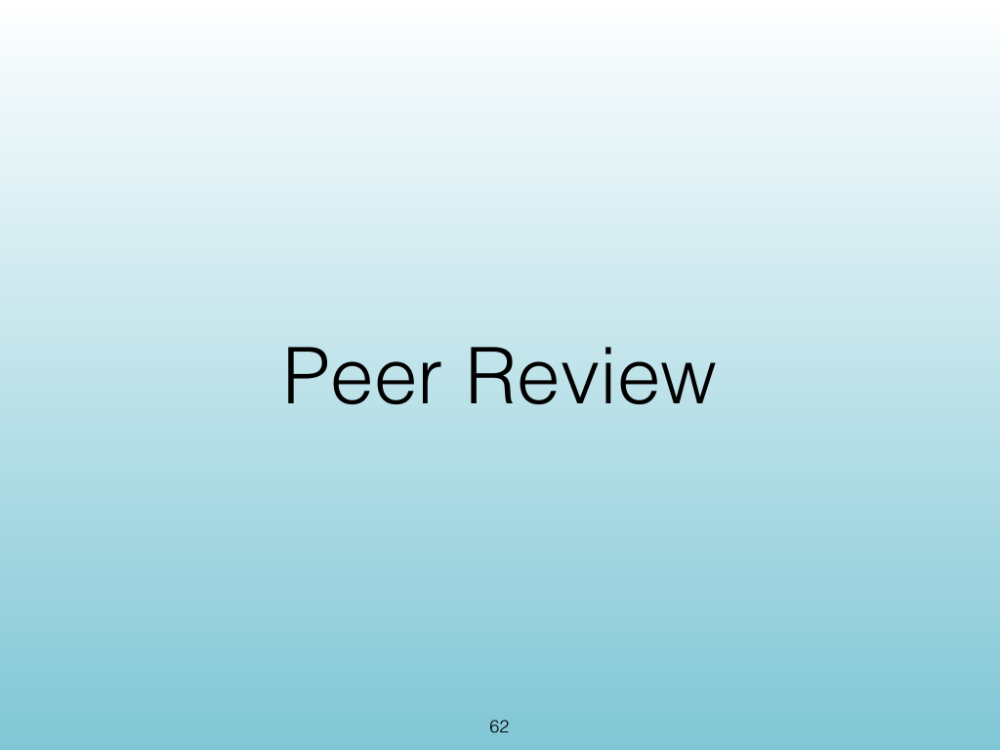
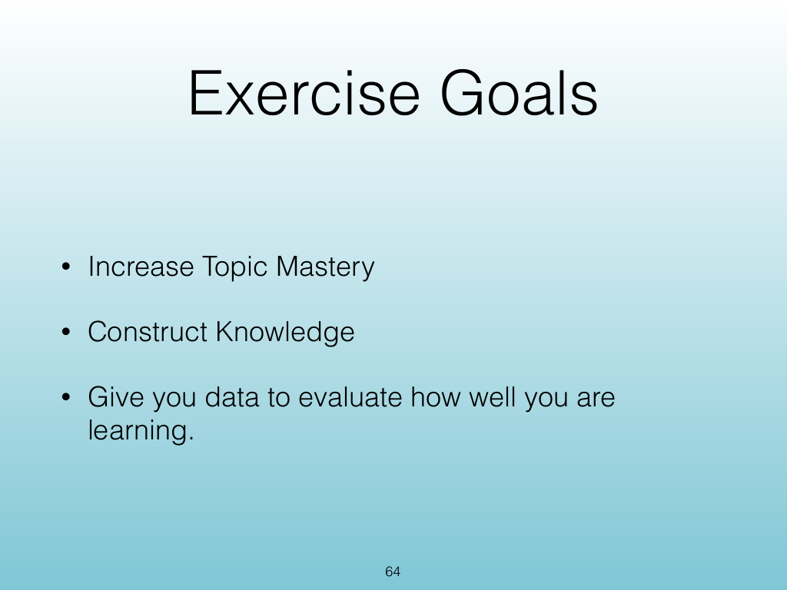
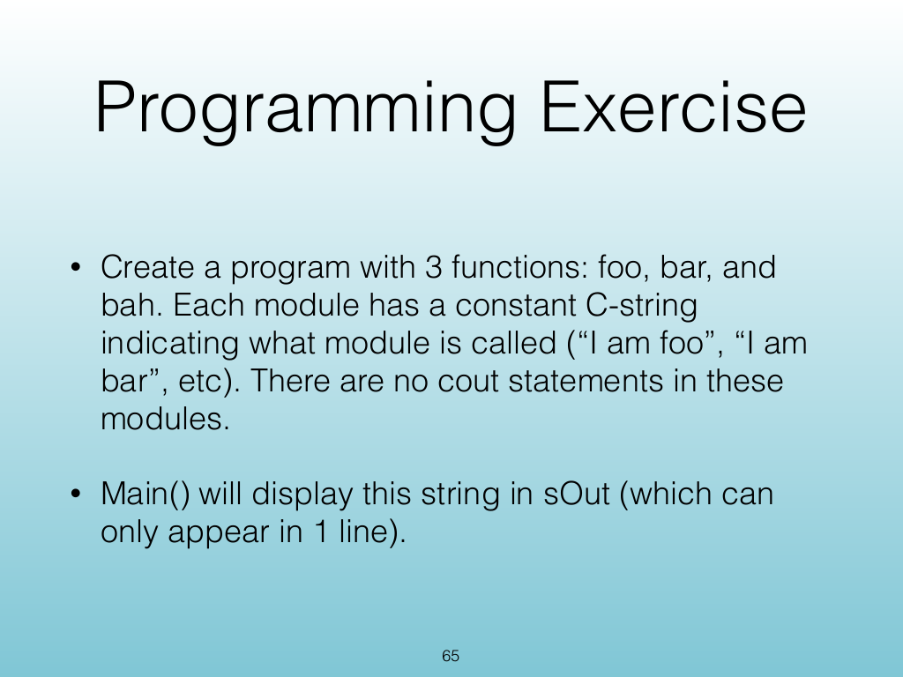

<!-- Topic: Peer Review and Programming Exercise -->
<!-- Slides 62–65 -->

# Peer Review and Programming Exercise

{width="100%" fig-alt="Peer Review and Programming Exercise"}

::: notes
Slides 62–65
Source slide 62 from the authoritative PDF.
:::

<!-- Slide 62 -->

---

## Source Slide 63

{width="100%" fig-alt="Programming Exercise"}

<!-- Slide 63 -->

---

## Source Slide 64

{width="100%" fig-alt="Exercise Goals"}

<!-- Slide 64 -->

---

## Source Slide 65

{width="100%" fig-alt="Programming Exercise"}

<!-- Slide 65 -->
