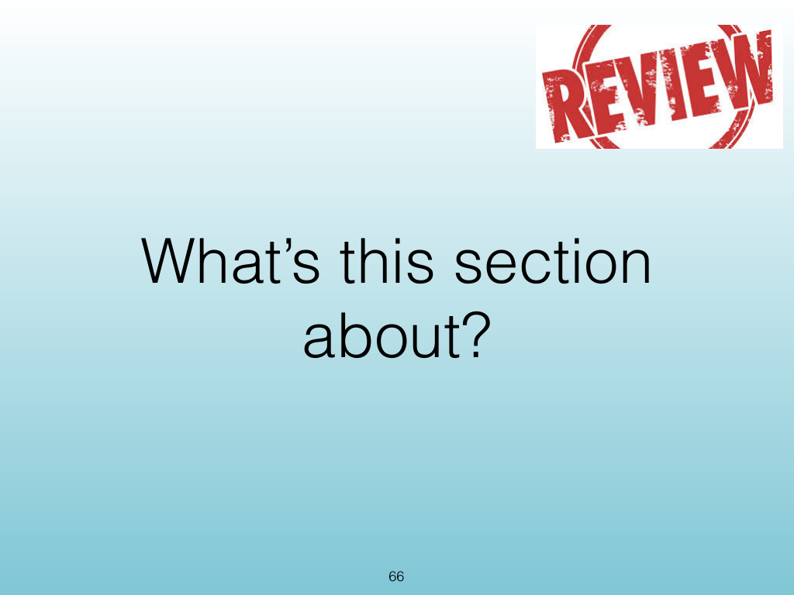
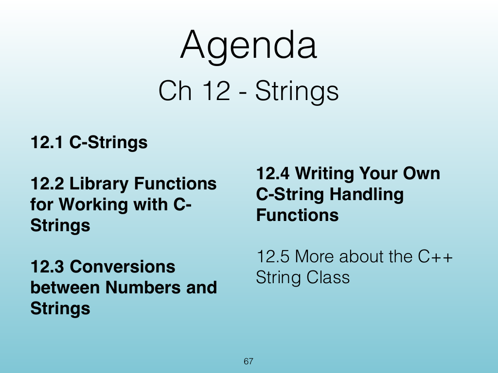
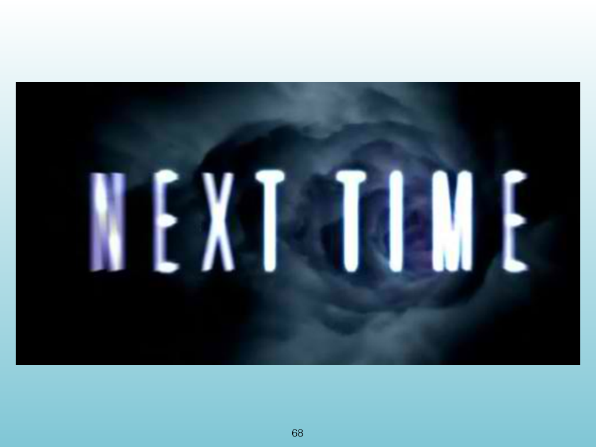
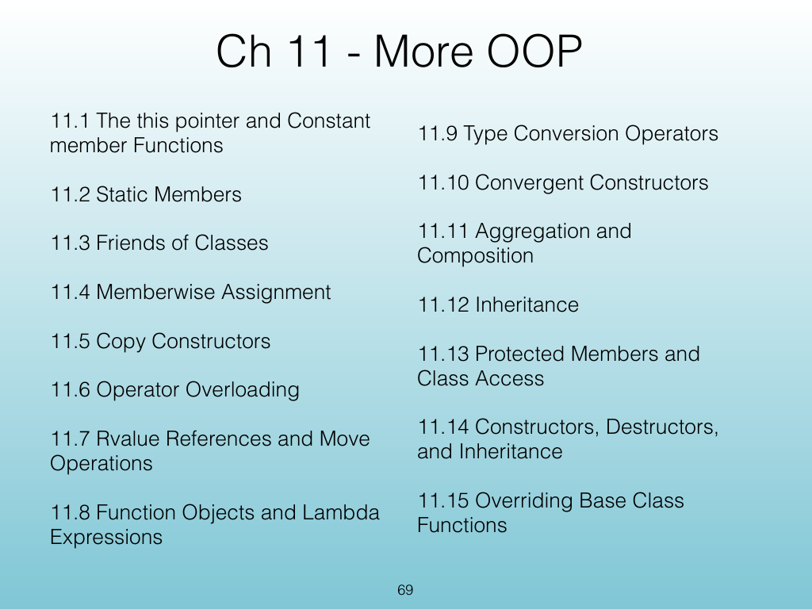
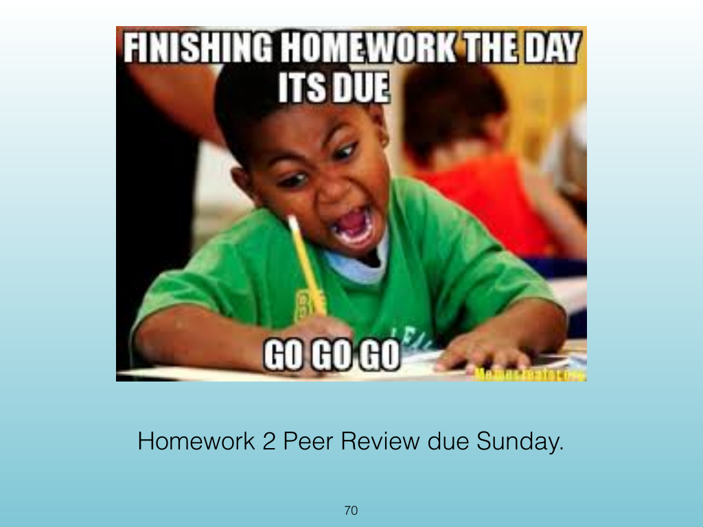

<!-- Topic: Lecture Wrap-Up -->
<!-- Slides 66–70 -->

# Lecture Wrap-Up

{width="100%" fig-alt="Lecture Wrap-Up"}

::: notes
Slides 66–70
Source slide 66 from the authoritative PDF.
:::

<!-- Slide 66 -->

---

## Source Slide 67

{width="100%" fig-alt="Agenda"}

<!-- Slide 67 -->

---

## Source Slide 68

{width="100%" fig-alt="68"}

<!-- Slide 68 -->

---

## Source Slide 69

{width="100%" fig-alt="Ch 11 - More OOP"}

<!-- Slide 69 -->

---

## Source Slide 70

{width="100%" fig-alt="Homework 2 Peer Review due Sunday."}

<!-- Slide 70 -->
