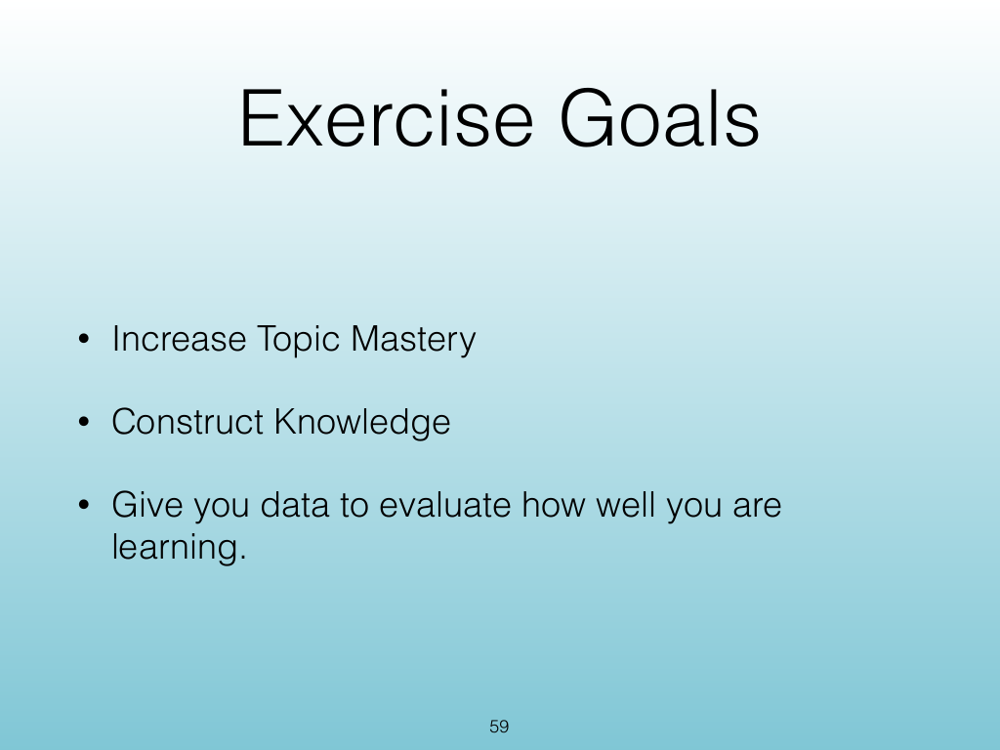
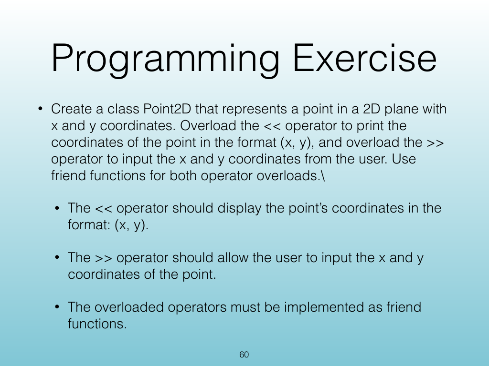
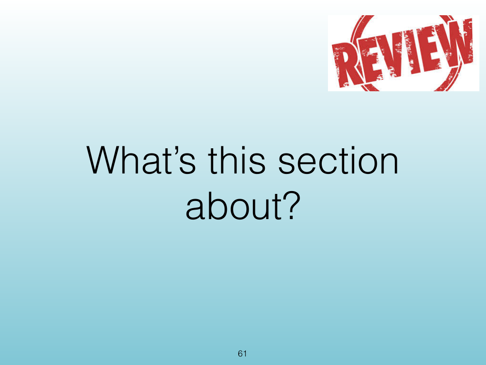
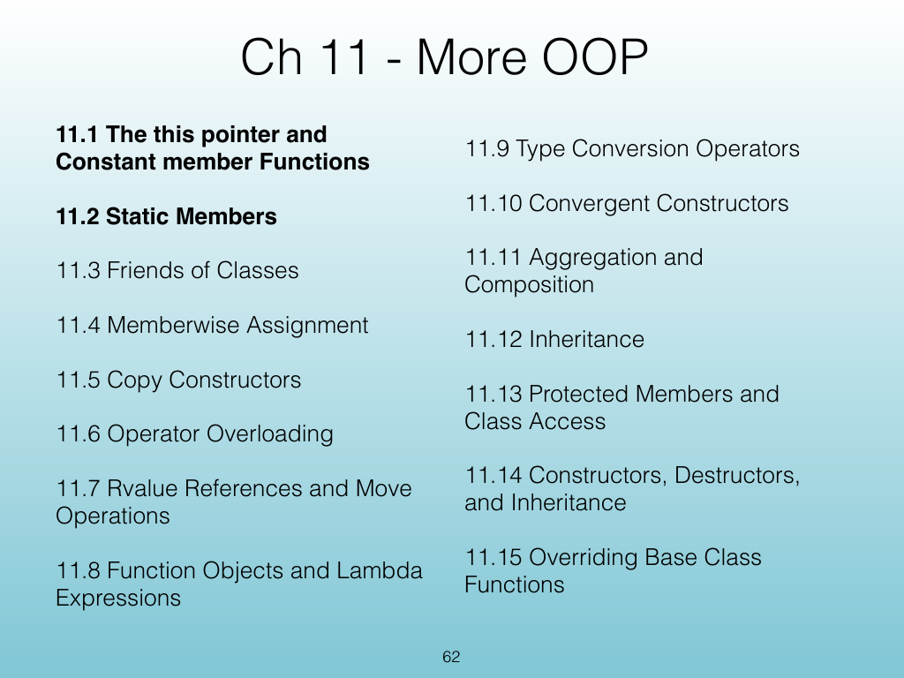
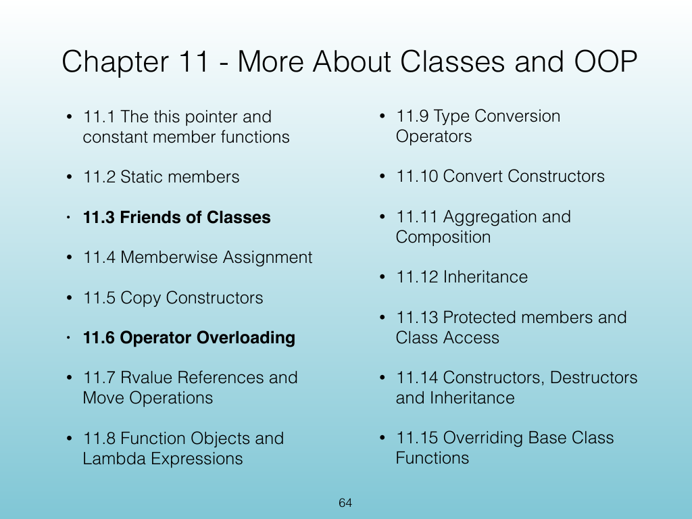

<!-- Topic: Operator Overloading Preview -->
<!-- Slides 59–64 -->

# Operator Overloading Preview

{width="100%" fig-alt="Operator Overloading Preview"}

::: notes
Slides 59–64
Source slide 59 from the authoritative PDF.
:::

<!-- Slide 59 -->

---

## Source Slide 60

{width="100%" fig-alt="Programming Exercise"}

<!-- Slide 60 -->

---

## Source Slide 61

{width="100%" fig-alt="What’s this section"}

<!-- Slide 61 -->

---

## Source Slide 62

{width="100%" fig-alt="Ch 11 - More OOP"}

<!-- Slide 62 -->

---

## Source Slide 63

{width="100%" fig-alt="63"}

<!-- Slide 63 -->

---

## Source Slide 64

{width="100%" fig-alt="Chapter 11 - More About Classes and OOP"}

<!-- Slide 64 -->
