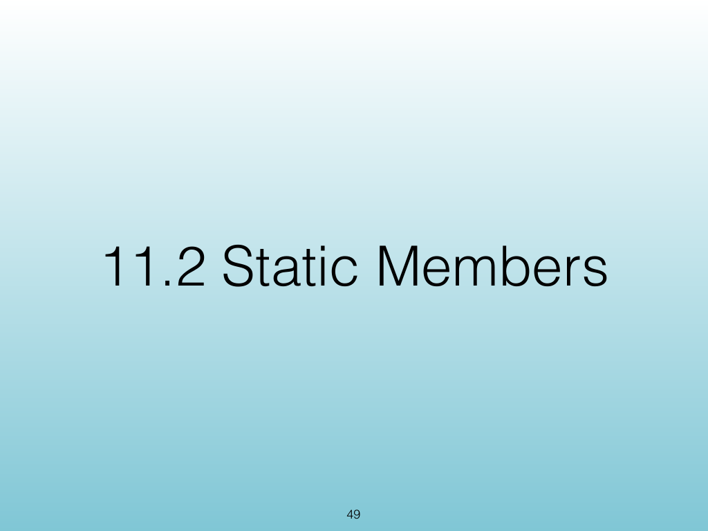
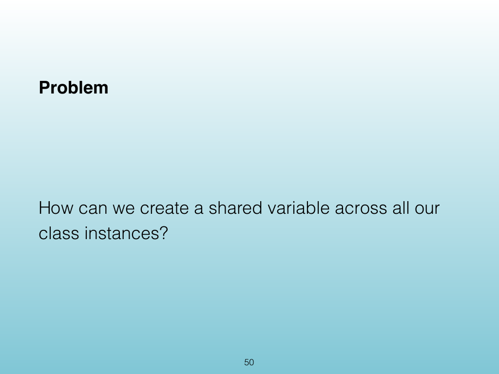
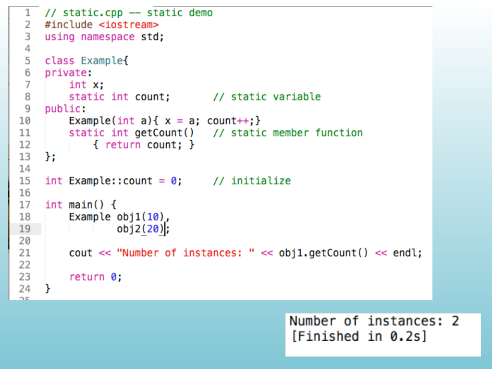
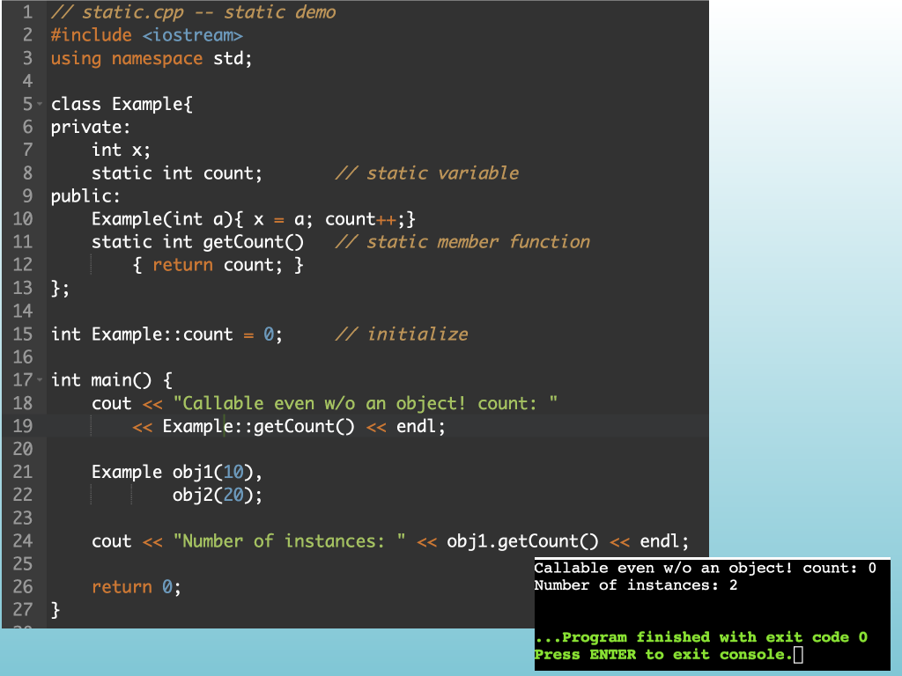
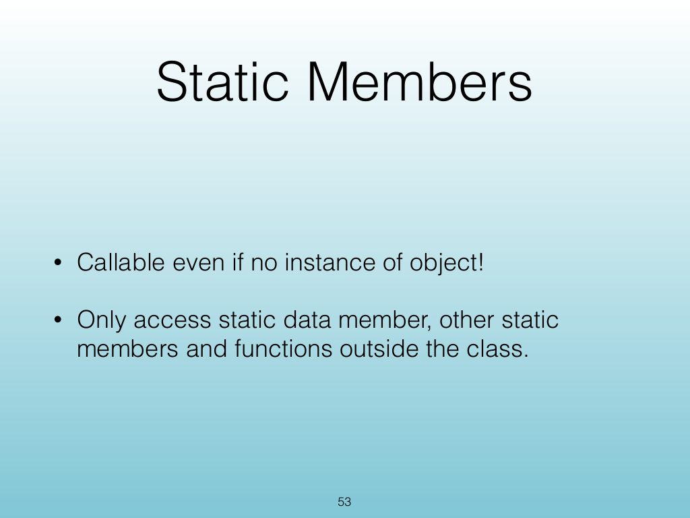
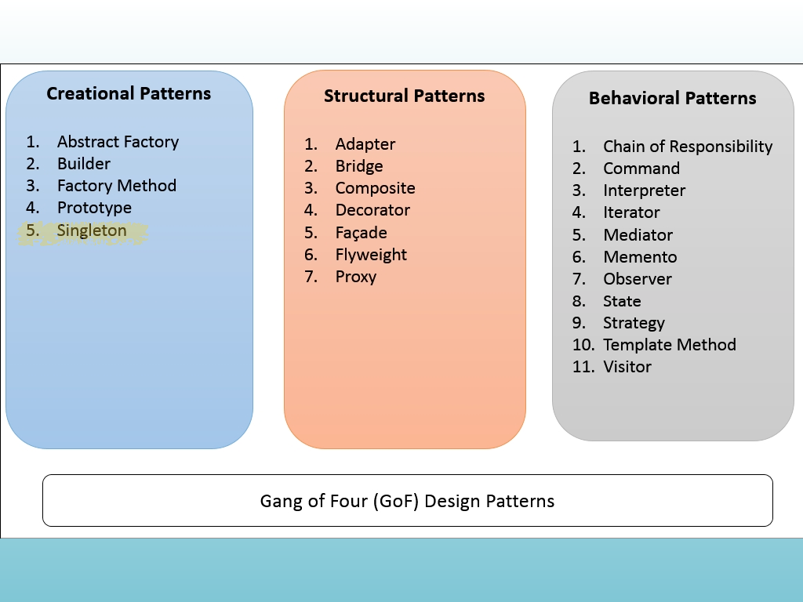
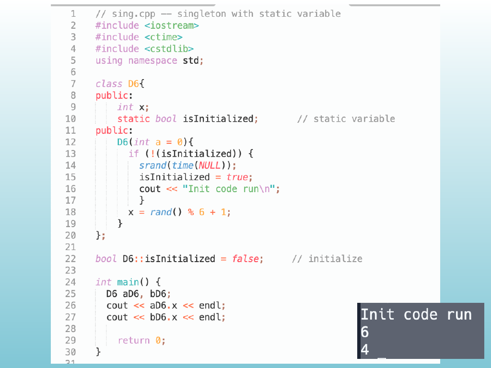
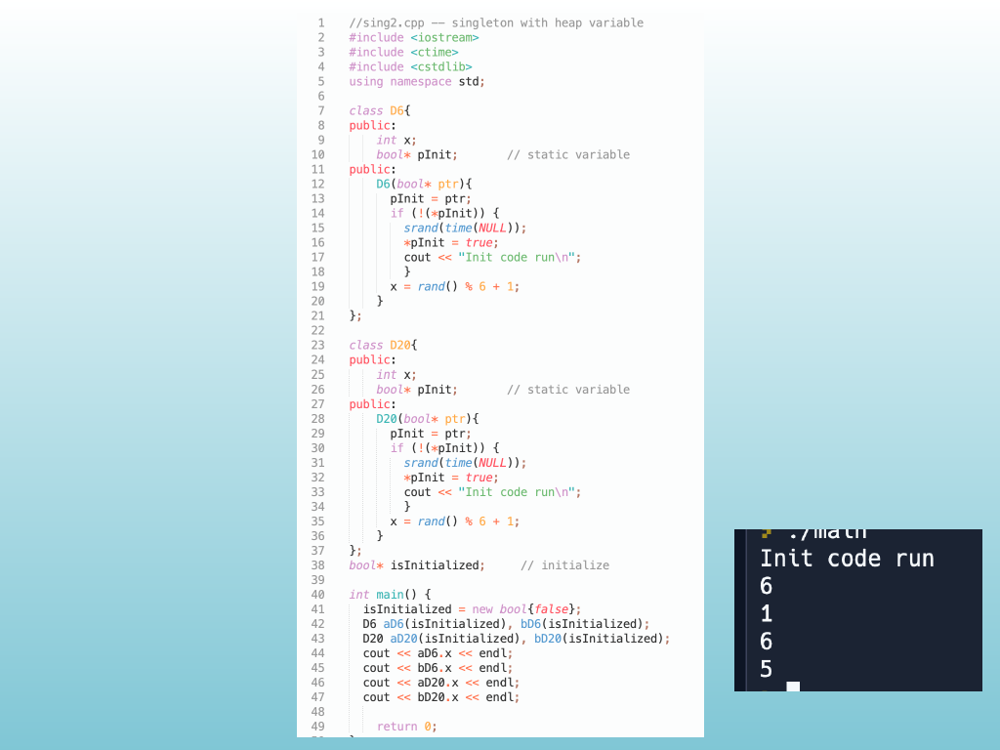

<!-- Topic: Static Members -->
<!-- Slides 49–58 -->

# Static Members

{width="100%" fig-alt="Static Members"}

::: notes
Slides 49–58
Source slide 49 from the authoritative PDF.
:::

<!-- Slide 49 -->

---

## Source Slide 50

{width="100%" fig-alt="Problem"}

<!-- Slide 50 -->

---

## Source Slide 51

{width="100%" fig-alt="Source Slide 51"}

<!-- Slide 51 -->

---

## Source Slide 52

{width="100%" fig-alt="Source Slide 52"}

<!-- Slide 52 -->

---

## Source Slide 53

{width="100%" fig-alt="Static Members"}

<!-- Slide 53 -->

---

## Source Slide 54

{width="100%" fig-alt="Source Slide 54"}

<!-- Slide 54 -->

---

## Source Slide 55

{width="100%" fig-alt="Source Slide 55"}

<!-- Slide 55 -->

---

## Source Slide 56

{width="100%" fig-alt="Source Slide 56"}

<!-- Slide 56 -->

---

## Source Slide 57

{width="100%" fig-alt="Source Slide 57"}

<!-- Slide 57 -->

---

## Source Slide 58

{width="100%" fig-alt="Programming Exercise"}

<!-- Slide 58 -->
