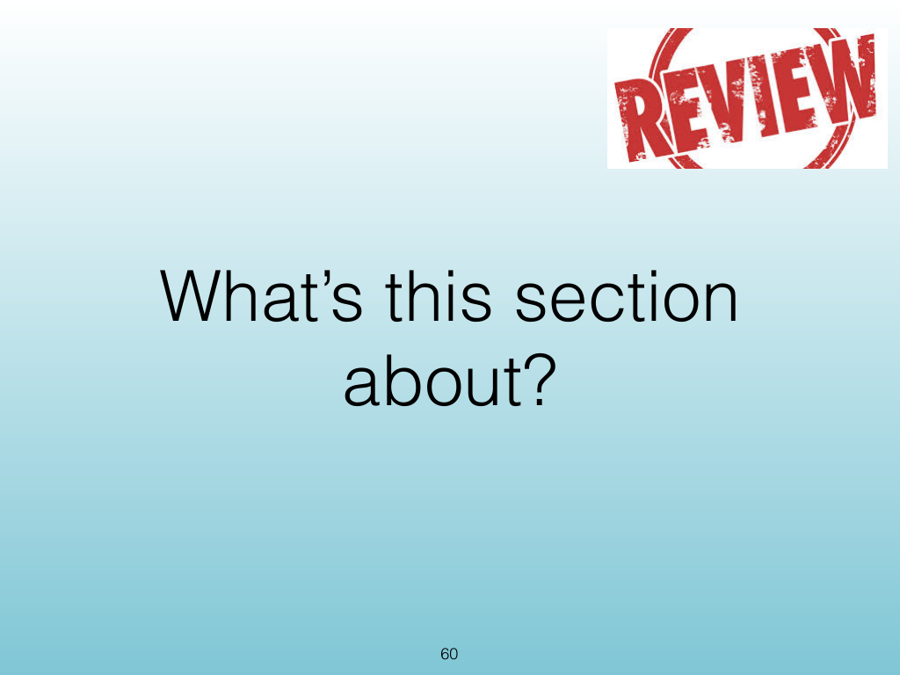
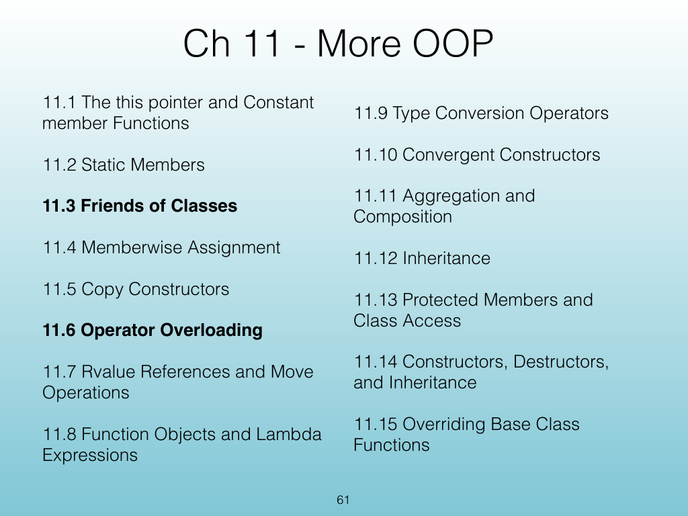
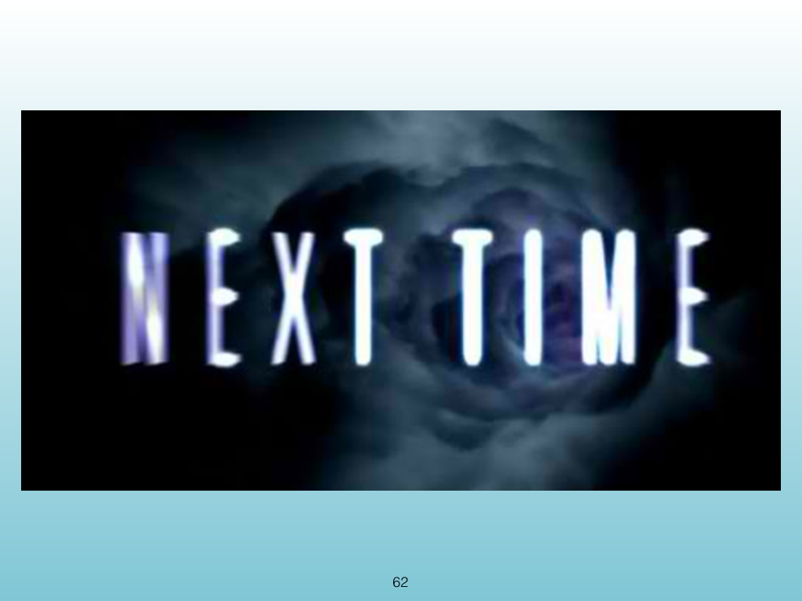
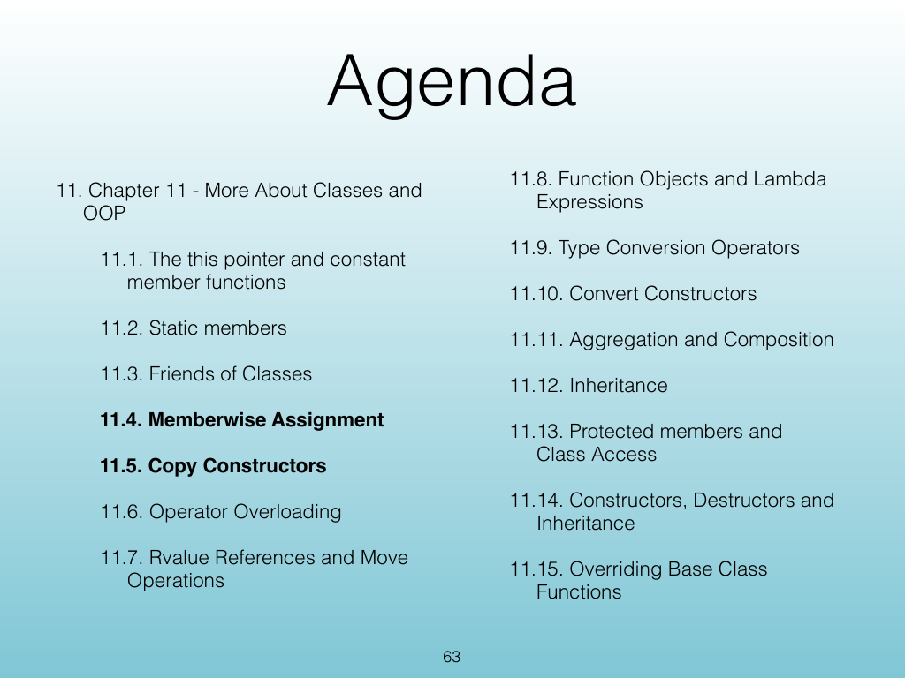
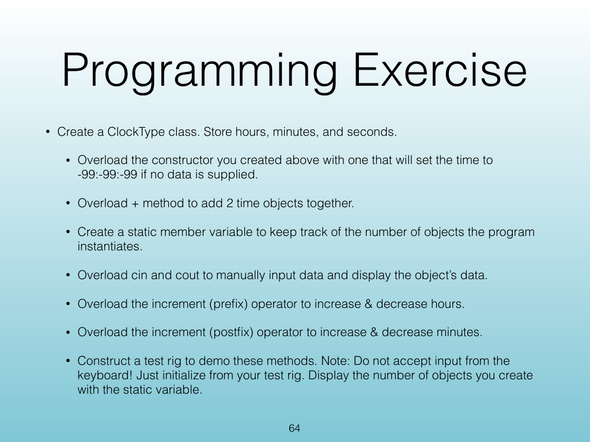

<!-- Topic: Lecture Wrap-Up -->
<!-- Slides 60–64 -->

# Lecture Wrap-Up

{width="100%" fig-alt="Lecture Wrap-Up"}

::: notes
Slides 60–64
Source slide 60 from the authoritative PDF.
:::

<!-- Slide 60 -->

---

## Source Slide 61

{width="100%" fig-alt="Ch 11 - More OOP"}

<!-- Slide 61 -->

---

## Source Slide 62

{width="100%" fig-alt="62"}

<!-- Slide 62 -->

---

## Source Slide 63

{width="100%" fig-alt="Agenda"}

<!-- Slide 63 -->

---

## Source Slide 64

{width="100%" fig-alt="Programming Exercise"}

<!-- Slide 64 -->
