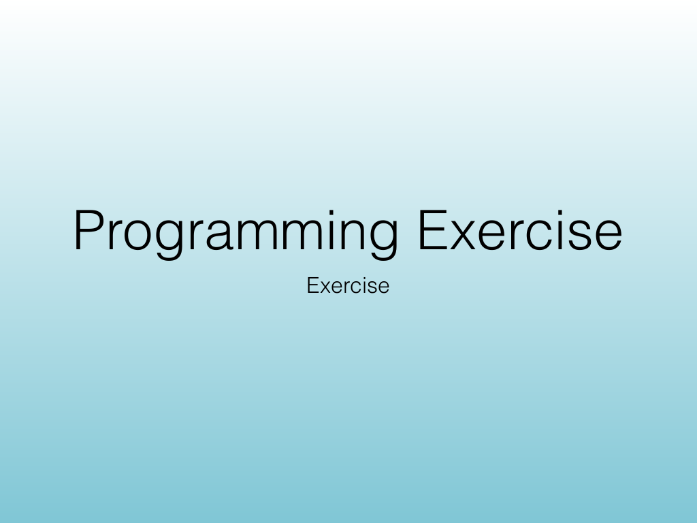
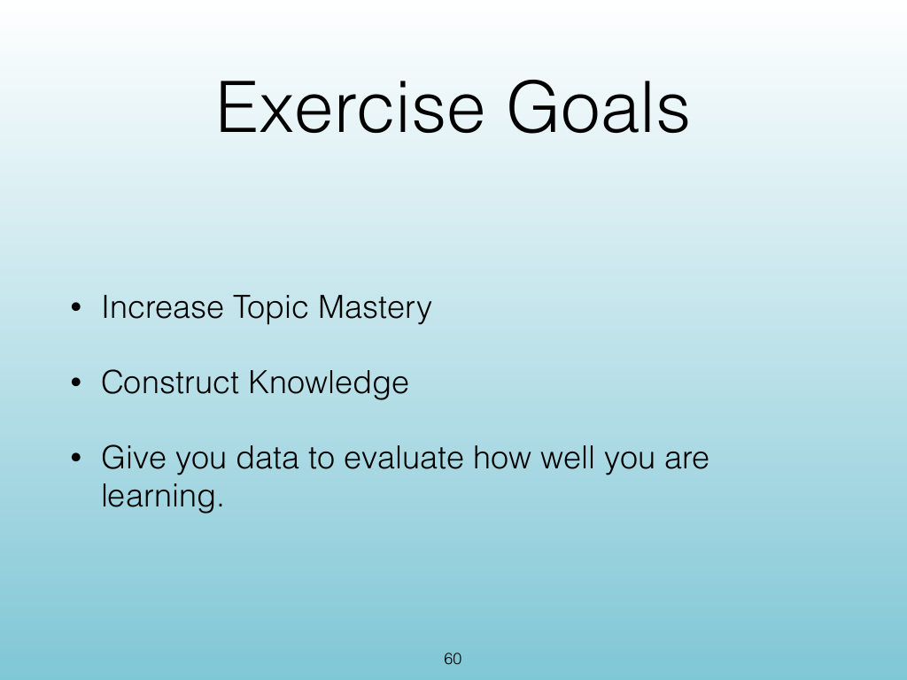
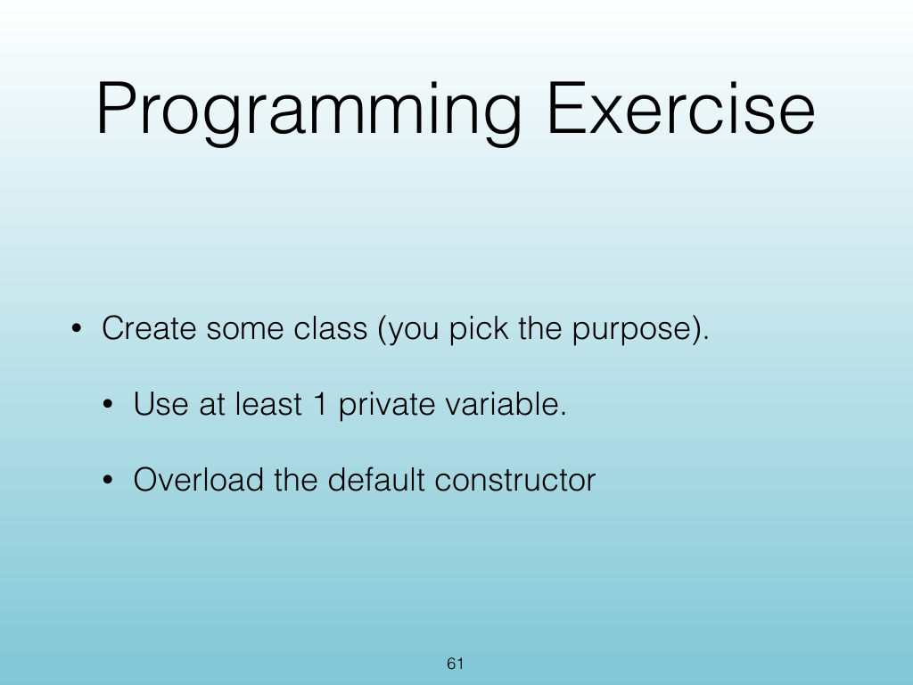
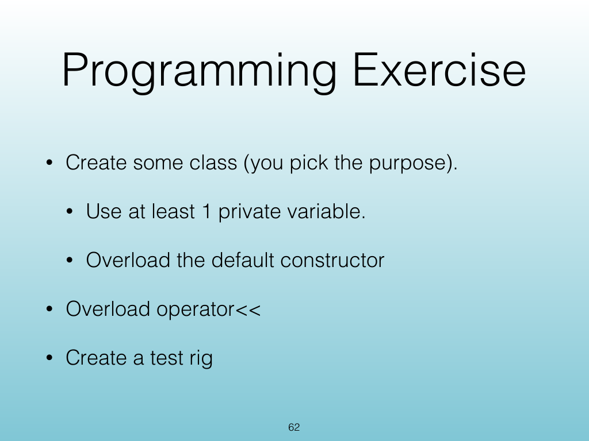
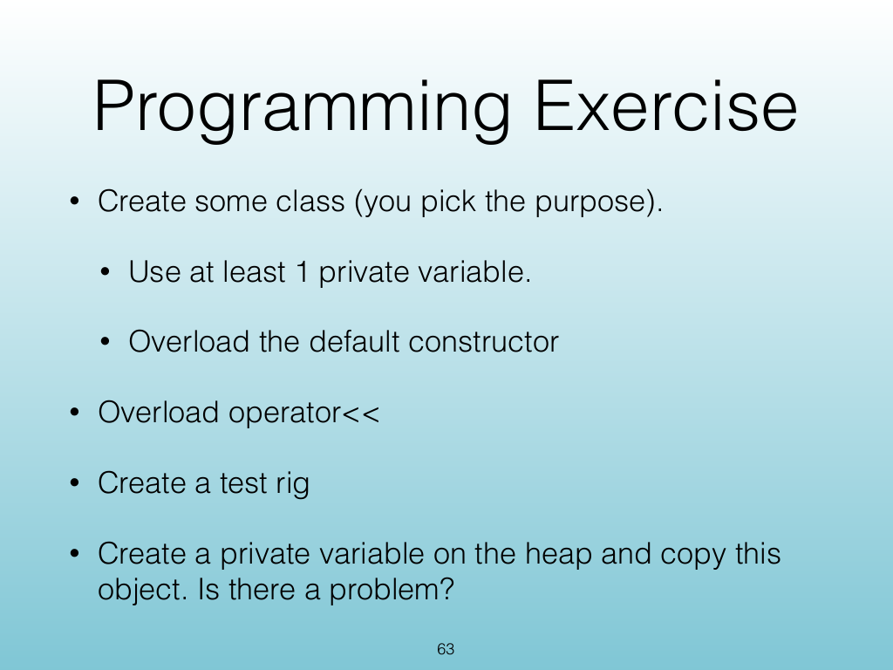

<!-- Topic: Programming Exercise -->
<!-- Slides 59–63 -->

# Programming Exercise

{width="100%" fig-alt="Programming Exercise"}

::: notes
Slides 59–63
Source slide 59 from the authoritative PDF.
:::

<!-- Slide 59 -->

---

## Source Slide 60

{width="100%" fig-alt="Exercise Goals"}

<!-- Slide 60 -->

---

## Source Slide 61

{width="100%" fig-alt="Programming Exercise"}

<!-- Slide 61 -->

---

## Source Slide 62

{width="100%" fig-alt="Programming Exercise"}

<!-- Slide 62 -->

---

## Source Slide 63

{width="100%" fig-alt="Programming Exercise"}

<!-- Slide 63 -->
