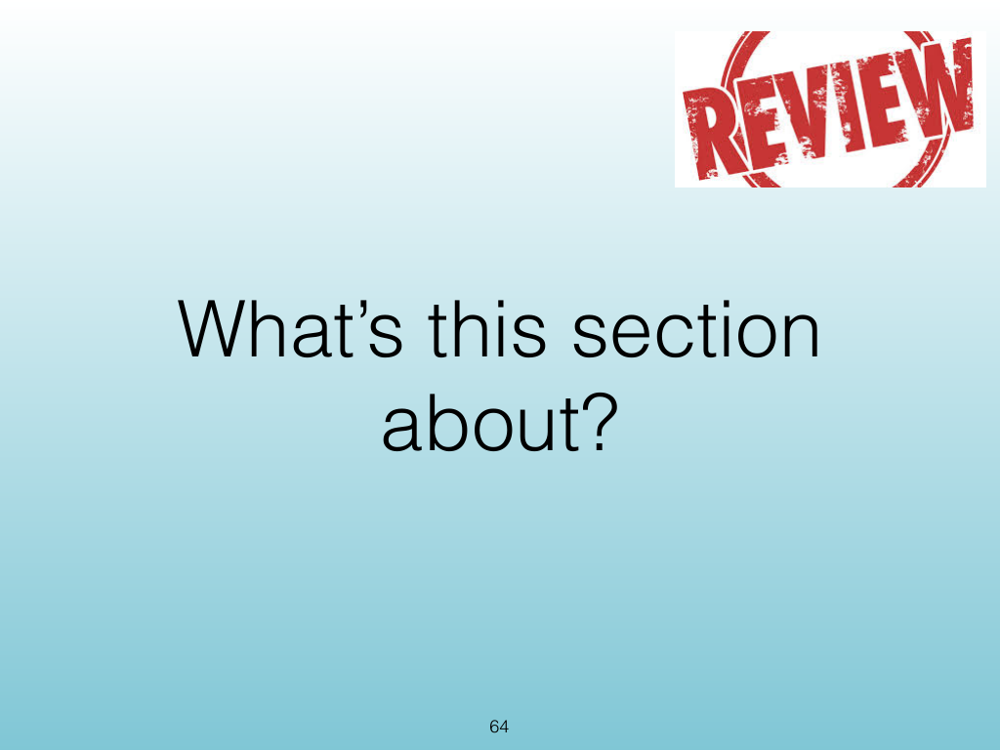
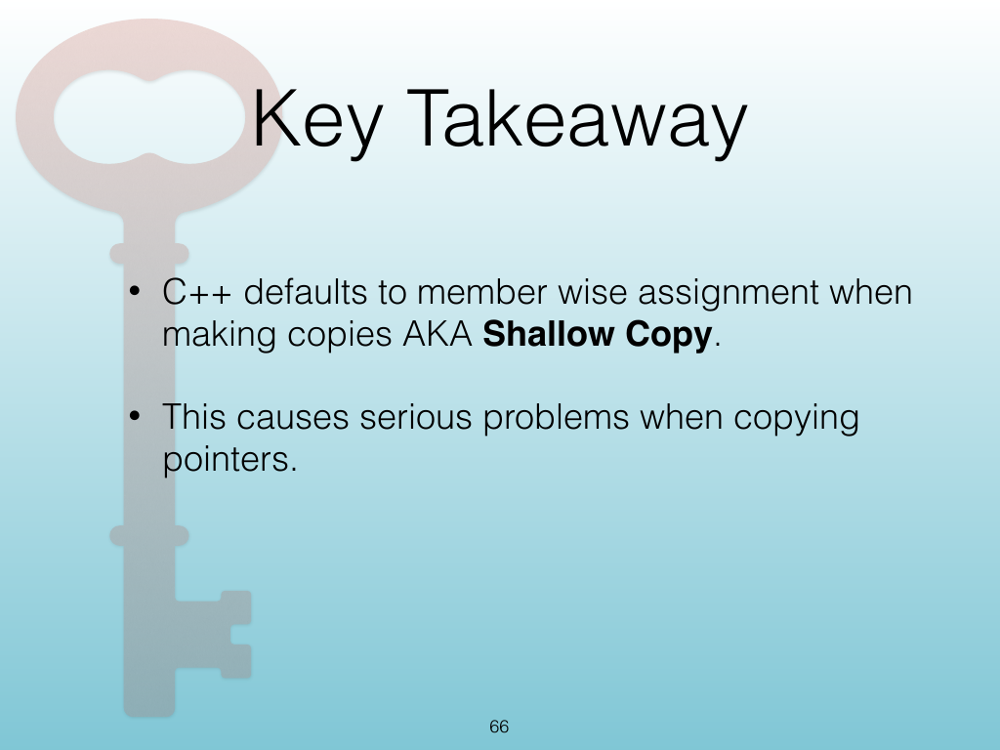
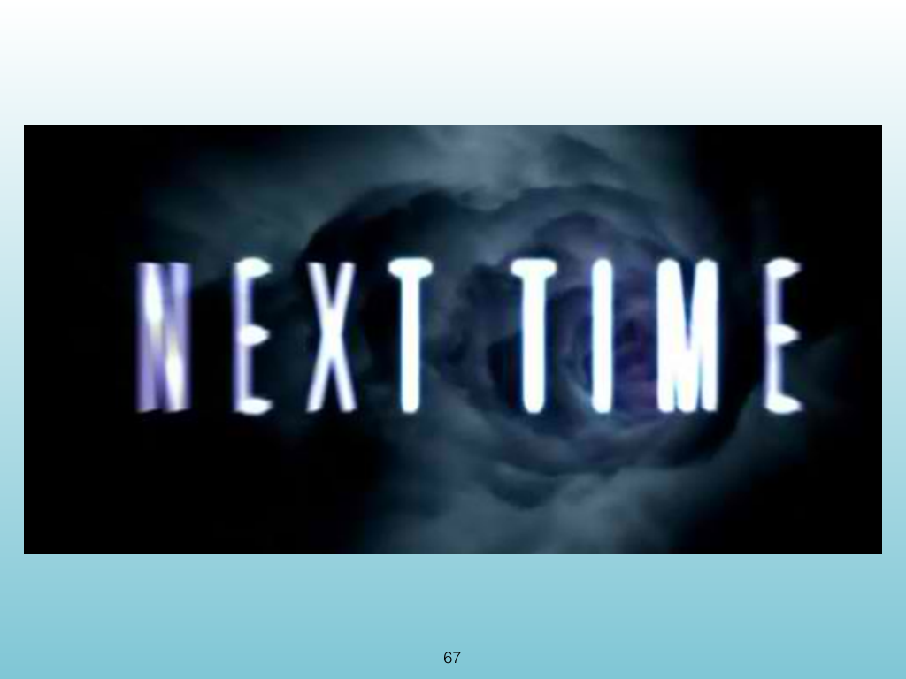
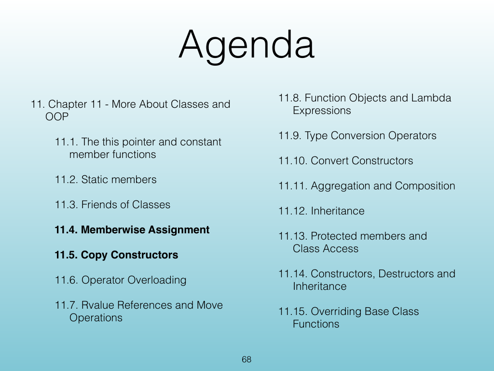
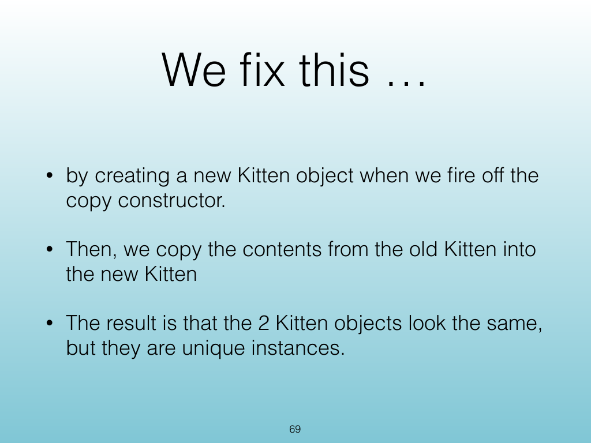
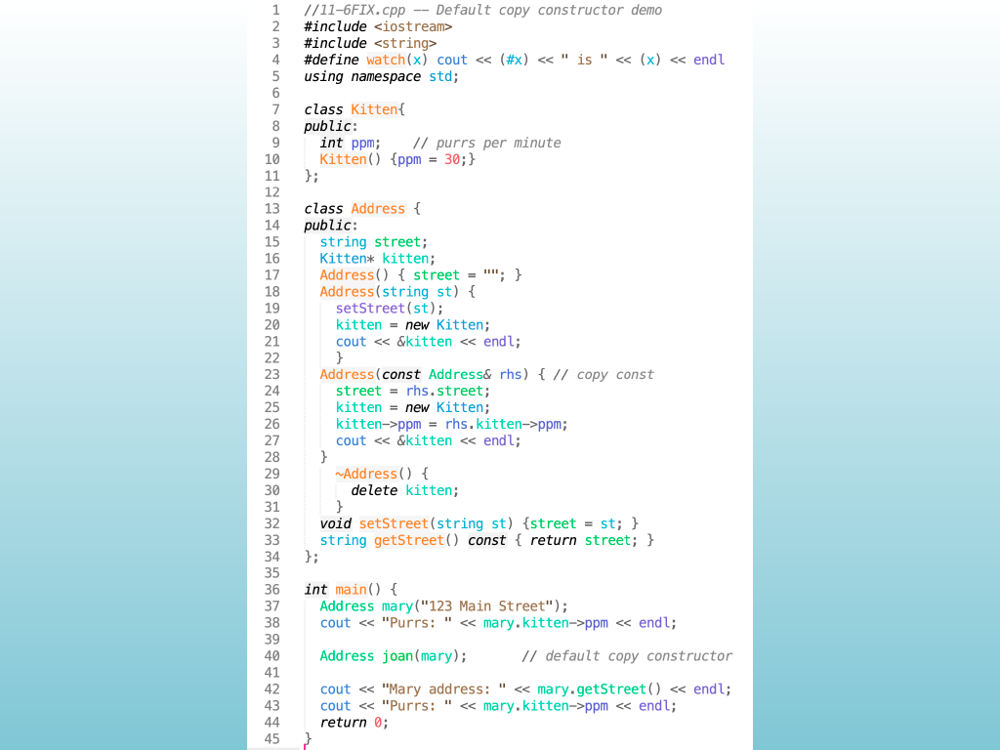
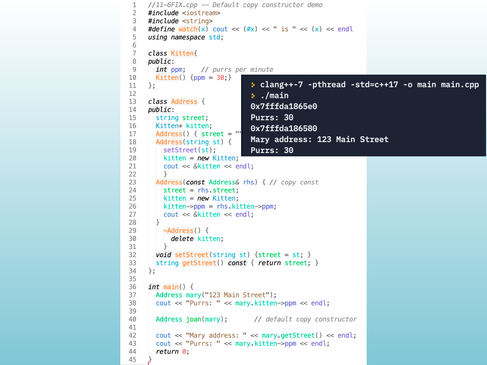
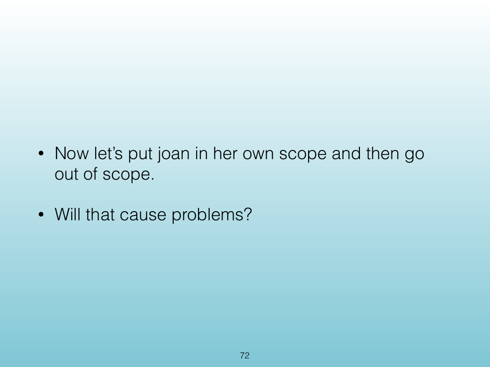
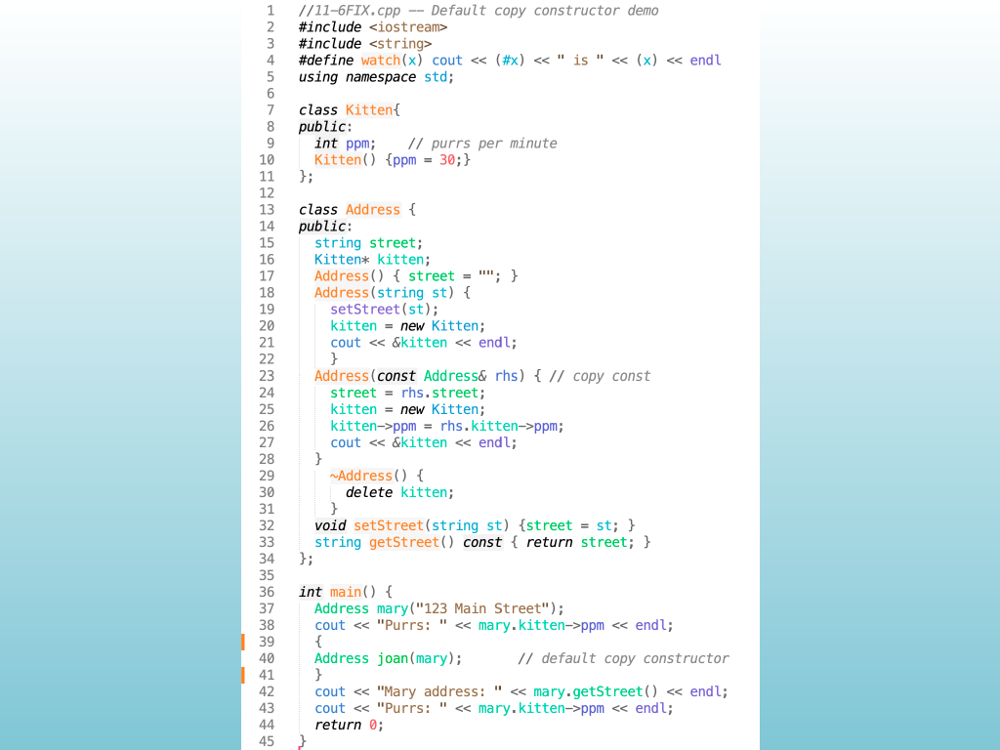
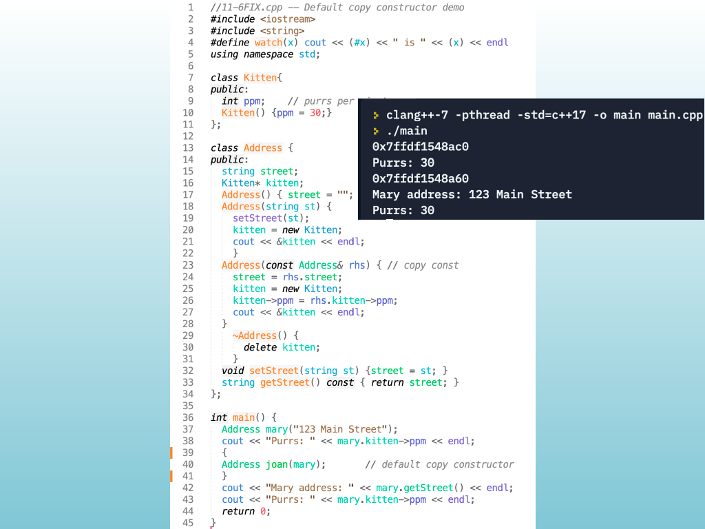

<!-- Topic: Lecture Wrap-Up -->
<!-- Slides 64–74 -->

# Lecture Wrap-Up

{width="100%" fig-alt="Lecture Wrap-Up"}

::: notes
Slides 64–74
Source slide 64 from the authoritative PDF.
:::

<!-- Slide 64 -->

---

## Source Slide 65

{width="100%" fig-alt="Agenda"}

<!-- Slide 65 -->

---

## Source Slide 66

{width="100%" fig-alt="Key Takeaway"}

<!-- Slide 66 -->

---

## Source Slide 67

{width="100%" fig-alt="67"}

<!-- Slide 67 -->

---

## Source Slide 68

{width="100%" fig-alt="Agenda"}

<!-- Slide 68 -->

---

## Source Slide 69

{width="100%" fig-alt="We x this …"}

<!-- Slide 69 -->

---

## Source Slide 70

{width="100%" fig-alt="Source Slide 70"}

<!-- Slide 70 -->

---

## Source Slide 71

{width="100%" fig-alt="Source Slide 71"}

<!-- Slide 71 -->

---

## Source Slide 72

{width="100%" fig-alt="• Now let’s put joan in her own scope and then go"}

<!-- Slide 72 -->

---

## Source Slide 73

{width="100%" fig-alt="Source Slide 73"}

<!-- Slide 73 -->

---

## Source Slide 74

{width="100%" fig-alt="Source Slide 74"}

<!-- Slide 74 -->
