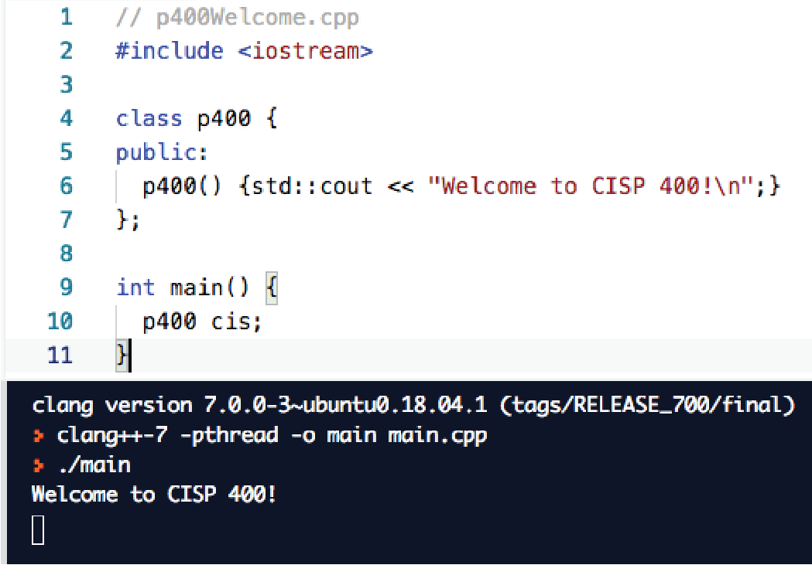

# CISP 400

**Object-Oriented Programming in C++**  
**Course Syllabus**  
Fall 2026

## Course Description

This course is an introduction to object-oriented programming using the C++ programming language. It is designed to enhance students’ abilities to implement object-oriented programs and to further develop programming proficiency. Detailed topics include classes, storage class and scope, encapsulation, polymorphism, inheritance, function overloading and overriding, virtual functions, operator overloading, templates, exception handling, stream I/O, file processing, and the Standard Template Library.

## Where Can I Go for the Latest Course Information?

The Folsom Lake College website has the most current information.

- [Main Catalog Page](https://flc.losrios.edu/2025-2026-official-catalog)
- [Class schedules](https://flc.losrios.edu/academics/search-class-schedules?flcFilter=true&openFilter=true&waitlistFilter=true&strm=1259,Fall%202025&link=true)
- [Academic Calendar](https://flc.losrios.edu/admissions/academic-calendar-and-deadlines)
- [Final Schedule](https://flc.losrios.edu/admissions/academic-calendar-and-deadlines/final-exam-schedule)
- [Prerequisite Challenge information](https://flc.losrios.edu/admissions/placement/prerequisite-verification-and-challenge) — the form link is about halfway down the page.

## Does This Class Have a Lab and What Exactly Does That Mean?

This class has a lab component. The lab is after class, on your own time. You will be involved in some classroom computer activities, but they will be structured and not as free-form as a lab would be. A lab is an informal work time — you will be programming.

## Contacting Me

My office hours are Monday through Thursday at 12:00 noon. You can use Student Connect in Canvas to schedule a Zoom appointment. If these times do not work for you, send me an email and we can arrange another time.

You can get in touch with me in the following ways:

1. My office (FL2-236) is the best way to contact me. Schedule an appointment and I guarantee I will be there. If you drop in, I will probably be out and you will need to wait.
2. Call me at my office: (916) 608-6595. If I am unavailable, leave a voicemail; it will be emailed to me.
3. Send me an email. I do not check email past noon on Saturdays and not at all on Sundays. It is not unusual for me to respond in a few days because I have many student inquiries. Pro tip: put the class number in the subject of your email (CISP 400 or p400) and my inbox will prioritize it.

None of these methods are immediate. If you need to see me now, you will need to come and find me. Plan accordingly.

## Prerequisites

If FLC cannot verify your prerequisites, you will need to file a Prerequisite Challenge Form immediately. You can find this online; it must be delivered with the supporting documents to the Dean’s office. Copy me on your email so I know you are in the process of challenging the prerequisite. You must start this process by the end of the first Sunday before our first face-to-face class meets. It must be completed by the end of the first week of the semester.

## Student Learning Outcomes

The State Chancellor’s Office wants to know if we are measuring student success against the Student Learning Outcomes (SLOs) standard. Upon completion of this course, the student will be able to:

1. Develop skills in object-oriented programming techniques using C++.
2. Use the programming language through coding, running, and testing programs.
3. Demonstrate an understanding of programming vocabulary and concepts.
4. Apply appropriate coding format and documentation standards to written programs.

## Text and Required Supplies

You will need access to a computer. I use Canvas to coordinate all classroom activities, including classroom courses. You will need to take notes; my lectures are insufficient for learning the material. Finally, you will need to acquire and read the textbook.

Your client — me — will use an Ubuntu Linux system to run your work. It will have the standard C++ libraries only. The gcc compiler will be used to check your code. All the tools you need are installed with the Desktop installation of Ubuntu; you will not need to install anything else. Online compilers such as [Replit](https://replit.com/), [Programiz](https://www.programiz.com/cpp-programming/online-compiler/), and [OnlineGDB C++](https://www.onlinegdb.com/online_c++_compiler) compile in a Linux backend, so they are suitable for working in this class as well. See the FAQ for more detailed information.

### Textbook

Gaddis, Walters, Muganda (2019). *C++ Early Objects* (10th ed.).  
ISBN: 978-0135235003.  
Upper Saddle River, NJ: Pearson Education.

When I refer to chapters, I mean the chapters in this book. That is changing as I update the material. You may want to look for the topics in whatever textbook you choose to use.

This is also a good online reference: [LearnCpp](https://www.learncpp.com/).

## Course Schedule and Grade Plan

The assignment schedule and grade plan below provide a high-level overview. Canvas is the authoritative source for assignment instructions, submission details, and any updates.

### Grade Plan

| Assignment | Freq | Points | Total | % |
| --- | ---: | ---: | ---: | ---: |
| Pig | 1 | 50 | 50 | 6% |
| Homework 1–6 | 6 | 100 | 600 | 71% |
| Final Project | 1 | 200 | 200 | 24% |
| **Total** | — | — | **850** | **100%** |

Percentages are rounded to the nearest whole percent.

### Course Topics

| Course topic | Brief summary |
| --- | --- |
| C++ Refresher and Program Design | Review procedural C++, functions, program organization, debugging, and coding practices that support object-oriented work. |
| Pointers, References, Arrays, and Dynamic Memory | Work with addresses, pointer and reference parameters, arrays, heap allocation, dynamic arrays, and safe resource cleanup. |
| Structures, Classes, and Encapsulation | Define custom types, organize data and behavior, use public interfaces and private representation, and build abstract data types. |
| Constructors, Destructors, and Resource Management | Control object initialization and lifetime, manage dependencies, apply assertions, and connect constructors and destructors to resource ownership. |
| Operators, Streams, Conversions, Lambdas, Functors, and Templates | Extend class behavior through overloaded operators, stream I/O, conversion functions, callable objects, lambdas, and generic programming. |
| Aggregation, Inheritance, and Polymorphism | Model relationships among objects, distinguish composition from inheritance, create abstract base classes, and use virtual functions for runtime behavior. |
| Exceptions and the Standard Template Library | Handle exceptional conditions safely and use standard library containers, algorithms, and related generic programming tools. |

### Assignment Schedule

| Assignment | Focus | Due date | GitHub assignment |
| --- | --- | --- | --- |
| Programming Task: Pig | Procedural C++ refresher | Sunday, August 30, 2026 | [Pig](https://github.com/9mytmh5z4p-sketch/CISP400/blob/main/hw/Programming%20Task%20Pig.md) |
| Homework 1 | Arrays, pointers, dynamic memory, functions, and overloading | Sunday, September 13, 2026 | [Homework 1](https://github.com/9mytmh5z4p-sketch/CISP400/blob/main/hw/Programming%20Homework%201.md) |
| Homework 2 | Structs, classes, dependencies, assertions, and dynamic arrays | Sunday, September 27, 2026 | [Homework 2](https://github.com/9mytmh5z4p-sketch/CISP400/blob/main/hw/Programming%20Homework%202.md) |
| Homework 3 | Stream operators, object interaction, and dynamic collections | Sunday, October 11, 2026 | [Homework 3](https://github.com/9mytmh5z4p-sketch/CISP400/blob/main/hw/Programming%20Homework%203.md) |
| Homework 4 | Lambdas, functors, conversions, and dynamic objects | Sunday, October 25, 2026 | [Homework 4](https://github.com/9mytmh5z4p-sketch/CISP400/blob/main/hw/Programming%20Homework%204.md) |
| Homework 5 | Aggregation, inheritance, abstract classes, and polymorphism | Sunday, November 8, 2026 | [Homework 5](https://github.com/9mytmh5z4p-sketch/CISP400/blob/main/hw/Programming%20Homework%205.md) |
| Homework 6 | Resource management, deep copy, move operations, and exceptions | Sunday, November 22, 2026 | [Homework 6](https://github.com/9mytmh5z4p-sketch/CISP400/blob/main/hw/Programming%20Homework%206.md) |
| Final Project | Genetic Algorithm Robots; introduced in late October | December 17, 2026 — last day of class | [Final Project](https://github.com/9mytmh5z4p-sketch/CISP400/blob/main/hw/Programming%20Homework%20Final.md) |

## Attendance

I teach face-to-face and online classes this semester. You can tell which class type you have by looking at the meeting time in the schedule. If the time is listed as 1:00–1:00, you are in an asynchronous, 100% online course. If you have any other meeting times, you are in a face-to-face course and the time listed is the actual time we will meet in the classroom. All labs are online.

If you are in an online class, see the “I’m in an online class…” section below.

If your class is in a classroom on campus, classroom attendance is mandatory. This class complies with the attendance policy specified under the Folsom Lake College Academic Policy and the FLC Catalog. You are expected to attend all classes. If you miss more than three classes, I will either drop you from the class or you will receive a zero for attendance, depending on where we are in relation to the withdrawal date. I no longer accept excuses. It is your responsibility to attend class and track your attendance.

You are also expected to be ready to start class when the class is scheduled to begin. Even if you are one minute late, you are late. I take roll and record who is absent and who is tardy. Canvas records this as “late.” If you are more than 30 minutes late, you are absent, not late.

My expectation is that you will attend for the full meeting time. If you leave early, I will record that as “left early.” Two “left early” records equal one absence. Two “late” records equal one absence. If you come to class late and leave early, you are absent. Coming in and out of the room once class starts is disruptive and unfair to students who arrange their schedules so they can attend class.

### Attendance and Extra Credit

Attendance is counted as extra credit. The amount is listed in the grade plan. Each attendance blemish reduces the amount of extra credit I will give you at the end of the semester. Divide the total extra credit by six: a late or left early reduces it by one-sixth, and an absence reduces it by two-sixths. After three absences, you will no longer receive attendance extra credit. You can still receive extra credit by completing extra-credit assignments. Online students are not eligible for attendance extra credit because weekly attendance is not mandatory for you.

### How Can I Track This?

Keeping track of attendance is a good idea. While rare, errors do occur in the roll. Canvas has a grade book built in, so check it frequently. It is accessible online 24/7. You agree with the grade book unless I hear otherwise.

### I Missed a Test, Quiz, or Project on the Day I Was Absent. What Can I Do?

Nothing — that is part of the price of missing class. You should expect a zero for that assignment. You cannot make it up. I do give extra credit, and you can recover some of the points you missed.

### What Is the Big Deal About Attendance?

In study after study, attendance is consistently linked to high grades. I want you to be successful, and you need to attend class to make that happen. Many times, winning is just a matter of showing up, and we want to encourage that behavior at FLC.

### I’m in an Online Class. Does That Mean Attendance Does Not Matter?

Attendance is different in an online class. Canvas tracks the dates you log on. If you have not logged on to Canvas for this class within the last two weeks, I will assume you are no longer interested in the class and withdraw you.

Bottom line: come talk to me about attendance. Do not just disappear.

## Lecture Stream

I live stream and record my lectures primarily so my online students have access to the most current digital artifacts. The live stream takes place at the same time the class is offered. It usually takes about a half hour after the class ends for the video to be available on Canvas. Online students are not required to attend the live stream, but are certainly welcome to do so. In-class students are also welcome to join the live stream if they cannot attend class, but this does not excuse their absence.

Canvas has the links to the Zoom live stream and contains links to the recordings.

## First Week of Classes

It is essential that you attend the first week of class. If you do not, I will drop you immediately. You will then need to get on the wait list to add. Perhaps there will still be space; perhaps not. Online students are not subject to this attendance requirement.

Furthermore, you must turn in the first assignment to avoid being dropped from the class. Los Rios has had a problem with fake students registering for classes to get .edu email addresses, applying for student aid, and then disappearing. Online students must also turn in the first assignment on time.

## Homework

This class has new homework assignments designed to put you ahead of chatbots. Why should you be well paid when an organization can hire someone for minimum wage and have them use ChatGPT? The answer is that you are going to bring more value to your employer than a chatbot. Therefore, you should be paid more. That is what we will work on here.

The homework is less about coding and more about understanding larger coding concepts and how they fit together in your program. We will discuss this in greater detail in class.

All homework assignments will be open and accessible from the first day of class. You can start on them whenever you wish. Do not get caught behind.

Homework is due on the due date. If you turn it in after the due date, the grade will suffer a 10% penalty per day late. That is automatic and built into Canvas. You have about five days to turn in late work to prevent yourself from falling too far behind. I will record a zero for missing assignments when I grade the class, but I will revise this grade if you later turn in the work. Do not let the zero dissuade you from completing the assignment. I do this because leaving work ungraded gives students an inaccurate, overly favorable picture of how they are performing.

### Plagiarism Scores

A score higher than 50% is unacceptable. You will need to take steps to remedy the situation if you score greater than 50% on the plagiarism checker.

## DSPS Students

It is my goal to create a learning experience that is as accessible as possible. If you anticipate issues related to the format, materials, or requirements of this course, please meet with me outside of class so we can explore potential options.

Students with verified disabilities may also wish to work with Disability Services and Programs for Students (DSPS) to discuss options for removing barriers in this course, including official accommodations. Please visit the [DSPS website](https://flc.losrios.edu/dsps) for contact and additional information. If you have already been approved for accommodations through DSPS, please share your letter of accommodations with me. The accommodation letter is just the beginning of our conversation. It is your responsibility to tell me what specific accommodations you will need; for example, if you need more time for a test, let me know how much more time you need.

- Website: [https://flc.losrios.edu/dsps](https://flc.losrios.edu/dsps)
- Phone: (916) 608-6611
- Email: [dsps@flc.losrios.edu](mailto:dsps@flc.losrios.edu)

## Social Media

Students frequently ask me to connect with them on LinkedIn, Facebook, and other social media. I do not do that. Managing the possible number of contacts would be a full-time job. Do not feel slighted if I do not respond to your social-media requests; I do not respond to anybody. It is not personal, and it is not you.

## Code of Conduct

All students are expected to conform to the Code of Conduct found in the FLC Catalog. This class is a “rehearsal space.” That means you have a place to try out new ideas and concepts before you launch them into the public sphere. This class is protected from the unending surveillance of the Internet and the dark side of social media. To that end, the following rule also applies.

### No Unauthorized Surveillance

This protects your privacy. You cannot be sure what harm you may cause to others if you publicize classroom activities; for example, the person in front of you may have a restraining order against someone else. No video or audio recording is allowed without prior instructor approval. No streaming of any kind is allowed. If you need to text or answer the phone, please go outside so you do not disturb the rest of the class. You cannot take other students’ work, comments, or electronic material from Canvas and post it to electronic services such as YouTube.

## Academic Honesty

I expect you to know the section on Academic Honesty in the catalog. I will hold you to that standard. I consider isomorphic homework to be plagiarism. Collaboration does not mean you may copy another student’s work.

Expect an F for your first offense; removal from the class for a subsequent offense. If you have questions about this, come and see me.

## Your Ideas and Evaluations

In general, your ideas, comments, suggestions, questions, grade challenges, and similar feedback are welcome. Your discretion in these matters is expected, however. No part of your grade will be based on anything other than your coursework and engagement activities. You are encouraged to take advantage of instructor office hours for help with coursework or anything else connected with your progress.

## Suggestions for Success

The key to succeeding in this course is to keep up with the work. Assignments may start out simple, but they quickly build in number and complexity. It is critical that you work steadily week in and week out. Every class, my students say, “I wish I had spent more time reading the textbook.” Success is built on many little things, not one big score.

- Buy the textbook.
- Read the textbook every week.
- Come to class every week.
- Keep up with the work.

Yes, it really is that simple. However, every semester, students try to prove this advice wrong and fail. Students usually do not implode spectacularly; they get further and further behind and die an inch at a time. The key to avoiding this is to stay out in front of your work. That is what keeps it manageable. You can do this!
